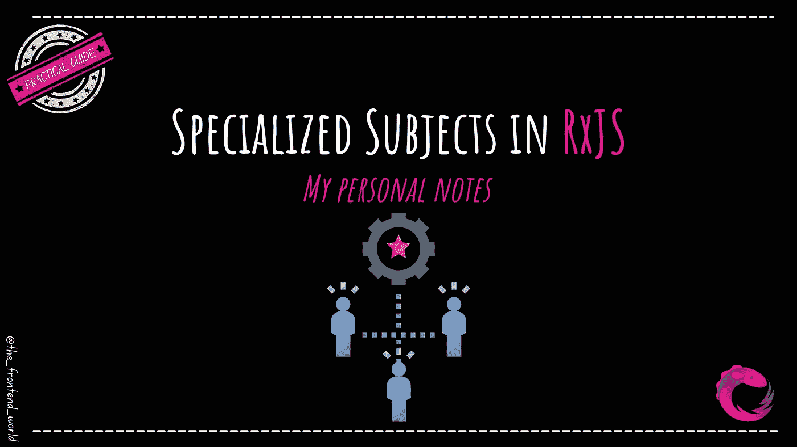

# RxJS 专业科目

> 原文：<https://javascript.plainenglish.io/specialized-subjects-in-rxjs-2bcc54a81227?source=collection_archive---------11----------------------->

## 关于 RxJS 专业课的个人笔记

By FAM

当您有专门的应用程序需求时，提前知道这些专门主题的存在以一种干净的方式解决问题并且不需要实现堆积如山的代码是非常值得的。

知道如何在你的用例中直接使用这些基础部分是有帮助的。主题给了你很多关于可观测量如何执行和传递价值的控制。

在这篇文章中，我将向您展示关于那些专门主题的大图，其他文章更深刻的文章将与大量用例一起发布。同样，我会根据需求对文章进行优先排序，所以请让我知道你最感兴趣的是什么！

我将介绍的内容:

*   `AsyncSubject`
*   `BehaviorSubject`
*   `ReplaySubject`

让我们开始吧！

如果你不知道我在说什么，我建议你先从这个开始:

 [## RxJS 像没见过一样！

### 关于 RxJS 你可能想了解或知道的一切！

levelup.gitconnected.com](https://levelup.gitconnected.com/rxjs-like-youve-never-seen-it-b99467557a54) 

我假设你已经掌握了跳到 RxJS 的下一个高级部分的必要知识。

# `AsyncSubject`

 [## 专业 RxJS 主题...async 主语

### RxJS 中 AsyncSubject 的整体情况

famzil.medium.com](https://famzil.medium.com/the-specialized-rxjs-subject-asyncsubject-e3ec9edcd785) 

# `BehaviorSubject`

 [## 专业 RxJS 主题...行为主体

### RxJS 中关于行为主体的大图

famzil.medium.com](https://famzil.medium.com/the-specialized-rxjs-subject-behaviorsubject-f2d296f2cf01) 

# `ReplaySubject`

 [## 专业 RxJS 主题...重播主题

### 关于 RxJS 中 ReplaySubject 的大图片

famzil.medium.com](https://famzil.medium.com/the-specialized-rxjs-subject-replaysubject-d083c6e117b0) 

> 所有代码示例都是[这里](https://stackblitz.com/edit/rxjs-8wzj1i?file=index.html)！

请告诉我您是否喜欢这篇文章，以及您是否希望我在以后的文章中为您提供更多关于这些专业主题和用例的示例。我很乐意把它加到我的待办事项里😉

下次见！

我希望这篇文章对你有帮助！

 [## 如果你喜欢看我的文章… ♥️

### 如果你喜欢读我的文章… ♥️，当我的文章发表时，欢迎你第一个得到通知…

famzil.medium.com](https://famzil.medium.com/subscribe) 

> 谢谢你，❤

如果你有兴趣成为付费会员，你可以使用我的推荐链接。下次见

亲爱的读者，感谢你在我生命中的存在。

**让我们在** [**上取得联系**](https://medium.com/@famzil/)**[**Linkedin**](https://www.linkedin.com/in/fatima-amzil-9031ba95/)**[**脸书**](https://www.facebook.com/The-Front-End-World)**[**insta gram**](https://www.instagram.com/the_frontend_world/)**[**YouTube**](https://www.youtube.com/channel/UCaxr-f9r6P1u7Y7SKFHi12g)**或**********

******参见我的关于网络要素和一般文化的电子书。******