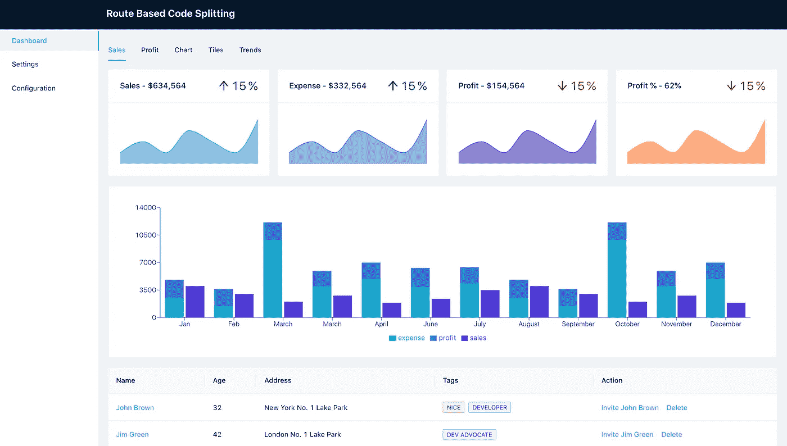
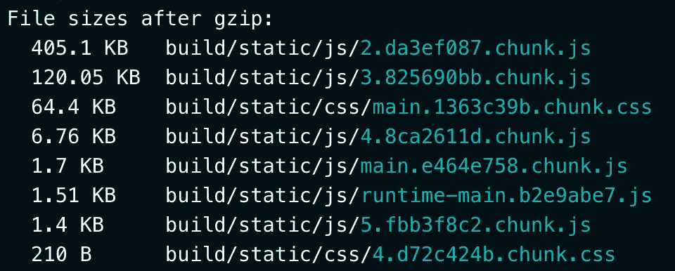
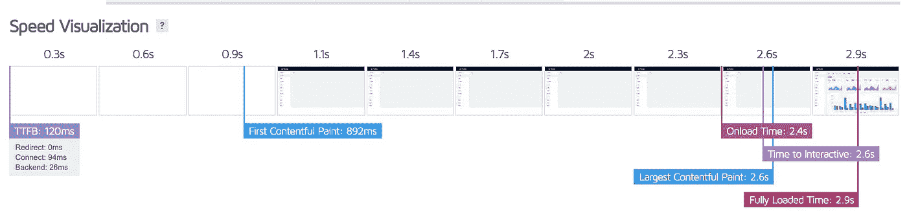
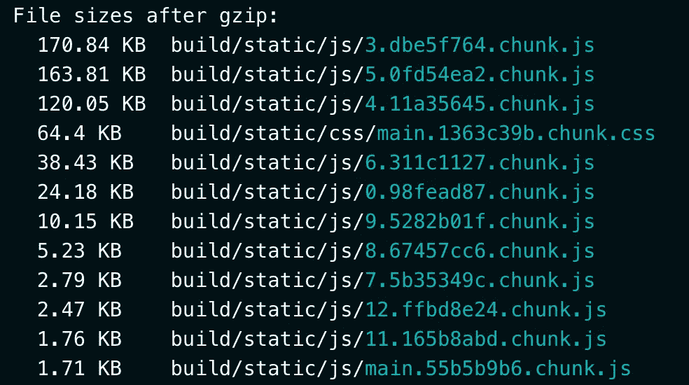
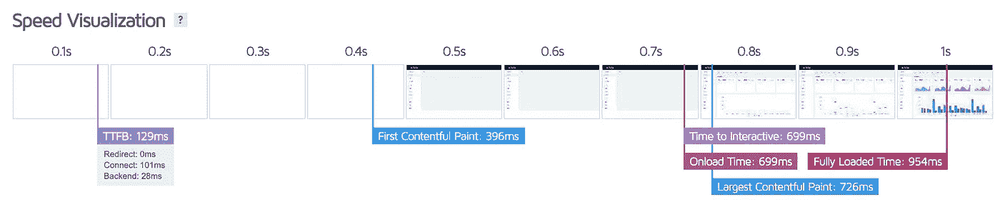
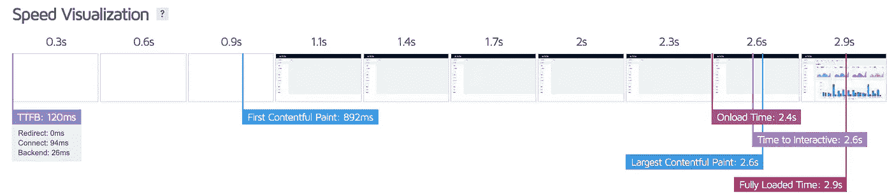
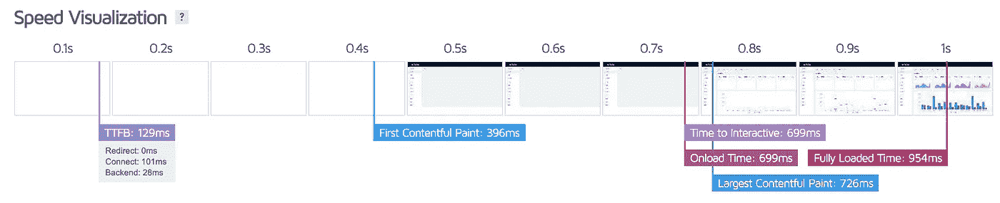

# 如何将 React 应用程序加载时间缩短 70%

> 原文：<https://javascript.plainenglish.io/speed-up-your-react-app-initial-load-using-code-splitting-f2de58c01ed2?source=collection_archive---------0----------------------->

使用代码分割减少 React 应用程序初始加载时间的步骤。

Photo by [NordWood Themes](https://unsplash.com/@nordwood?utm_source=unsplash&utm_medium=referral&utm_content=creditCopyText) on [Unsplash](https://unsplash.com/s/photos/loading?utm_source=unsplash&utm_medium=referral&utm_content=creditCopyText)

我们使用 [React](https://reactjs.org) 构建大规模应用。在构建这些应用程序时，我们面临的主要问题是应用程序性能。当应用程序变得越来越大时，性能可能会下降。特别是应用程序的初始加载时间将受到更大的影响。最初的应用程序加载需要快速，而不需要向用户显示几秒钟的空白屏幕。因为需要更多的时间来加载，这会给用户留下不好的印象。

这个问题的主要原因是在一个包文件中添加了太多的组件，所以加载这个包文件可能需要更多的时间。为了避免这种问题，我们需要以一种优化的方式构建我们的组件。为了解决这个问题，react 本身有一个本地解决方案，那就是代码分割和延迟加载。这允许将包文件分割成较小的大小。

引入代码分割的最佳位置是在路由中。基于路由的代码分割解决了一半的问题。但是大多数应用程序只利用了代码分割的 50%的优势。

当使用代码分割时，我们是否正确地构造了组件？我们可以使用一些代码示例来了解为什么以及如何修复它。为此，我们将使用一个带有一些 UI 组件的示例 React 应用程序。

在下面的截图中，我们可以看到一个仪表板组件，它有多个选项卡。每个选项卡都有多个组件。

仪表板组件使用基于路线的代码分割作为下面的代码。

仪表板组件包含一些子组件，如销售、利润、图表、图块和趋势，如下面的代码

我们已经把代码分成了几条路线。因此，当应用程序被捆绑，我们得到一个单独的构建文件为每条路线如下

从上图来看，大小为 **405.1 KB** 的文件是 dashboard 组件，其他文件是 Header、sidebar、其他组件和 CSS。

我已经在 [Netlify](https://www.netlify.com/) 托管了这个应用来测试性能。就像我们在本地测试应用程序一样，我们找不到不同之处。当我用 [GTmetrix](https://gtmetrix.com/) 测试托管的应用程序时，仪表板屏幕花了 **2.9 秒**加载，检查下图的逐帧加载。

仪表板组件是该应用程序的初始页面，因此当我们点击应用程序 URL **时，405.1KB** 文件将与标题和侧栏一起加载。

最初，用户将只查看**销售**选项卡，但是我们的示例应用程序仪表板组件有多个选项卡。浏览器也在下载其他标签代码，所以它延迟了用户的第一次绘制。为了减少初始加载时间，我们需要对仪表板组件进行如下更改

在这里，我用延迟加载导入了每个选项卡组件，并用悬念包装了组件。为了更好的理解，我在这里添加了多个悬念，但是你可以对所有组件使用单个悬念。

我没有对路由级代码分割做任何修改。当我们构建应用程序时，我们会添加一些额外的文件，因为我们已经延迟加载了仪表板组件中的每个选项卡。检查下图中的构建文件分离。

Build Logs

现在，让我们根据上面的更改，再次使用 GTmetrix 测试该应用程序。查看下图中的应用程序性能

如您所见，现在我们的仪表板组件在 **1 秒**内加载完毕。由于**销售**标签代码现在只加载。通过做一些改动，我们已经减少了差不多 **2 秒**。让我们看看下图中基于路由和基于路由、基于组件的代码分割的比较。

Route Based Code Splitting

Route and Component-Based Code Splitting

正如你所看到的，这是应用程序初始加载的巨大改进。现在，通过在仪表板组件中有效地使用代码拆分，我们已经通过一些调整将 React 应用程序的初始加载时间减少了 70%。

# 参考

1.  [代码拆分](https://reactjs.org/docs/code-splitting.html#code-splitting)
2.  [第一次心满意足的画画](https://gtmetrix.com/blog/first-contentful-paint-explained/)

# **结论**

以优化的方式构建组件并有效地使用 React APIs 将提高大型应用程序的性能。

感谢您的阅读。

*更多内容请看*[***plain English . io***](http://plainenglish.io/)