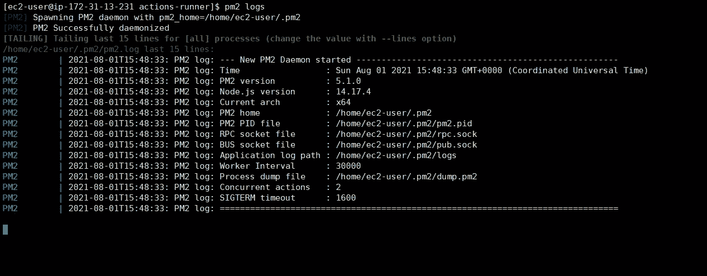

# 使用 GitHub 加速您的工作流程-行动

> 原文：<https://javascript.plainenglish.io/speed-up-your-workflows-with-github-actions-b3928069443f?source=collection_archive---------5----------------------->


Photo from Dev.to

**GitHub Actions** 是由 GitHub 提供的一个工具/服务，帮助您构建、测试和部署应用程序。GitHub Actions 帮助您在存储代码的同一个地方实现软件开发工作流的自动化，GitHub。此外，在请求和问题上进行协作。有了它们，您可以直接在存储库中构建端到端的连续集成(CI)和连续部署(CD)功能。

**工作流**是定制的自动化流程，是单个任务(*操作*的组合，您可以在您的存储库中设置以构建、测试、打包、发布或部署您的项目。我们可以编写我们的定制工作流，或者从 GitHub 市场获得工作流。我们在 YAML 配置中配置工作流，我们将在存储库中创建该配置，以定义需要执行的操作。

**运行程序**是安装了 GitHub Actions runner 应用程序的服务器。我们可以使用由 GitHub 托管的跑步者，也可以托管您自己的跑步者。在这个演示中，我将向您展示如何在 AWS 的 EC2 实例中设置 GitHub runner，并通过示例 NodeJS 项目执行您的工作流。

首先，您需要在 GitHub 中创建一个存储库来存储您的代码。当您点击基本 URL 时，我们将使用一个简单的 NodeJS 应用程序，它将返回消息“API Running”。


Creating GitHub Repository

之后，您需要初始化 NodeJS 项目，并安装以下依赖项来创建基本的 NodeJS 应用程序。安装 express、dotenv 和 cors 作为一般依赖项。在安装了所有必要的依赖项之后，您的 package.json 将会是这个样子。

*   **express** 是一个 NodeJS 框架
*   **dot NV**允许从源代码中分离秘密。
*   **cors** 是一种在网络浏览器中实现的机制，允许或拒绝来自不同域的对 web 应用的请求

package.json

然后创建一个名为 server.js 的文件来创建一个快速服务器，当你点击基本 URL[http://localhost:5000](http://localhost:5000)时，它会给你“API Running”文本。

server.js

现在一切都准备好了。不要担心，在本文的最后，如果您在这个过程中遗漏了什么，我将分享我的完整代码库供您参考。让我们将更改提交给本地存储库，并将更改推送到我们之前创建的远程存储库。为了自动化我们的更改，我们需要在 EC2 实例中创建一个 GitHub runner。

转到您的 GitHub 存储库->设置->操作->运行程序->添加运行程序。


GitHub runner (self-hosted runner)

为了托管这个 GitHub runner，我用默认配置创建了一个自由层 EC2 实例。对于安全组，我只打开了 HTTP 端口(80)、自定义端口(5000)和 SSH(22)端口。这里我用的是**亚马逊 Linux 2 AMI** 。因此，命令可能会不同。登录到您的实例后，您需要使用命令“sudo yum update”将实例中的所有包更新到最新版本。之后，按照下载&配置部分提到的说明安装 GitHub runner。您应该在/home/ec2-user 中配置您的更改。


Registering GitHub Runner

要使 GitHub runner 成为一项服务，请尝试以下命令。

```
sudo ./svc.sh install
sudo ./svc.sh start
```


现在我们已经成功注册了我们的 GitHub runner。现在，让我们设置在同一服务器中部署 NodeJS 应用程序所需的环境。执行以下命令在服务器上安装 NodeJS。

# 步骤 1 —配置 Yum 存储库

首先你需要在你的系统中启用 node.js 官网提供的 node.js yum 库。您还需要开发工具来构建要安装在您的系统上的本地附加组件。

```
sudo yum install -y gcc-c++ make 
curl -sL https://rpm.nodesource.com/setup_14.x | sudo -E bash -
```

# 步骤 2 —在 Amazon Linux 上安装 Node.js

```
sudo yum install -y nodejs
```

# 步骤 3 —检查版本

```
node -v
```

我们还需要在服务器上安装 PM2。PM2 是 NodeJS 应用程序的生产流程管理器，内置负载平衡器。它允许您**保持应用程序永远运行**，在不停机的情况下重新加载它们，并简化常见的系统管理任务。

```
sudo npm install pm2@latest -g
```

现在我们已经在服务器上安装了 NodeJS & PM2。让我们在应用程序代码中创建工作流。为了创建工作流，我们需要创建一个名为。github，然后在文件夹里面，我们需要创建另一个文件夹叫做 workflows。在 workflows 文件夹中，我们需要创建一个名为 node.js.yml 的文件，并在 YAML 配置中添加以下代码。

YAML Configurations

做出更改后，您可以将更改推送到 GitHub 资源库。该变化将被检测到，并将自动触发管道。


GitHub Actions Pipeline Execution

如果您点击您部署的实例 URL，它将显示您在服务器上显示的消息。


Base URL

现在，让我们在应用程序中做一个简单的更改，如下所示，并将您的代码推送到您的存储库。


server.js

几秒钟之内，您的页面将启动并运行。


Base URL

如果你在这个过程中遇到任何错误，你可以使用 GitHub 操作控制台和 PM2 日志来解决。


GitHub Actions Console



pm2 logs

如果你在这个演示过程中错过了什么，我在这篇文章中附上了我在这个演示中使用的 GitHub 库。

[](https://github.com/ezioguga/github-actions) [## GitHub-ezioguga/GitHub-行动

### 在 github 上创建一个帐户，为 ezioguga/github-actions 的发展做出贡献。

github.com](https://github.com/ezioguga/github-actions) 

我要感谢我的朋友 Muljayan，他鼓励我使用 GitHub Actions，并修复了设置 GitHub runner 时出现的一些问题。

 [## Muljayan J. -斯里兰卡|职业简介| LinkedIn

### 查看 Muljayan J .在 LinkedIn 上的职业简介。LinkedIn 是世界上最大的商业网络，帮助…

www.linkedin.com](https://www.linkedin.com/in/muljayan/) 

我希望你们喜欢这篇文章。我们再碰上另一个有趣的话题。谢谢你。

*更多内容看*[***plain English . io***](http://plainenglish.io/)