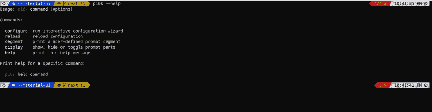
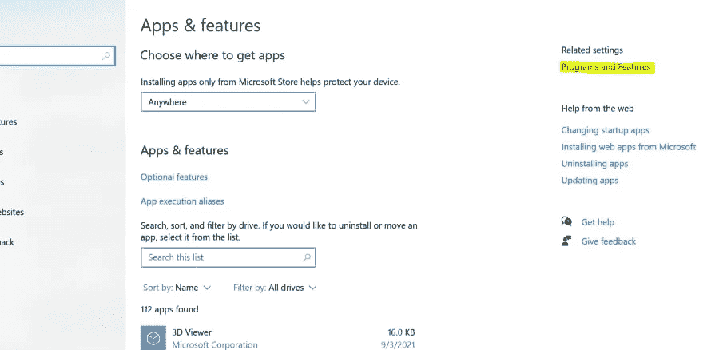
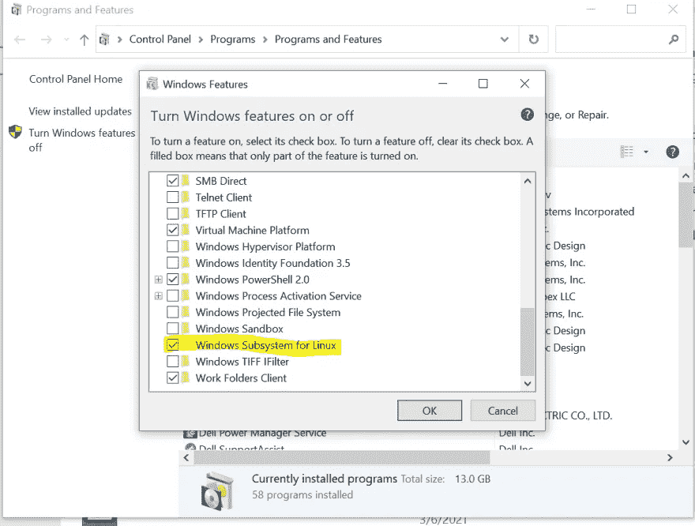
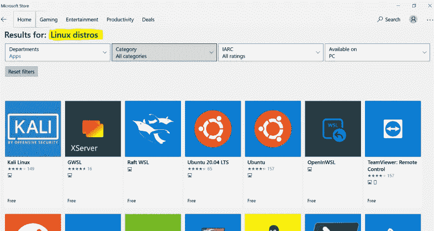
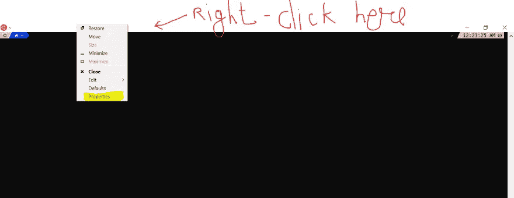
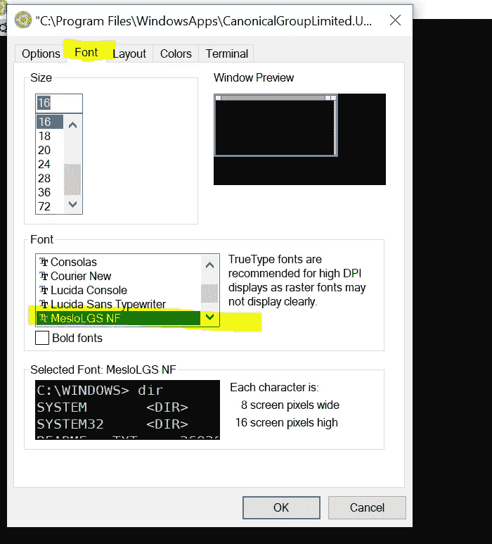

# 为基于 Linux 的 Windows 终端增添情趣

> 原文：<https://javascript.plainenglish.io/spice-up-linux-based-terminal-on-windows-cc1e4913f1fe?source=collection_archive---------7----------------------->


Photo by [Thomas M. Evans](https://unsplash.com/@grfxman?utm_source=medium&utm_medium=referral) on [Unsplash](https://unsplash.com?utm_source=medium&utm_medium=referral)

我同时是 Windows UI 和 Linux 终端界面的粉丝。是啊！我们确实存在😉。

在我的大学时代，我在我的笔记本电脑上设置了双重启动 Windows 和 Linux。它允许我完成任务，为此我更喜欢 Linux 终端。同时，我可以扮演 CSGO🔫在 Windows 上通过切换操作系统。然而，有了办公室提供的笔记本电脑，我只能使用 Windows😞。我想念 Linux 终端，Windows 原生终端很糟糕，因为我已经习惯了使用通常不起作用的 Linux 命令。

几天前，我接触了 Windows Subsystem for Linux (WSL ),这使我能够在 Windows 上运行 Linux 命令。除此之外，我将终端配置为看起来很奢侈，如下所示(注意那些彩色的说明和图标):



Spicy Terminal

在这篇博客中，我将分享一些步骤，通过这些步骤，你也可以设置一个类似的终端，并在 Windows 上享受 Linux 终端的特性。

让我们开始吧。

# 1.在 Windows 中安装 WSL。

**第一步**:启用 WSL 功能。

要在 windows 上运行 WSL，首先需要启用该功能。
进入**设置** > **应用** > **应用** & **功能**。在**相关设置**部分选择**程序和功能**。



现在选择左边的**打开或关闭 Windows 功能**选项。从打开的选项列表中，打开 Linux 的 **Windows 子系统。**



**第二步**:安装 Linux 发行版

去**微软**商店搜索 **Linux 发行版**。你会看到很多选项像 Ubuntu 20.94LTS，Kali Linux，Ubuntu 18.04LTS，Debian，SUSE Linux。你可以根据自己的喜好下载任何一个。我更喜欢用 Ubuntu，因为我已经用过了。



安装完成后，通过从开始菜单或微软商店搜索来启动下载的 Linux 发行版。第一次，您将被要求设置您的用户名和密码。

完成上述步骤后，您就可以在 Windows 中使用 Linux 终端了。尝试使用这些命令。太酷了😎，对吧？现在让我们继续给这个终端改头换面，使它看起来更有吸引力。

# 2.让终端焕然一新

**第一步:**安装`zsh`

`zsh`是一种类似于`bash`的 shell，但是更具交互性。(在这里了解更多关于 zsh [)。运行以下命令来安装 zsh:](https://www.zsh.org/)

```
sudo apt-get install zsh
```

安装完成后，通过运行`zsh --version`确保安装完成。如果它显示一个版本，请确保安装了 zsh。

**第二步:**安装`oh-my-zsh`

oh-my-zsh 是一个强大的`zsh` shell 插件管理器。包含 [**300+**](https://github.com/ohmyzsh/ohmyzsh/wiki/Plugins) 可选插件(rails、git、OSX、hub、docker、homebrew、node、PHP、Python 等...)、 **140+** 给你的早晨增添情趣的主题，还有一个自动更新工具，让你轻松跟上社区的最新更新。

引用自`oh-my-zsh`:

> *一旦安装完毕，你的终端外壳将会成为全城的话题或者你的退款！随着命令提示符下的每一次按键，你将利用数百个强大的插件和美丽的主题。陌生人会在咖啡馆里走向你，问你:“太棒了！你是某种天才吗？”*

好了，说够了。让我们看看它的实际效果。🎬

```
sh -c “$(curl -fsSL [https://raw.githubusercontent.com/ohmyzsh/ohmyzsh/master/tools/install.sh](https://raw.githubusercontent.com/ohmyzsh/ohmyzsh/master/tools/install.sh))"
```

上述命令将在您的终端上安装`oh-my-zsh`并更新`~/.zshrc`文件。如果您不知道，`.*rc`文件是配置文件。bash 里有`~/.bashrc`。同样，在`zsh`中有`~/.zshrc`文件。与 zsh shell 相关的所有配置都将在这里进行。

现在你可能想知道我们从中得到了什么。如前所述，oh-my-zsh 将允许您为您的终端安装各种插件和主题。插件让你的生活变得更简单。他们用自己的特殊能力给你力量，让你感觉自己是 10 倍的开发者。例如,`git`插件会在命令行上显示您所在的分支以及有多少文件被更改——不需要手动运行 git 命令来查找分支或被更改的文件。你可以在这里找到可用插件列表。另一方面，主题是为了让你的终端看起来更漂亮。您可以根据自己的喜好从可用主题列表([内部主题](https://github.com/ohmyzsh/ohmyzsh/wiki/Themes)、[外部主题](https://github.com/ohmyzsh/ohmyzsh/wiki/External-themes))中进行选择。

现在你会问在哪里添加插件，配置主题？`~/.zshrc`的角色来了。用`vi ~/.zshrc`在内嵌编辑器中打开文件。(请不要说不喜欢 vi 编辑器🙉).寻找`plugins`变量。将有默认的一些插件已经提到如下:

```
 plugins=(
 git
 bundler
 dotenv
 osx
 rake
 rbenv
 ruby
)
```

您可以根据需要添加或删除插件。你可以从上面分享的列表中搜索插件。

现在来看主题，你会看到一个变量`ZSH_THEME`和一个默认的主题`ZSH_THEME="robbyrussell"`。

我不喜欢默认主题，更喜欢`powerlevel10k`主题。它又快又轻，非常好用。所以在接下来的步骤中，我将分享如何设置`powerlevel10k`主题。如果你喜欢装另一个主题，也没关系；您可以从可用主题列表中使用它。(以上分享链接)。

**第三步:**安装 powerlevel10k 主题。

运行以下命令来克隆存储库:

```
 git clone — depth=1 [https://github.com/romkatv/powerlevel10k.git](https://github.com/romkatv/powerlevel10k.git) ${ZSH_CUSTOM:-$HOME/.oh-my-zsh/custom}/themes/powerlevel10k
```

克隆完成后，在`~/.zshrc`中设置`ZSH_THEME="powerlevel10k/powerlevel10k"`。现在运行`source ~/.zshrc`。对于第一次使用的用户，`powerlevel10k`会询问一系列问题来配置您的终端外观。如果它没有问，不用担心；在终端运行`p10k configure`。

如果您注意到图标或形状没有正确呈现，这意味着没有安装所需的字体。在这里安装所有提到的字体。

在 Windows 中安装字体后，打开 Linux 终端设置(如下所示):



在设置面板中，将字体设置为 **MesloLGS NF Regular** 。



设置好字体后，运行`p10k configure`重新配置主题，现在你就可以看到所有的图标和形状了。

它增加了你在 Windows 中使用 Linux 终端的体验吗？

希望这对你有帮助，有意思。如果你觉得这很有用，请鼓掌并写下你的想法，让我知道。

我在推特上。你可以跟着我去。

[](https://twitter.com/utkarsh22garg) [## 乌特卡什·加尔格

### 在 Twitter 上关注我

twitter.com](https://twitter.com/utkarsh22garg) 

*更多内容尽在* [***说白了***](http://plainenglish.io/)