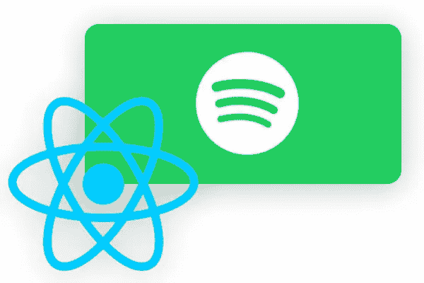
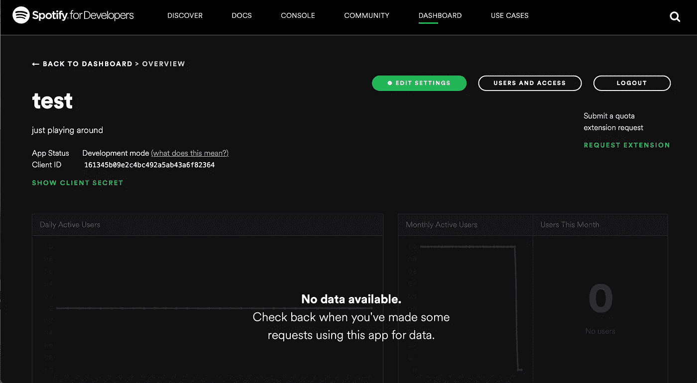
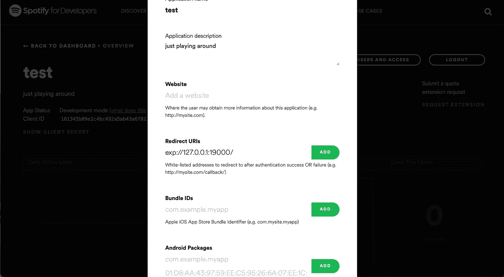

# 使用 React Native 进行 Spotify 认证

> 原文：<https://javascript.plainenglish.io/spotify-authentication-with-reactnative-2b6156573d19?source=collection_archive---------0----------------------->



# 介绍

当我第一次开始这个项目时，我面临的问题是，关于认证 Spotify 用户的教程没有我预期的那么多。这就是为什么我决定公布我解决这个问题的方法。

这将是由两篇文章组成的系列文章。在第一个步骤中，我将通过 Spotify、ReactNative 和 expo-auth-session 完成认证过程。第二部分是以 tinderlike swipecards 的形式展示和播放你个人当前的 20 首热门歌曲。观看这个[视频](https://www.youtube.com/watch?v=UmSQqXhGjkA)进行快速演示。

整个项目可以在[这里](https://github.com/kevintomas1995/spotify_top_songs_player)找到


# 设置

在深入研究代码之前，我们首先要设置一些关于 Spotify 的事情。前往[这个网站](https://developer.spotify.com/dashboard/applications)，用你的 Spotify 账户登录。之后，创建一个 app。在以下屏幕中，您稍后将需要**客户端 id** 。



接下来，您需要进入**“编辑设置”**屏幕。在那里，您需要插入一个重定向 URI。在我的例子中，它是“exp://127.0.0.1:19000/”，因为我在本地机器上使用 expo。



这都是关于设置！现在让我们深入研究代码吧！

# 登录屏幕

```
import { StatusBar } from "expo-status-bar";
import React from "react";
import { View, StyleSheet, KeyboardAvoidingView, Text } from "react-native";
import { Button, Image } from "react-native-elements";
import { useEffect, useState } from "react";
import { ResponseType, useAuthRequest } from "expo-auth-session";
import { useSelector, useDispatch } from "react-redux";
import * as tokenAction from "../store/actions/token";
import axios from "axios";
import * as songAction from "../store/actions/topSongs";const discovery = {
  authorizationEndpoint: 
  "https://accounts.spotify.com/authorize",
  tokenEndpoint: 
  "https://accounts.spotify.com/api/token",
};const LoginScreen = ({ navigation }) => {
  const dispatch = useDispatch();
  const [token, setToken] = useState("");
  const [request, response, promptAsync] = 
  useAuthRequest(
    {
      responseType: ResponseType.Token,
      clientId: "YOUR_CLIENT_ID",
      scopes: [
        "user-read-currently-playing",
        "user-read-recently-played",
        "user-read-playback-state",
        "user-top-read",
        "user-modify-playback-state",
        "streaming",
        "user-read-email",
        "user-read-private",
      ],
      // In order to follow the "Authorization Code Flow" 
      // to fetch token after authorizationEndpoint
      // this must be set to false
      usePKCE: false,
      redirectUri: "exp://127.0.0.1:19000/",
    },
    discovery
  ); useEffect(() => {
    if (response?.type === "success") {
      const { access_token } = response.params;
      setToken(access_token);
    }
  }, [response]); useEffect(() => {
    if (token) {
      axios(
        "https://api.spotify.com/v1/me/top/
        tracks?time_range=short_term", {
        method: "GET",
        headers: {
          Accept: "application/json",
          "Content-Type": "application/json",
          Authorization: "Bearer " + token,
        },
      })
        .then((response) => {
          dispatch(songAction.addTopSongs(response));
        })
        .catch((error) => {
          console.log("error", error.message);
        }); setTimeout(
        () =>
          navigation.replace("Home", {
            token: token,

          }),
        500
      ); dispatch(tokenAction.addToken(token));
    }
  }); return (
    <KeyboardAvoidingView behavior="padding" 
    style={styles.container}>
      <StatusBar style="light" />
      <Text
        style={{
          fontSize: 30,
          fontWeight: "bold",
          color: "white",
          marginBottom: "20%",
        }}
      >
        top song player
      </Text>
      <Button
        title="Login with Spotify"
        style={styles.button}
        onPress={() => {
          promptAsync();
        }}
      />
      <View style={{ height: 100 }} />
    </KeyboardAvoidingView>
  );
};export default LoginScreen;const styles = StyleSheet.create({
  container: {
    flex: 1,
    alignItems: "center",
    justifyContent: "center",
    backgroundColor: "black",
  }, button: {
    width: 200,
    marginTop: 50,
  },
});
```

如果你看一下导入，你可以看到我使用 **redux** 进行状态管理，使用 **axios** 进行数据获取，使用 **expo-auth-session** 进行实际的认证。其他进口货都很标准。

一般来说，我们使用的是**隐式** [认证流程](https://developer.spotify.com/documentation/general/guides/authorization-guide/#implicit-grant-flow)。

```
const discovery = {
  authorizationEndpoint: 
  "https://accounts.spotify.com/authorize",
  tokenEndpoint: 
  "https://accounts.spotify.com/api/token",
};
```

第一个常量 **discovery** 包含两个链接，这对认证过程至关重要。**授权端点**将是您点击登录按钮后将被重定向到的链接。第二个是 **tokenEndpoint** ，它将调用 spotify api，以便为您当前的会话创建一个唯一的 spotify 令牌。

```
const [request, response, promptAsync] = 
useAuthRequest(
    {
      responseType: ResponseType.Token,
      clientId: "YOUR_CLIENT_ID",
      scopes: [
        "user-read-currently-playing",
        "user-read-recently-played",
        "user-read-playback-state",
        "user-top-read",
        "user-modify-playback-state",
        "streaming",
        "user-read-email",
        "user-read-private",
      ],
      // In order to follow the "Authorization Code Flow" to 
      // fetch token after authorizationEndpoint
      // this must be set to false
      usePKCE: false,
      redirectUri: "exp://127.0.0.1:19000/",
    },
    discovery
  );
```

关于**使用权限请求**钩子的详细解释请看[这里](https://docs.expo.dev/guides/authentication/#spotify)。这段代码中要编辑的最重要的东西首先是 **clientId** 。您必须在设置步骤中插入您的客户端 ID。其次，你需要定义**范围**。这对您可以成功使用哪个 spotify api 端点有影响。看看 [spotify api 文档](https://developer.spotify.com/documentation/web-api/quick-start/)。这里最后一个重要的东西是 **redirectUri** ，在成功连接到 spotify 后，您需要在这里插入您希望重定向您的用户的 url。在我的例子中，它是 exp://127.0.0.1:19000/。这个**必须和**和你设置中的 URL 一样！

```
useEffect(() => {
    if (response?.type === "success") {
      const { access_token } = response.params;
      setToken(access_token);
    }
  }, [response]);
```

在本节中，我们将检查身份验证过程是否成功。如果是这样的话，我们将从之前代码片段返回的响应中提取访问令牌，并存储它。

之后，我们就可以使用访问令牌从 spotify api 获取数据了！

```
useEffect(() => {
  if (token) {
    axios(
      "https://api.spotify.com/v1/me/top/tracks?time_range=short_term",
       {
      method: "GET",
      headers: {
        Accept: "application/json",
        "Content-Type": "application/json",
        Authorization: "Bearer " + token,
      },
    })
      .then((response) => {
        dispatch(songAction.addTopSongs(response));
      })
      .catch((error) => {
        console.log("error", error.message);
      }); setTimeout(
      () =>
        navigation.replace("Home", {
          token: token,

        }),
      500
    ); dispatch(tokenAction.addToken(token));
  }
});
```

此时，我们正在调用 [top tracks 端点](https://developer.spotify.com/console/get-current-user-top-artists-and-tracks/?type=artists)以获取当前热门歌曲。在头中，我们使用访问令牌来访问这个端点。此外，我还将热门歌曲和访问令牌发送到 redux 商店。因为我们只有两个屏幕，所以这不是很必要，你也可以通过你的组件传递数据。尽管如此，如果应用程序变得更加复杂，这将变得非常有用。最后一步，我们用主屏幕替换登录屏幕。

代码的其余部分实际上是非常标准的反应式代码！

正如我在介绍中提到的，请随意查看 github 回购

# 结论

在这个系列的第二部分，我们将介绍你当前热门歌曲的显示和播放。一如既往的感谢你阅读我的故事！

*更多内容请看*[***plain English . io***](http://plainenglish.io)