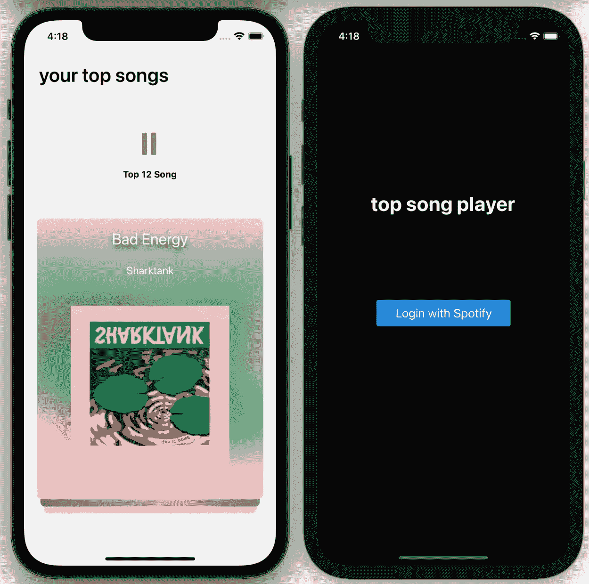

# 使用 React Native 构建您自己的 Spotify 播放器

> 原文：<https://javascript.plainenglish.io/spotify-player-with-reactnative-f605e447ca9e?source=collection_archive---------7----------------------->

## 我如何创建一个定制的 Spotify 播放器

## 介绍

在本系列的第一篇文章中，我解释了我是如何管理 ReactNative 和 Spotify 的认证过程的。在这篇文章中，我将解释我是如何用 swipecard 动画创建自己的 Spotify 播放器的。观看这个[视频](https://www.youtube.com/watch?v=UmSQqXhGjkA)的快速演示。

你看看这里的回购

## 主屏幕

如果您看一下导入，您可以看到我们导入了三个自定义组件:CustomHeader、Player 和 MainSwiper。这些是应用程序中最有趣的部分。但首先让我们看看主屏幕的其余部分！

我们定义了变量“index”，每次调用函数“onSwiped”都会改变这个变量。该函数是 MainSwiper 组件的一部分，它确保在刷卡时跟踪当前索引。

还需要索引来显示当前歌曲在 spotify 帐户前 20 首歌曲中的当前位置。因此，显示和播放的第一首歌曲将是您当前的热门歌曲。此外，还需要索引来告诉播放器组件中的 spotify api 需要播放哪首歌曲。

这就是主屏幕。让我们继续这个应用程序更有趣的部分。

## 播放器组件

正如你可以从导入中得到的，我在这里不是直接与 Spotify Api 对话。相反，我使用的是 [Spotify Web Api 节点，](https://github.com/thelinmichael/spotify-web-api-node)，这使得与 Spotify Api 的通信更加容易。

首先，我们需要创建一个 api 实例，如上面的第一行代码所示。其次，我们需要向 spotify api 提供从身份验证过程中获得的访问令牌。然后我们就可以开始使用 api 了！

在这个 useEffect 钩子中，我们引用了从身份验证过程中获得的 topSong 数据。为了通过 api 播放一首歌曲，我们需要提供一个 song_uri，它包含在 topSong 数据中。因此，每当 Home 组件中的索引发生变化时，spotify api 也会播放不同的歌曲。最后，我们的 topSong 数据是一个 Song 对象数组，我们对其进行迭代。props.index 告诉 api 应该选择数组中的哪个对象。

这两个 api 调用(spotifyapi . pause()spotifyapi . play())被包装在两个 TouchableOpacities 中，这两个 TouchableOpacities 表示播放和暂停按钮。根据“播放”状态，其中一个会显示出来并可触摸，然后播放会暂停或继续。

## Swiper 组件

在 swiper 组件中，我们使用了 [react-native-deck-swiper 包](https://github.com/alexbrillant/react-native-deck-swiper)，这使得实现 swipecard 动画变得非常容易！

然后，您只需要向 Swiper 组件提供一些数据，在本例中就是我们的 topSongs。我们正在映射这个 topSongs 数组的所有对象，对于每首歌曲，我们都显示一个带有背景、实际封面图像、歌曲名称和艺术家的视图。对于背景样式，我使用的是 expo-blur 的 BlurView 组件，看起来很酷吧？

请随意查看这里的其余代码，在我看来没有什么特别的。

## 结论

这就是你用几行代码创建自己的 Spotify 播放器有多容易。我希望你喜欢这篇文章。如果你有，请在这里留下赞和评论。

祝您愉快！

*更多内容尽在*[***plain English . io***](http://plainenglish.io)