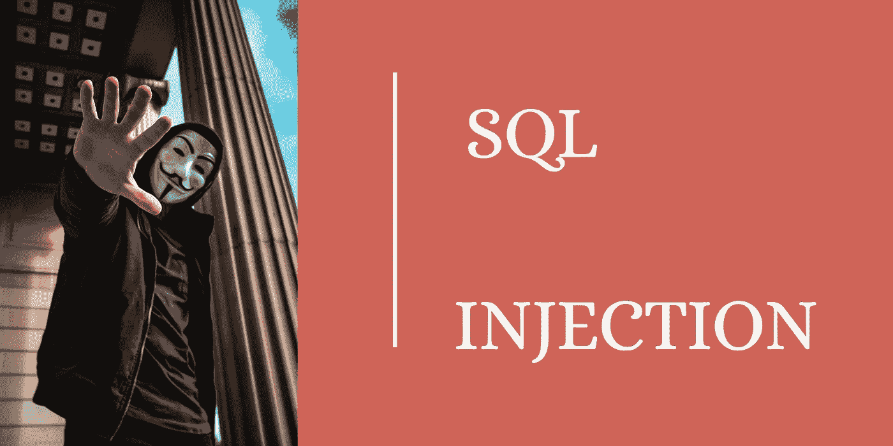

# Node.js 中的 SQL 注入攻击

> 原文：<https://javascript.plainenglish.io/sql-injection-attack-in-nodejs-a840893f228b?source=collection_archive---------2----------------------->

## 了解 SQL 注入攻击是如何执行的，以及如何使用 Node.js 避免 SQL 注入



Hacker Image From [https://unsplash.com/photos/EsBufnuK4NE](https://unsplash.com/photos/EsBufnuK4NE)

我们正在以快速的方式创建软件应用程序原型。客户会要求许多大型应用程序在更少的几天/几个月内创建。今天，我们生活在一个快速发展的世界。如果您正在考虑在一个地方创建一个应用程序，那么在另一个地方已经有人开始做与您相同的应用程序了。每天都有新的想法被提出。这些想法将会被推动来创建一个应用程序。

因此，组织/开发人员没有时间对应用程序进行所有的测试。尤其是**安全测试**。安全性在软件应用程序开发中起着非常重要的作用。如果应用程序遭到破坏，那么我们将失去我们的客户信息和客户对我们的信任。所以我们必须更加关注应用程序的安全性。甚至我们可以雇佣一些安全专家，请他们攻击我们的应用程序，找出应用程序中的**漏洞**。

下面列出了常见的安全攻击。

1.  SQL 注入袭击
2.  跨站点脚本
3.  不安全的反序列化
4.  身份验证被破坏
5.  跨站点请求伪造攻击
6.  敏感数据暴露
7.  deputy director of ordnance services 军火服务司副司长

在本教程中，我们将涵盖以下主题。

1.  什么是 SQL 注入？
2.  如何测试 SQL 注入的 URL？
3.  如何使用 **Node.js** 和 **MySQL** 避免 SQL 注入？您可以使用任何编程语言来应用这个概念。这里我用的是 Node.js。

## **什么是 SQL 注入？**

SQL 注入只不过是您正在使用的 SQL 查询中的一个简单缺陷/漏洞。SQL 查询中的缺陷会对数据造成任何损害，或者会将数据**暴露给**未授权的**人。所有开发人员都被要求转移到**预备语句**概念，而不是在编程语言中使用语句概念(技术上)。准备好的语句将处理 SQL 注入。但是，如果开发人员不知道什么是 SQL 注入，那么即使是准备好的语句也有可能暴露数据。**

我们来举一个实时的例子。在 MySQL 中使用下面的查询创建一个表。

```
CREATE TABLE `contact_list` (
  `id` int(11) NOT NULL AUTO_INCREMENT,
  `name` varchar(45) DEFAULT NULL,
  `mobile` varchar(45) DEFAULT NULL,
  `email` varchar(100) DEFAULT NULL,
  `created_date` timestamp NULL DEFAULT NULL,
  PRIMARY KEY (`id`)
);
```

使用下面的查询在上表中插入数据。

```
INSERT INTO contact_list(name,mobile,email) VALUES('RAJA',998800,'raja@mail.com');INSERT INTO contact_list(name,mobile,email) VALUES('Mano',789070,'mano@mail.com');INSERT INTO contact_list(name,mobile,email) VALUES('Tom',636261,'tom@mail.com');
```

现在，我正在编写一个 MySQL SQL 查询，使用 Node.js 中的以下 SQL 查询来检索特定用户的数据。

1.  这是一个 REST API。当我们传递正确的用户 id 时，它将产生输出。
2.  假设我们从浏览器传递用户 id，如下所示。

```
[http://localhost:3000/get-info?id=1](http://localhost:3000/get-info?id=1)
```

它将向等于 1 的用户 id 返回相应的数据。

3.现在在你的浏览器中执行下面的 URL。

```
[http://localhost:3000/get-info?id=1](http://localhost:3000/get-info?id=1) or 1=1
```

它将暴露所有的用户信息，而不是返回一个用户信息。

> 这如何暴露数据？

当我们使用 concatenate 时，对于上面的输入，SQL 查询执行如下。

```
SELECT * FROM contact_list WHERE id=1 or 1=1
```

因此**或**语句将接受任何真值，并将返回所有数据。

同样的问题也会发生在字符串上。假设我们使用名称来检索用户信息。SQL 查询创建如下。

```
const query="SELECT * FROM contact_list where name='"+req.id+"'";
```

在这里，有经验的黑客可以通过使用 URL 来操纵单引号。

```
[http://localhost:3000/get-info?name=](http://localhost:3000/get-info?id=1)Raja' or '1=1
```

查看如何在 concatenate 中操纵单引号。以上将暴露所有数据。

**SQL 注入袭击的可能例子列表。**

1.  使用下面的 SQL 查询获取数据库名称。

```
UNION SELECT DATABASE()
```

2.并将上述代码添加到我们现有的 URL 中。它将公开当前的数据库名称。这是有史以来最大的风险。

```
[http://localhost:3000/get-info?id=1](http://localhost:3000/get-info?id=1) UNION SELECT 1 id,1 name,1 mobile,1 email,DATABASE() created_date
```

这里我添加了 5 列。为什么？因为我知道输出是 5 列。因此，当使用 UNOIN 时，我们必须添加 5 列。第 5 列将显示当前数据库名称。

3.使用下面的 SQL 查询获取用户名。

```
UNION SELECT USER()
```

4.并将上述代码添加到我们现有的 URL 中。它将公开当前的用户名。同样，我们可以和 SQL 注入一起做很多事情。

```
[http://localhost:3000/get-info?id=1](http://localhost:3000/get-info?id=1) UNION SELECT 1 id,1 name,1 mobile,1 email,USER() created_date
```

这里我只列出了几个攻击。使用下面的链接从 OWASP 了解有关 MySQL 中 SQL 注入攻击的更多信息。

[](https://owasp.org/www-project-web-security-testing-guide/latest/4-Web_Application_Security_Testing/07-Input_Validation_Testing/05.2-Testing_for_MySQL.html) [## WSTG -最新

### WSTG-OWASP 基金会主要网站的最新消息。OWASP 是一个非营利基金会，致力于改善…

owasp.org](https://owasp.org/www-project-web-security-testing-guide/latest/4-Web_Application_Security_Testing/07-Input_Validation_Testing/05.2-Testing_for_MySQL.html) 

## **使用 Node.js 避免 SQL 注入的预准备语句方法**

使用下面的代码来避免 MySQL 和 Node.js 中的 SQL 注入

只是用问号来避免 SQL 注入的攻击。并尝试在将输入推送到 SQL 查询之前对其进行净化。

## **如何避免使用 Node.js 进行 SQL 注入**

1.  不要**连接**SQL 查询字符串。这是黑客操纵 SQL 查询来暴露数据的地方。所以永远不要在 SQL 查询上执行 concatenate。
2.  始终使用准备好的陈述方法(问号方法)。
3.  使用问号的好处是，它将只匹配特定列的数据比较。即使黑客修改了输入，修改后的输入值也只会与一列进行比较。所以它不会暴露数据。
4.  了解现有的可能的 SQL 注入攻击模式，并在开发应用程序时尽量避免这些模式。

## **结论**

我们必须更加关注应用程序的安全性测试。那里有许多安全漏洞。我们必须让所有的开发人员和程序员了解现有的安全缺陷。在编写新的应用程序时，我们必须避免现有的安全缺陷。我们必须使用 OWASP 网站保持关于安全测试的更新。OWASP 是一个致力于提高软件安全性的非盈利基金会。在本教程中，我只解释了仅使用 MySQL ad Node.js 的 SQL 注入攻击。同样的预防措施可以应用于任何编程语言和数据库。

前端开发人员、全堆栈开发人员和 REST API 开发人员必须了解这个 SQL 注入。为什么？因为他们是在应用程序中处理安全相关事务的主要参与者，并且负责开发更好的应用程序。

谢谢你阅读这篇文章。

如果您有任何问题，请发表评论。

**进一步阅读:**

[](https://owasp.org/www-project-web-security-testing-guide/latest/) [## WSTG -最新

### WSTG——OWASP 基金会主网站上的最新消息。OWASP 是一个致力于改善…

owasp.org](https://owasp.org/www-project-web-security-testing-guide/latest/) [](https://js.plainenglish.io/create-rest-api-using-nodejs-and-mysql-from-scratch-d1844601e21) [## 从头开始使用 NodeJS 和 MySQL 创建 REST API

### MySQL 的 CRUD 示例从头开始

js.plainenglish.io](https://js.plainenglish.io/create-rest-api-using-nodejs-and-mysql-from-scratch-d1844601e21) [](https://js.plainenglish.io/implement-jwt-based-authorization-using-nodejs-and-angular-9f75ab5904ac) [## 使用 NodeJS 和 Angular 实现基于 JWT 的授权

### 如何使用 NodeJS、MySQL 创建 JWT 授权并使用 Angular 集成它的完整示例

js.plainenglish.io](https://js.plainenglish.io/implement-jwt-based-authorization-using-nodejs-and-angular-9f75ab5904ac)