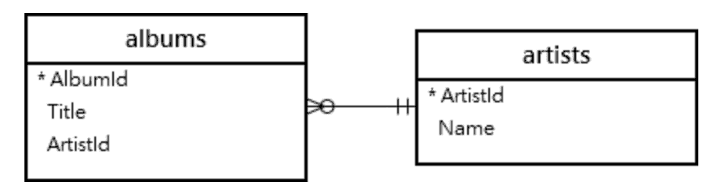

# SQL:了解联接

> 原文：<https://javascript.plainenglish.io/sql-understanding-joins-b5888eda54ae?source=collection_archive---------16----------------------->

使用 SQLite 开始使用 join。

当学习 *SQL* 时，也就是结构化查询语言，需要理解的最重要的概念之一，是使用**连接**。在这篇博客中，我将分解不同的连接类型，为什么它们是相关的，以及你如何自己实现它们。

简单回顾一下，SQL 帮助我们用关系数据库处理数据。当一个数据库中有不同的表时，我们需要找到一种方法来连接这些表的数据，这就是联接的用武之地。

# 什么是联接？

在不同的表中，我们可以使用一个 JOIN 关键字将表相互连接起来。通常，当表之间存在一对多或多对多关系时，您会看到使用联接。

有几种不同类型的连接:

内部连接

左连接

右连接

完全加入

请参见下图，了解这些不同连接的可视化效果:

# 内部连接

内部连接将允许我们返回在两个表中都有匹配值的数据记录。

举个例子，我将从一个示例数据库中提取。我们将探究这两个表之间的关系。

我们可以通过共享的 **ArtistId** 值在两个表之间创建一个**内部连接**，参见使用内部连接连接表数据的语法:

**using INNER JOIN keyword is the same as using the JOIN keyword

现在来看看这个查询的结果，以便更全面地理解这个查询。

*abbreviated showing of only first 6 results

# 左连接

left join 关键字将返回左表中的所有数据记录和右表中满足条件的数据记录。让我们使用这个示例查询来看看这是如何工作的。

LEFT JOIN keyword is also the same as LEFT OUTER JOIN keyword

现在，在上面的查询中，我们从**左艺术家**表中提取，并基于连接条件**艺术家匹配**右专辑**表中的行。ArtistId =相册。ArtistId** 。

这个左连接将返回左 artists 表中的所有行和右 album 表中的匹配行。在此查看查询结果:

**if using SQlite and there are no matching results, you will receive a “null” result value

# **右连接**

右连接实际上与左连接非常相似！使用左连接，我们将从左表中获得所有数据记录，从右表中获得匹配的行。

通过正确的连接，我们可以得到结果的另一面！**右连接**将返回右表的所有行和左表的所有匹配行。

# 完全连接

完全连接将继续进行，并返回连接表中的所有行，无论它们是否匹配。

***重要提示，SQLite 不支持使用完全连接，有时也称为完全外部连接**

举个例子，下面是如何编写完全连接:

当您想使用完全连接时的一个用例是当您想从两个表中返回不匹配的行时。

# 奖励:交叉连接

前面没有提到，但是在你的后袋中值得知道的是交叉连接！

交叉连接创建两个表中的行的乘积，*没有连接条件。*交叉连接的 Synax:

*selection of first 6 output results from that query about

您可以看到有一些重复的数据结果，交叉连接的一个用例是创建一个初始数据集，以便进行进一步的查询或分析。

# 结论

我希望您喜欢这次对 SQL 连接的深入研究！如果您希望使用 SQL，掌握它们是非常重要的。感谢您的阅读，祝您在以后的 SQL 和编码冒险中好运！

*更多内容尽在*[***plain English . io***](http://plainenglish.io/)