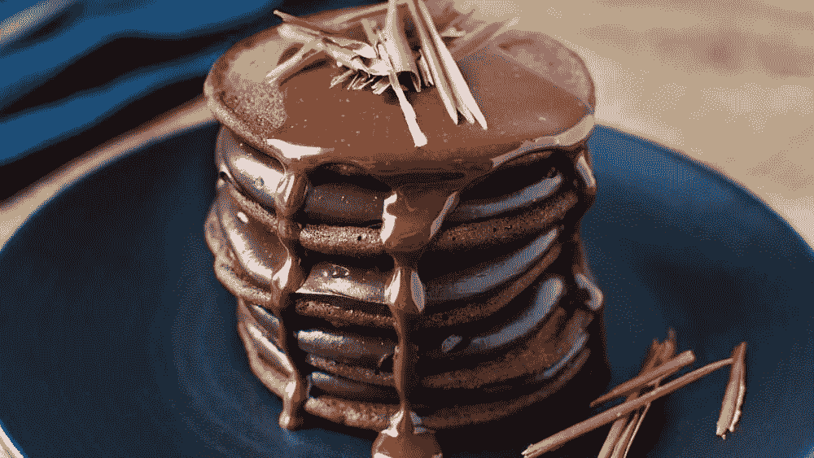
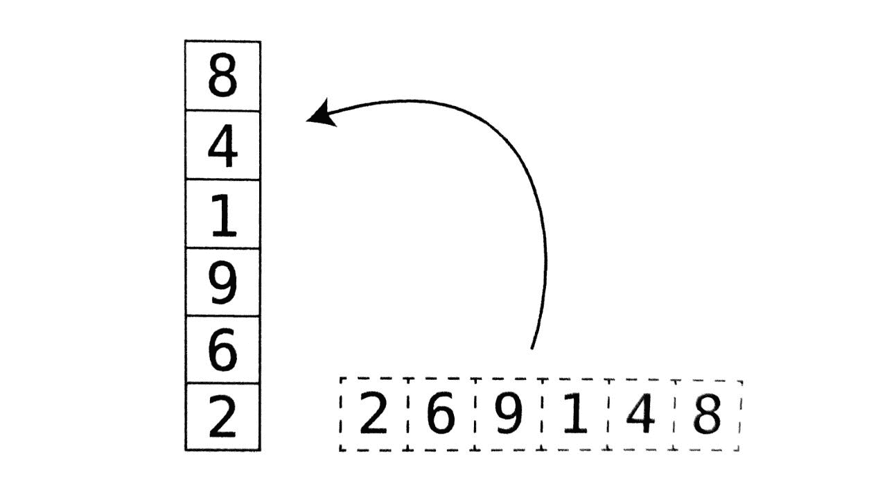
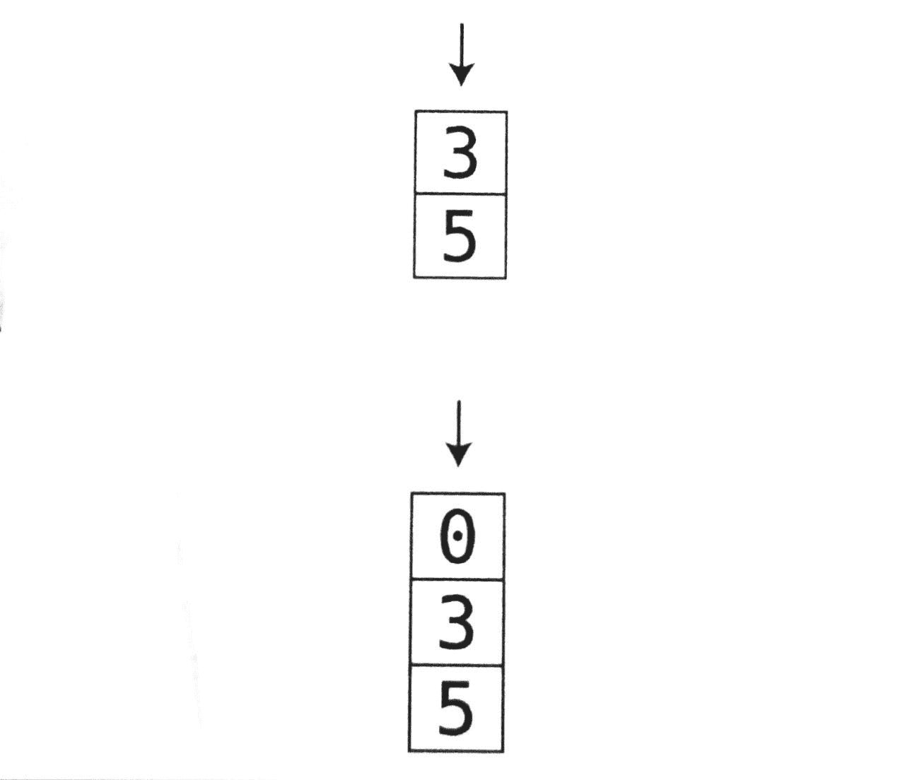

# 编程基础:堆栈基础

> 原文：<https://javascript.plainenglish.io/stack-basics-f389f06bfbf0?source=collection_archive---------15----------------------->

算法和数据结构是编程的基础部分。知道你将在什么时候使用什么数据结构是很重要的，所以在这篇博客中，我将介绍栈数据结构的基本原理。

## 什么是堆栈？🤔

栈只是一个有限制的数组。这是一个处理临时数据的优秀工具，它专注于处理数据的顺序。

堆栈是一种线性数据结构，遵循后进先出(LIFO)或先入后出(FILO)的性能顺序。

我们可以想象的最好的方法是用一些薄煎饼！

就像小火龙一样，做煎饼时，我们倾向于在上菜前把它们堆成一座塔。不过，先吃哪种煎饼呢？答案很简单——最后做好的煎饼，放在煎饼堆上。换句话说，堆叠的最后一个薄饼是供应的第一个薄饼，制作的第一个薄饼是供应的最后一个薄饼(后进先出或先入后出)。

## 显现💭

现在，让我们用一个数组来看这个问题，将堆栈视为垂直数组，如下所示:

当我们看到从水平到垂直的转换时，很明显数组中的第一项现在是堆栈的底部，而数组中的最后一项现在是顶部。

现在让我们通过可视化一个空栈来看看栈的运行，我们如何添加元素以及如何删除它们。

## 推到堆栈上🤚🏼

我们将从一个空栈开始，看看我们是如何向它们添加内容的。为了添加到堆栈中，我们*按下*，这意味着将值插入到堆栈中，这里我们将 5 推送到堆栈中:

接下来，我们将插入一个 3，然后一个 0，就像这样:

每次我们添加一个元素，或者*把*元素放到堆栈中，我们就把它们放在堆栈的顶部。这意味着，如果我们想在中间或底部添加 0，我们不能这样做。

## 从堆栈中弹出🍾

当我们从堆栈中移除元素时，我们称之为*从堆栈中弹出*。我们将使用前面的例子来显示元素被删除的顺序。

我们只能移除顶部的元素，因为堆栈遵循 LIFO/FILO 原则。因此，我们唯一可以*弹出*的元素是 0，如下所示:

然后我们只剩下两个元素，我们唯一可以去掉的是 3，就像这样:

我希望这能让您很好地理解什么是栈，以及如何在处理临时数据时看到好处。