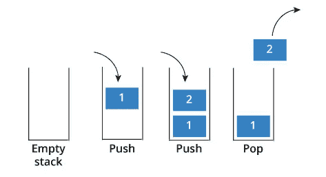

# 求解'移除字符串中所有相邻重复项'

> 原文：<https://javascript.plainenglish.io/stack-of-pancakes-solving-remove-all-adjacent-duplicates-in-string-c3ace240f4f7?source=collection_archive---------7----------------------->

## 一叠煎饼


Photo by [Luke Pennystan](https://unsplash.com/@lukepennystan?utm_source=medium&utm_medium=referral) on [Unsplash](https://unsplash.com?utm_source=medium&utm_medium=referral)

我要探索的下一个数据结构是栈。我发现完全理解数据结构(比如栈)的最好方法是解释它们是什么，然后演练练习问题。我将简单介绍一下什么是堆栈，然后我将回顾一下我最近在 [LeetCode 上完成的一个堆栈问题:移除字符串](https://leetcode.com/problems/remove-all-adjacent-duplicates-in-string/)中所有相邻的重复项。让我们首先定义什么是堆栈，然后深入研究。

我是空腹写这个的，所以我就拿煎饼来举例。你决定邀请你的朋友一起吃早餐。大家一致想要煎饼。幸运的是，你很擅长做煎饼。第一块薄饼做好后，你把它放在盘子里。下一块薄饼做得非常完美，你把它叠在第一块上面。你继续做这个模式，直到你做了足够的。你已经用完了所有的面糊，你的盘子里堆满了几十个煎饼。该吃饭了！你从最上面开始分发煎饼，一直分发到没有煎饼剩下为止。那么这和栈数据结构有什么相似之处呢？



Image from [http://www.technotaught.com/wp-content/uploads/2018/11/stack-1.jpg](http://www.technotaught.com/wp-content/uploads/2018/11/stack-1.jpg)

堆栈遵循后进先出原则(LIFO)。规则是最后一个进入堆栈的元素将是第一个必须退出的元素。你从煎饼的顶部开始，一点一点往下。你不能在一堆煎饼中间随便拿一块！有一个从上到下的标准 pancake 协议。后进先出原则也意味着第一个煎饼是最后分发的煎饼。

# 操作

我们可以在上面加一块薄饼，或者从上面去掉一块薄饼。在堆栈上添加一个元素(pancake)的操作是`push()`方法，从堆栈中删除一个元素(pancake)的操作是`pop()`方法。

# 大 O

在中插入和删除元素的时间复杂度为 O(1)时间，常数时间。

搜索和访问一个元素需要 O(n)时间，线性时间。

# **实现**

堆栈可以通过使用链表或数组来实现。最后提供的参考资料详细介绍了如何在数组和链表中进行堆栈。在我讨论的 LeetCode 问题中，我们使用数组实现。如果你需要复习一下链表是什么，你可以看看我关于链表的文章。现在，让我们开始解决问题吧！

# 删除字符串中所有相邻的重复项

**说明:**

给定小写字母的字符串 S，重复删除包括选择两个相邻且相等的字母，并删除它们。

我们在 S 上重复删除，直到我们不能再这样做。

在所有这样的重复删除完成后，返回最后一个字符串。保证答案是唯一的。

**例子:**

```
**Input:** "abbaca"**Output:** "ca"
```

我们马上看到有两个 b 紧挨着。我们想移除它们。现在字符串看起来像“aaca”，这也不好。我们现在有两个“a”在一起，我们删除它们，现在输出是“ca”。不再重复！

**解决问题的方法:**

1.创建一个空的堆栈数组。

2.遍历字符串 s。

3.检查堆栈的最后一个元素是否等于 s 的当前元素。

4.如果为 true，则移除堆栈中的最后一个元素。

5.如果为 false，则将 S 的当前元素添加到堆栈的末尾。

6.以字符串形式返回堆栈数组。

这是我用 JavaScript 写的解决方案。我将遍历每个元素的迭代，因为跟踪我们正在检查的元素可能会有点混乱。

# **循序渐进**

第一次迭代，`char = 'a'`，但什么是`stack[stack.length-1]`？`stack`是空的，所以`stack.length = 0`，所以我们要`stack[-1]`。这最终是一个值`undefined`。`undefined`不等于`'a'`，因此我们将`'a'`推送到`stack`。

第二次迭代，`char = 'b'`和`stack[stack.length-1] = 'a'`。它们不相同，所以`'b'`被压入堆栈。堆栈现在是`['a', 'b']`。

第三次迭代，`char = 'b'`和`stack[stack.length-1] = 'b'`。它们是相同的，所以`'b'`从堆栈中删除。堆栈现在是`['a']`。

第四次迭代，`char = 'a'`和`stack[stack.length-1] = 'a'`。它们是相同的，因此`'a'`从堆栈中移除。堆栈现在是`[]`。

第 5 次迭代，`char = 'c'`和`stack[stack.length-1] = undefined`，因为堆栈为空。它们不一样，所以`'c'`被推送到堆栈。现在栈是`['c']`。

最后一次迭代，`char = 'a'`和`stack[stack.length-1] = 'c'`。它们是不一样的，所以`'a'`被推到堆栈中。现在栈是`['c', 'a']`。

然后，我们返回最终输出为`'ca'`的堆栈。我希望这个演练是有帮助的！

# 资源:

关于栈的更多资源，我建议看看这些有用的链接。

[https://medium . com/better-programming/data-structures-an-introduction-to-stacks-a 902 CD 830018](https://medium.com/better-programming/data-structures-an-introduction-to-stacks-a902cd830018)

[https://medium.com/basecs/stacks-and-overflows-dbcf7854dc67](https://medium.com/basecs/stacks-and-overflows-dbcf7854dc67)

[https://medium . com/@ hitherejoe/data-structures-stacks-queues-a3b 3591 c8 CB 0](https://medium.com/@hitherejoe/data-structures-stacks-queues-a3b3591c8cb0)

[https://medium . com/swlh/stacks-and-queues-simplified-ef0f 838 fc 534](https://medium.com/swlh/stacks-and-queues-simplified-ef0f838fc534)

**链接到 LeetCode 问题:**

[https://leet code . com/problems/remove-all-adjacent-duplicates-in-string/](https://leetcode.com/problems/remove-all-adjacent-duplicates-in-string/)

**我的链表文章:**

[https://medium . com/JavaScript-in-plain-English/remove-duplicates-from-a-sorted-linked-list-c 9e 0 e 62d 2c 96](https://medium.com/javascript-in-plain-english/removing-duplicates-from-a-sorted-linked-list-c9e0e62d2c96)