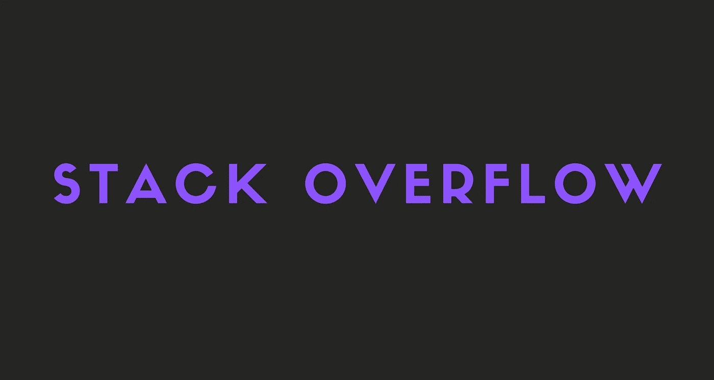
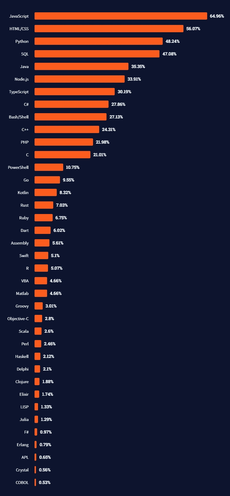
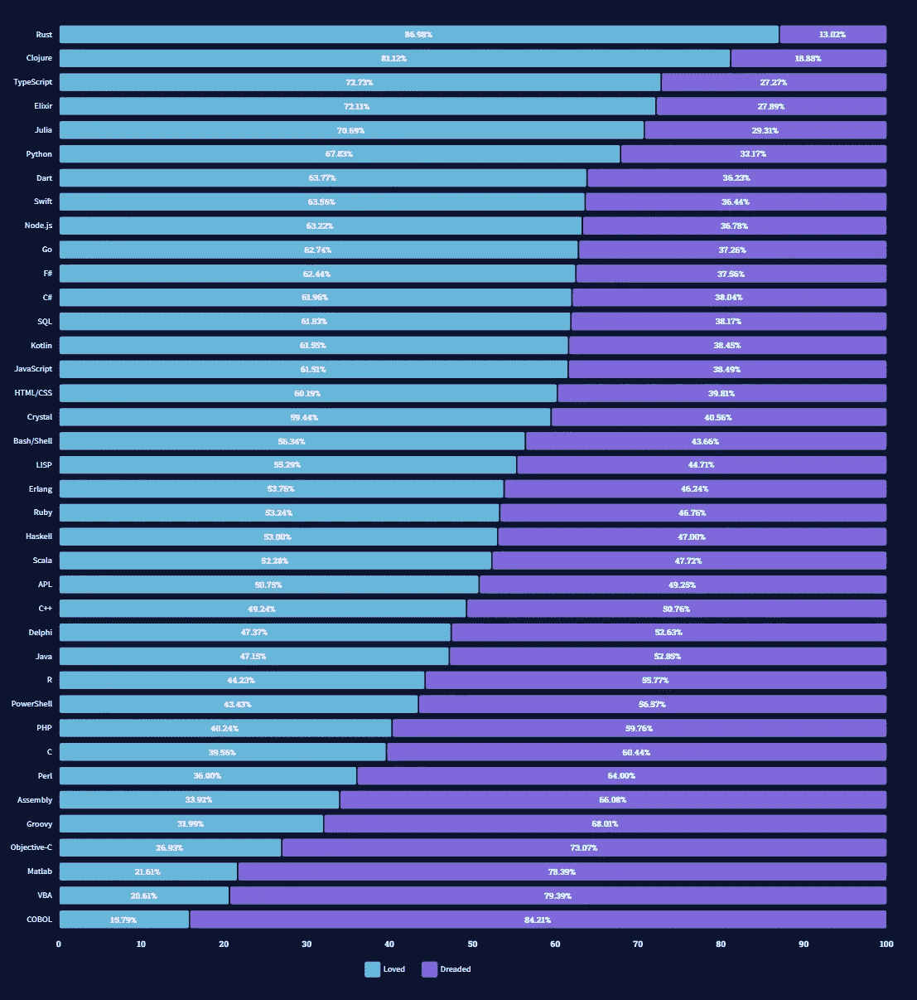
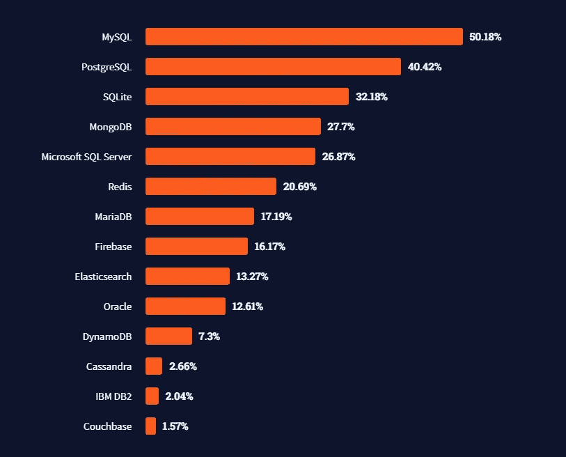
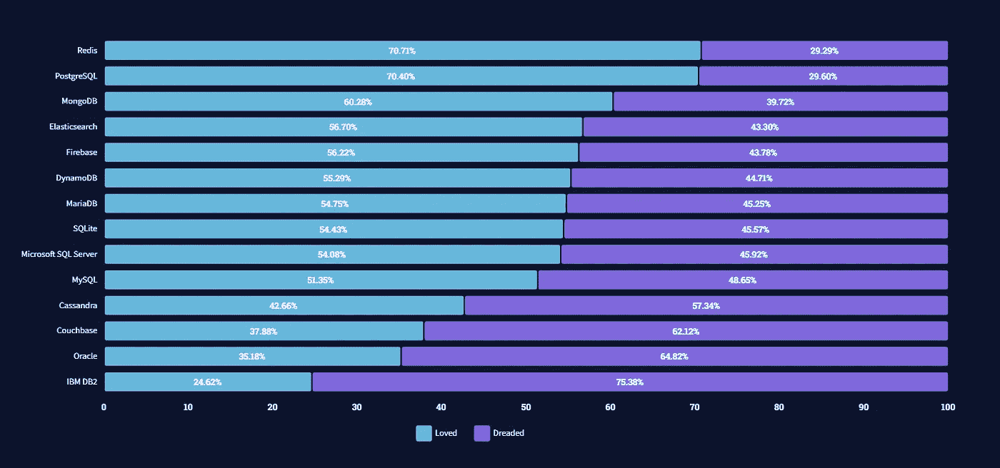
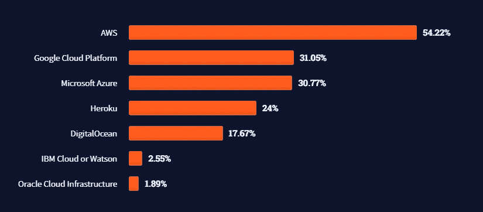
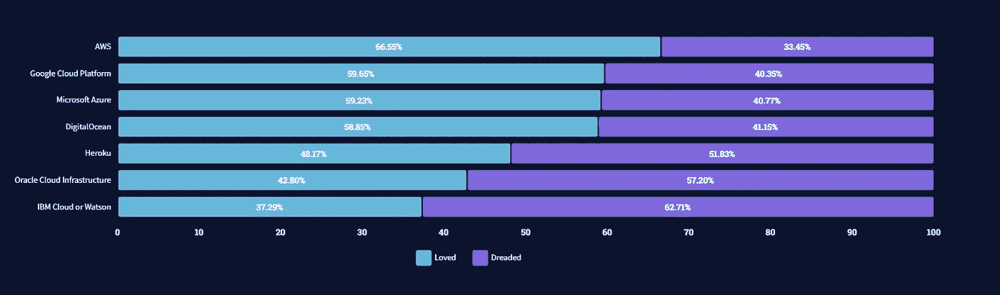
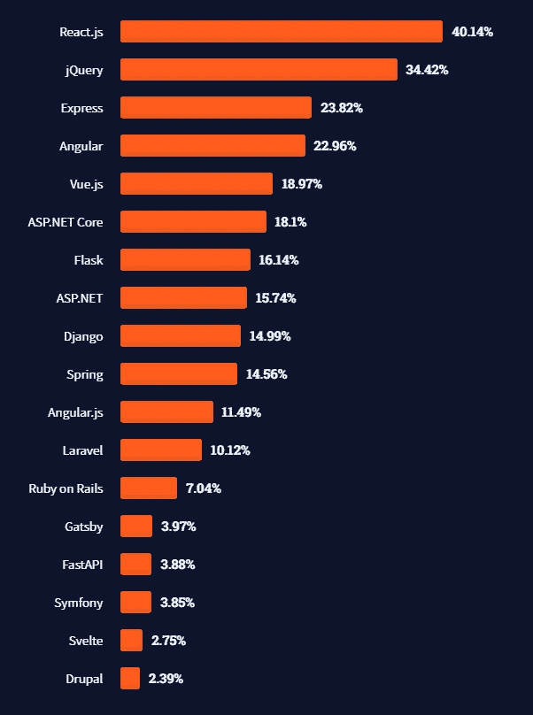
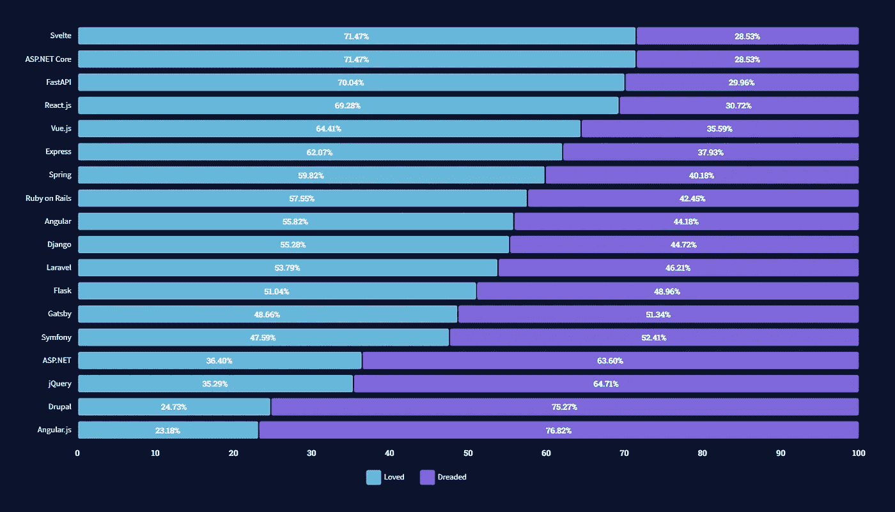

# 堆栈溢出开发者调查 2021

> 原文：<https://javascript.plainenglish.io/stack-overflow-developer-survey-2021-b5f6a1e8ca45?source=collection_archive---------5----------------------->

了解开发人员喜欢和讨厌的技术。

在这个故事中，你将看到堆栈溢出开发者调查 2021 的结果，并了解它们的含义。我们还将分析这些技术，并讨论你是否应该学习它们。

开始吧！

# 什么是栈溢出开发者调查？

开发人员调查是 Stack Overflow 的大规模调查，以了解开发人员使用什么技术，喜欢或讨厌什么技术，想要学习什么技术，他们的工作状态等等。

每年有超过 80，000 名开发人员参与这项调查，它帮助我们许多开发人员选择我们可能要考虑使用或放弃的技术。

这个故事将主要集中在 2021 年堆栈溢出开发者调查中最流行和最受欢迎/最令人恐惧的技术部分。

## 注意

如果你想了解更多关于其他类别或想自己看看结果，请随时访问他们的网站。

 [## 堆栈溢出开发者调查 2021

### 尽管工程经理、sre、DevOps 专家职位的薪酬最高，但我们发现他们的平均薪酬也超过…

insights.stackoverflow.com](https://insights.stackoverflow.com/survey/2021) 

# 编程语言

JavaScript 是最流行的语言。

哇，这是一个庞大的名单，不是吗？

如你所见，JavaScript 仍然是最常用的语言。其他流行的语言有 HTML/CSS、Python 和 Java。

但是，与 2020 年的调查相比，除 SQL 之外的前 5 种语言的受欢迎程度有所下降。

这主要是因为像 Elixir、Go 和 Rust 这样的语言越来越流行。我认为这是现代网络发展的未来。

## 喜爱和恐惧的语言

铁锈是最受喜爱的语言。

在这里你可以看到最喜爱和最恐惧的语言。正如你所看到的，大多数 Rust、Clojure、TypeScript、Elixir 和 Julia 开发人员对他们所做的事情感到满意，但 JavaScript、HTML/CSS、Java 和 C 开发人员却不满意。

这也意味着大多数讨厌自己工作的开发人员正在转向其他语言，比如 Elixir、Rust、Go 和 TypeScript。

## 结论

像 JavaScript 和 Python 这样的语言还是很受欢迎的，还会用一段时间。但是看到像 Elixir、Go 和 Rust 这样的语言越来越受欢迎，我肯定会建议考虑学习这三种语言中的一种。

像 Kotlin 和 Dart 这样主要用于移动开发的语言也越来越受欢迎。从 Java 转换到 Kotlin 或 Dart 的又一个原因。

随着科特林和达特的知名度越来越高，斯威夫特的知名度反而降低了。我不建议现在学习它。

# 最流行的数据库

MySQL 是最流行的数据库。

结果与之前的调查非常相似。唯一的主要区别是 MySQL 的受欢迎程度下降，而 PostgreSQL、MongoDB、MSSQL、Redis 和 Firebase 的受欢迎程度上升。

## 喜爱和害怕的数据库

Redis 是最受喜爱的数据库。

如你所见，人们正慢慢开始从 MySQL 转向 PostgreSQL、Redis 和 MongoDB。考虑学习这些数据库的又一个理由。

## 结论

即使 MySQL 仍然非常受欢迎，我认为像 PostgreSQL、SQLite 和 MongoDB 这样的数据库很快就会推翻它。

我会推荐至少学习 PostgreSQL 和 Redis。像 MSSQL、MongoDB、SQLite 和 Firebase 这样的数据库是可选的，但也非常有用。

# 最受欢迎的云平台

AWS 是最受欢迎的云平台。

其实没什么好说的。所有的云平台都很棒，我都推荐。结果与之前的调查非常相似。

## 既喜欢又害怕的云平台

AWS 是最受喜爱的云平台。

令人喜爱和恐惧的统计数据与云平台的流行程度没有什么不同，因此没有太多可谈的。

## 结论

在我看来，学习云平台并不难，我建议尝试所有的平台。

# 最流行的 web 框架

React.js 是最流行的 web 框架。

与 2020 年的调查不同，今年 React 推翻了 jQuery。其他框架仍然有类似的受欢迎程度。

游戏里还有一个新玩家，Svelte！与其他框架相比，Svelte 是一个相当新的框架，并且已经获得了相当多的欢迎。

苗条又闪亮了！ASP.NET 核心和 FastAPI 也很受欢迎。Angular 之所以在我看来没有 Svelte，React，Vue 那么受人喜爱，是因为它比较硬。开发者喜欢能够马上构建东西，哈哈。

## 结论

如果你是 JavaScript 开发人员，学习 React。去做吧。棱角分明，Vue 和苗条也很棒，是的。但是 React 已经成为了行业标准，你肯定应该知道。

其他语言的框架流行程度与前几年相似，所以如果你不是 JavaScript 开发人员，就坚持你正在做的事情，至少现在是这样。

## 注意

如果你想学习更多关于 JavaScript 框架的知识，一定要看看我写的关于它们的故事。

 [## 2021 年最佳前端 JavaScript 框架对比

### 哪个 JavaScript 框架最适合你？

javascript.plainenglish.io](/best-frontend-javascript-framework-96ecef9791fa) 

# 最后的想法

希望这个故事对你有帮助。总的来说，结果在预料之中。

由于这个故事或 Stack Overflow Developer Survey 2021，您决定学习任何新技术了吗？

如果是，请在评论中告诉我你决定学习哪种技术！

# 仅此而已。感谢您阅读这个故事！

如果你喜欢这个故事，一定要为它鼓掌！你想问我什么都可以。

在 Twitter 上关注我:

 [## re _ ally 边缘

twitter.com](https://twitter.com/Re_allyedge) 

在 Patreon 上支持我:

 [## 阿里木阿尔斯兰卡亚是创造编程故事和教程。帕特里翁

### 今天就成为阿里木阿尔斯兰卡亚的赞助人:在世界上最大的…

www.patreon.com](https://www.patreon.com/allyedge) 

*更多内容看*[***plain English . io***](http://plainenglish.io/)