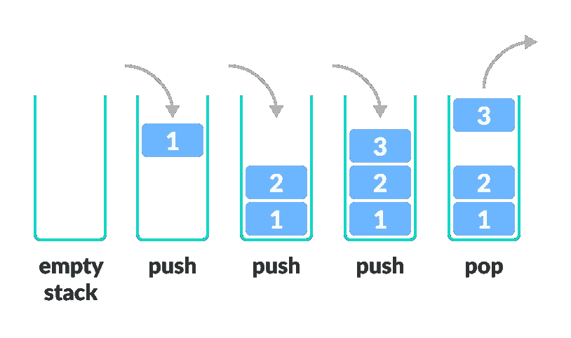
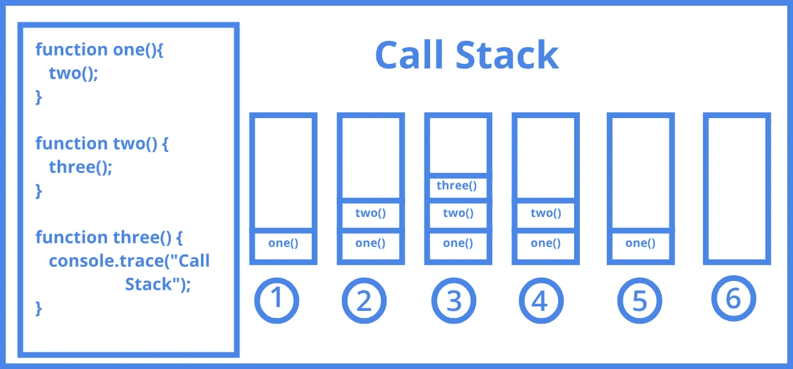

# 堆栈—目的、实施和应用

> 原文：<https://javascript.plainenglish.io/stacks-purposes-implementations-applications-2d9e2bc6f33b?source=collection_archive---------20----------------------->


Photo by [Brooke Lark](https://unsplash.com/@brookelark?utm_source=medium&utm_medium=referral) on [Unsplash](https://unsplash.com?utm_source=medium&utm_medium=referral)

成为一名伟大的开发人员的道路有时会非常坎坷。 [*栈溢出*](https://stackoverflow.com/) 可能是这个时代最受欢迎的网站和工具之一，几乎每个开发者每天至少引用一次，*如果不是更多*。这个名字来自计算机科学中使用的最重要和最常见的数据结构之一，一个*栈*。我们将回顾一下*堆栈溢出*实际上是什么，但是首先…

# 什么是堆栈？

与[链表](https://en.wikipedia.org/wiki/Linked_list)或[数组](https://en.wikipedia.org/wiki/Array_data_structure)相比，*栈*是一种线性数据结构，可以包含一组元素。作为一种具有有限容量的抽象数据类型，堆栈只是一种数据结构，允许以特定的顺序添加和删除元素。当添加一个元素时，它位于堆栈的顶部，唯一可以移除的元素是最后添加的元素，其位置在堆栈的最顶部。



Stack Push & Pop operations taken from [Programiz](https://www.programiz.com/dsa/stack)

想到这一点的一个简单方法是想象一个叠一个的板块。堆叠顶部的板是第一个被移除的板，放置在最底部位置的板将在堆叠中保留最长时间。这种行为被称为后进先出法(T21)或后进先出法。

## 常见操作

以下是在堆栈上执行的一些最常见的操作:

*   **Push:** 将一个项目添加到堆栈中——如果堆栈已满，会导致*堆栈溢出(不是网站)。*
*   **弹出:**从堆栈中删除一个项目——如果堆栈为空，将导致*堆栈下溢。*
*   **Peek 或 Top:** 返回栈顶元素。
*   **isEmpty:** 如果堆栈为空，则返回 true 否则，将返回 false。

# 用 JavaScript 实现

> 这里是一个使用数组的 JavaScript 实现 stack 的例子— *假设 stack 可以动态增长。*

Implementation of a Stack in JavaScript ES6 using an array.

# JavaScript 的调用堆栈

作为一名学习 JavaScript 的新开发人员，您将了解到该语言是单线程的，每个语句都是同步运行的。这意味着语言中的语句不能同时或并行执行。JavaScript 引擎基于单个 [*调用堆栈*](https://en.wikipedia.org/wiki/Call_stack) ，这是一个堆栈数据结构，基本上存储了关于任何给定 JavaScript 程序中的每个函数调用和语句的信息。

> 调用堆栈是一种解释器跟踪其在调用多个函数的脚本中的位置的机制——当前正在运行什么函数，以及从该函数中调用了什么函数。[1]



Call Stack visualization taken from [Medium](https://medium.com/swlh/in-depth-introduction-to-call-stack-in-javascript-a07b8513bcc3)

开发人员在使用 JavaScript 时，尤其是在发出 API 请求时，通常需要编写异步代码。例如，如果您正在编写一个使用外部 API 的应用程序，并且您正在请求同步下载一个图像，如果互联网速度慢或 API 关闭，程序将会冻结并且无法继续运行。当您同步请求数据时会发生这种情况，因为 JavaScript 会等待，直到请求完成且响应从 API 发回，然后再继续应用程序中的下一条语句。

使用 JavaScript ES6，有许多新的和旧的方法来编写异步代码。一个简单而伟大的异步 JavaScript 例子是`setTimeout()`。该方法利用浏览器的 Web API 来确保作为该方法的参数调用的代码将在给定的时间后运行。

```
//setTimeout([callback], milliseconds)function hello() {
    console.log('Hello world');
}setTimeout(hello, 5000);
console.log("This will output before: 'Hello World'");
```

在上面的块中，`setTimeout()`方法在 *5000 毫秒*后调用`hello()`函数。虽然`console.log()`是在`setTimeout()`方法被调用之后被调用的，但是 Web API 将回调作为第一个参数传递到`setTimeout()`方法中，并将其放入 ***回调队列*** 中，直到给定的时间(在本例中为 *5000 毫秒*)过去。

# JavaScript 的事件循环


JavaScript’s Event Loop taken from [loginradius](https://www.loginradius.com/blog/async/understanding-event-loop/)

以下是事件循环中每个元素的简要概述:

**堆栈(调用堆栈):**这是一个堆栈，所有的 JavaScript 代码在整个程序中被同步地推入其中。解释器读取代码，一旦执行完成，每个项目按时间顺序从堆栈中弹出。如果调用栈中的语句是异步的，比如`setTimeout(),`一个承诺，或者`ajax()`一个请求，回调函数将被推送到回调队列，这是另一个*栈，*它将在那里等待执行。

**堆(内存堆):**这是为整个程序中的任何变量、对象和函数分配内存的地方。

**回调队列:**来自调用栈中异步代码的回调会被推送到回调队列中，一直等到调用栈空闲。一旦调用栈被释放，来自异步函数的回调将被推回到调用栈，并且回调将作为正常的函数执行来执行。

**事件循环:**事件循环持续运行，一直检查调用栈中是否有函数调用，如果没有，会检查回调队列。如果回调队列不为空，它将弹出回调队列中的任何内容，并将其推入调用堆栈以便执行。

> [放大镜](http://latentflip.com/loupe/?code=JC5vbignYnV0dG9uJywgJ2NsaWNrJywgZnVuY3Rpb24gb25DbGljaygpIHsKICAgIHNldFRpbWVvdXQoZnVuY3Rpb24gdGltZXIoKSB7CiAgICAgICAgY29uc29sZS5sb2coJ1lvdSBjbGlja2VkIHRoZSBidXR0b24hJyk7ICAgIAogICAgfSwgMjAwMCk7Cn0pOwoKY29uc29sZS5sb2coIkhpISIpOwoKc2V0VGltZW91dChmdW5jdGlvbiB0aW1lb3V0KCkgewogICAgY29uc29sZS5sb2coIkNsaWNrIHRoZSBidXR0b24hIik7Cn0sIDUwMDApOwoKY29uc29sZS5sb2coIldlbGNvbWUgdG8gbG91cGUuIik7!!!PGJ1dHRvbj5DbGljayBtZSE8L2J1dHRvbj4%3D)是一个很棒的工具，可以帮助你可视化调用栈是如何排队的，以及事件循环和回调队列是如何工作的。

# 有用的应用

**内存管理—** 任何现代计算机都使用堆栈。计算机系统上运行的每个程序都有自己的内存分配。它被称为堆栈内存分配，因为分配发生在函数调用堆栈中。

一些*(但不是全部)*其他有用的应用包括:

*   重做-撤销特性(几乎在任何程序中)
*   浏览器历史记录
*   Web 浏览器中的向前和向后功能
*   回溯问题
*   字符串反转
*   [拓扑排序](https://www.geeksforgeeks.org/topological-sorting/) & [强连通分量](https://www.geeksforgeeks.org/strongly-connected-components/)

# 那么……是什么让栈如此特别呢？

堆栈模式本身！回想一下 **LIFO** *(后进先出)*，从堆栈中插入或移除元素的唯一方法，允许从顶部开始调整任何内容。在计算机科学中，我们在堆栈中存储对象，无论是数字、字符串、内存地址，甚至是其他数据结构；不胜枚举！

## **参考文献**

[1][https://developer . Mozilla . org/en-US/docs/Glossary/Call _ stack](https://developer.mozilla.org/en-US/docs/Glossary/Call_stack)

[](https://www.programiz.com/dsa/stack) [## 堆栈数据结构

### 堆栈是编程中一种有用的数据结构。就像一堆盘子叠放在一起。在这个…

www.programiz.com](https://www.programiz.com/dsa/stack) [](https://www.geeksforgeeks.org/stack-data-structure-introduction-program/#:~:text=Mainly%20the%20following%20three%20basic,an%20item%20in%20the%20stack.&text=Peek%20or%20Top%3A%20Returns%20top,stack%20is%20empty%2C%20else%20false) [## 堆栈数据结构(简介和程序)- GeeksforGeeks

### 堆栈是一种线性数据结构，它遵循操作执行的特定顺序。订单可能会…

www.geeksforgeeks.org](https://www.geeksforgeeks.org/stack-data-structure-introduction-program/#:~:text=Mainly%20the%20following%20three%20basic,an%20item%20in%20the%20stack.&text=Peek%20or%20Top%3A%20Returns%20top,stack%20is%20empty%2C%20else%20false) [](https://www.geeksforgeeks.org/implementation-stack-javascript/) [## JavaScript - GeeksforGeeks 中栈的实现

### 在本文中，我们将使用 Javascript 实现堆栈数据结构。栈是一个非常有用的数据结构和…

www.geeksforgeeks.org](https://www.geeksforgeeks.org/implementation-stack-javascript/) [](https://www.loginradius.com/blog/async/understanding-event-loop/) [## 理解 JavaScript 中的事件循环

### 我们经常听说 JavaScript 是单线程编程语言，这意味着它执行所有的…

www.loginradius.com](https://www.loginradius.com/blog/async/understanding-event-loop/)