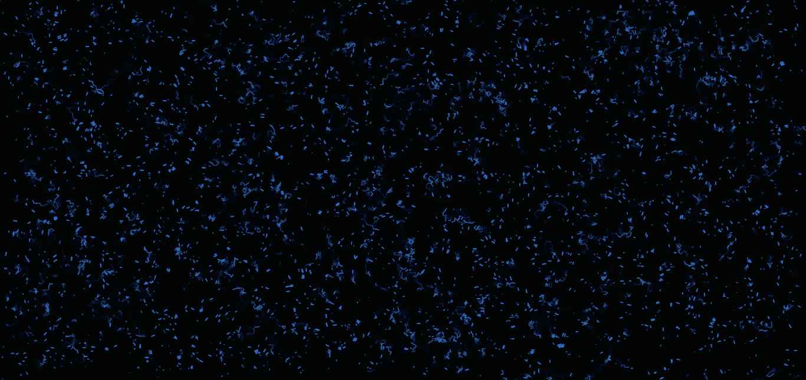
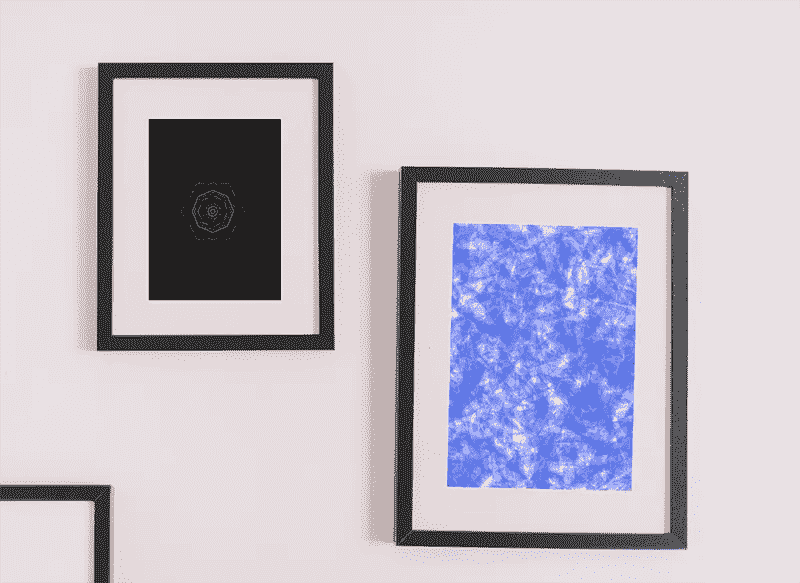

# 开始用 JavaScript 创作艺术

> 原文：<https://javascript.plainenglish.io/start-creating-art-with-javascript-261cb516402b?source=collection_archive---------11----------------------->

## 为热爱艺术的开发者介绍一个 JavaScript 库。



Art made with JavaScript

# **简介**

JavaScript 库 p5.js 使编码人员只需编码就能创造出奇妙的艺术。本文的目的是提供使用 p5.js 创作艺术的基本信息。该库允许我们将简单的儿童艺术制作成一系列高度精细的艺术。我将在本文中涵盖以下主题。

*   在本地环境中设置 p5.js
*   画一个椭圆
*   我的创意编码艺术作品集
*   制作复杂艺术的资源
*   通过编码制作艺术品的好处

## 在本地环境中设置 p5.js

最初，创建一个文件夹，如你所愿命名；在文件夹中，创建两个文件，index.html 和 sketch.js，复制下面的代码片段并粘贴到 index.html。

```
<html>
  <head>
    <script src="https://cdn.jsdelivr.net/npm/p5@1.2.0/lib/p5.js">
    </script>                        
    <script src="sketch.js"> </script>
  </head>
  <body>
    <main>
    </main>
  </body>
</html>
```

index.html 是我们程序的入口点，在这里我们加载了使用 p5.js 创建艺术的所有函数。本地制作的 JavaScript 文件 sketch.js 也需要打包。需要将下面附加的代码放入 sketch.js 中。

```
function setup() {
 createCanvas(400, 400);
}function draw() {
 background(120);
}
```

我们在方法 setup()上创建画布，因为它只在程序第一次加载时运行。draw()方法一直运行到程序结束，在那里我们定义想要在屏幕上呈现的代码。因此，我们在本地设置了一个 p5.js 环境。双击 index.html 可以看到你的背景是灰色的画布。

## **画椭圆**

在本文中，我选择了绘制椭圆作为一个部分，以提供用代码制作形状的基本思想。通过了解创建椭圆的公式，您可以制作其他形状。制作椭圆的语法如下。

```
ellipse(x, y, w, [h])
```

x:表示椭圆的 x 坐标
y:表示椭圆的 x 坐标
w:表示椭圆的宽度
h:表示椭圆的高度

```
function draw() {
 background(120);
 ellipse(50,50,80,80);
}
```

## 我的创意编码艺术作品集



Art I made using p5.js

我不是艺术家；我仍然可以用 p5.js 在框架内创建艺术。为了创建这样的艺术，你应该学习一些数学、随机性、柏林噪声等等。我花了大约一个月的时间来理解这个公式。我还用另一种有趣的方法制作了这篇文章的封面图片，这种方法叫做生成艺术(generative art)，我们写的算法会自己自动生成一些随机的艺术。

尽管如此，我在这个领域还是一个初学者；我的知识不足以教你如何制作那些错综复杂的艺术，仅凭一知半解，是无法传达事物的，所以我决定把我以前学习的资源全部分享出来。

## 制作复杂艺术的资源

我的第一个参考是 YouTube 上一个名为[的频道《编码列车](https://www.youtube.com/playlist?list=PLRqwX-V7Uu6Zy51Q-x9tMWIv9cueOFTFA)；在那里，一个很酷的家伙毫不费力地教 p5.js 从基础到我提到的所有高级主题，像随机性、柏林噪声等等。

看完他所有的播放列表后，进入 p5.js [参考页面](https://p5js.org/reference/)，你就可以在 p5.js 上获得所有可用功能的语法来开始你的艺术创作。

## 通过编码制作艺术品的好处

如果你不是艺术家，仍然热爱做艺术，那么用 p5.js 进行创意编码是更好的选择。制作艺术可以作为一种爱好，并通过出售艺术获得一些被动收入。像 Teespring 和 Redbubble 这样的网站允许我们出售墙壁艺术。我们需要将我们的设计上传到这些网站，我们将从每笔销售中获得版税。

用 p5.js 制作美术会增加你的解题技巧，因为颜色变换和排列形状都是由数学方程组成的。此外，你的生产力和创造力也会提高。