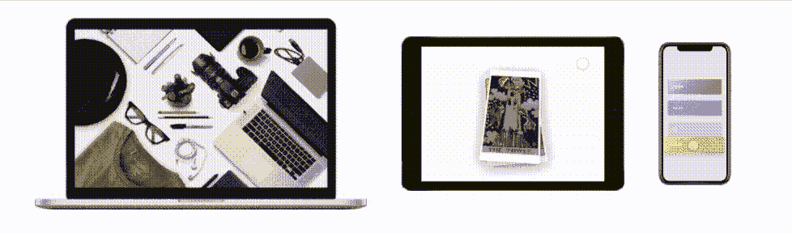
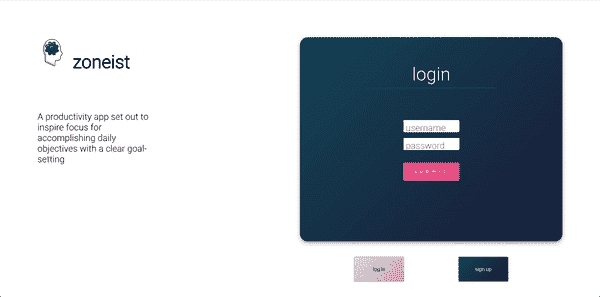

# 开始用 react-spring 实现动画

> 原文：<https://javascript.plainenglish.io/start-implementing-animations-with-react-spring-c871c5d877fc?source=collection_archive---------19----------------------->



demos from [react-spring.io](https://react-spring.io/)

当我年轻的时候浏览网页，我没有真正考虑或欣赏网站或网络应用程序中的动画，无论是页面上某个地方的组件转换还是一些悬停动画。

随着我对 web 开发了解的越来越多，我开始对它们着迷，尤其是在代码训练营期间参与的最初几个项目。我想把简单的动画应用到每一件小事上。我尝试了一些 JavaScript 动画库，最终在我的 react 项目中遇到了 [react-spring](https://react-spring.io/) 。从一开始，他们的登录页面就充满了您可以通过他们的库实现的一些可能性的演示。浏览图书馆的文献当然是一种享受。

这篇文章将主要传达我使用 react-spring 的经验，以及即使你是一个使用动画库的新手，如何快速地将库的钩子实现到你的项目中。为了更好地有效利用和学习 react-spring，我建议对 [React.js](https://reactjs.org/) 和 [React 钩子](https://reactjs.org/blog/2019/02/06/react-v16.8.0.html)有一个基本的了解。

# react-spring 入门

将 react-spring 添加到项目中最有效的方式是通过包管理器。使用应用程序根目录中的终端窗口，运行以下命令:

```
yarn add react-spring#ORnpm install react-spring
```

这将在您的项目中安装整个库，并且您现在可以访问以供以后使用。这个库非常庞大，所以我将只介绍一下`useSpring`的用法，它是一个比较简单的钩子，也是我个人在项目中经常使用的一个。

在您的项目中，在您想要应用动画的任何组件中获取导入。要做到这一点，只需在文件顶部编写以下 import 语句:

`import { useSpring, animated } from 'react-spring'`

然后你需要定义你的弹簧。`useSpring`将使价值观从一种状态变为另一种状态。将有一些保留的关键字，所以如果需要的话，请参考文件。

你可以用两种方式利用你的钩子。
首先是覆盖现有道具的值来改变动画像这样:

```
const styles = useSpring({ opacity: toggle ? 1 : 0 })
```

一旦你的组件重新渲染，动画将应用改变后的道具。

第二种方法是通过定义一个 updater 函数来使用 API 进行更新。

```
const [props, set, stop] = useSpring(() => ({opacity: 1}))
    // Update spring with new props
    set({opacity: toggle ? 1 : 0})
    // Stop animation
    stop()
```

这是为了让您可以获得一个 API 对象，这将提供更大的灵活性。虽然动画仍在执行，但它不会像上面的方法那样使组件渲染。

下面是来自我的一个项目的分享要点。

在这里，我将我的弹簧定义为一个名为 fadeIn 的变量。这将呈现来自上边距的任何元素。我现在可以利用这个淡入，只需将它分配给我希望制作动画的元素的 style 属性。您还需要将`animated.`添加到元素的开始和结束标记中，您将把它应用到。

```
<animated.div style={fadeIn}> //insert content</animated.div>
```

将这些定义的弹簧附加到一些元素上，您可以设置一些组件的平滑过渡。下面是一些利用我定义的淡入弹簧的组件的例子。



login page of my app [zoneist](https://github.com/matthewogtong/zoneist-frontend)

# 最后的想法

react-spring 最大的资产之一是它相对于其他动画库的性能优势。它将应用动画，而不必依赖 React 来逐帧渲染组件更新。并不是说永远不要使用任何其他的动画库，因为有一些也值得使用，比如 [threejs](https://threejs.org/) 或 [animejs](https://animejs.com/) 。我个人认为 react-spring 非常直观，如果你喜欢平滑的动画来使你的项目生动起来，我推荐使用它。

# 资源

[](https://react-spring.io/) [## 反作用弹簧

### react-spring 是一个基于 spring 物理学的动画库，应该涵盖了你的大部分 UI 相关的动画需求。它…

react-spring.io](https://react-spring.io/) 

*更多内容尽在*[*plain English . io*](http://plainenglish.io/)