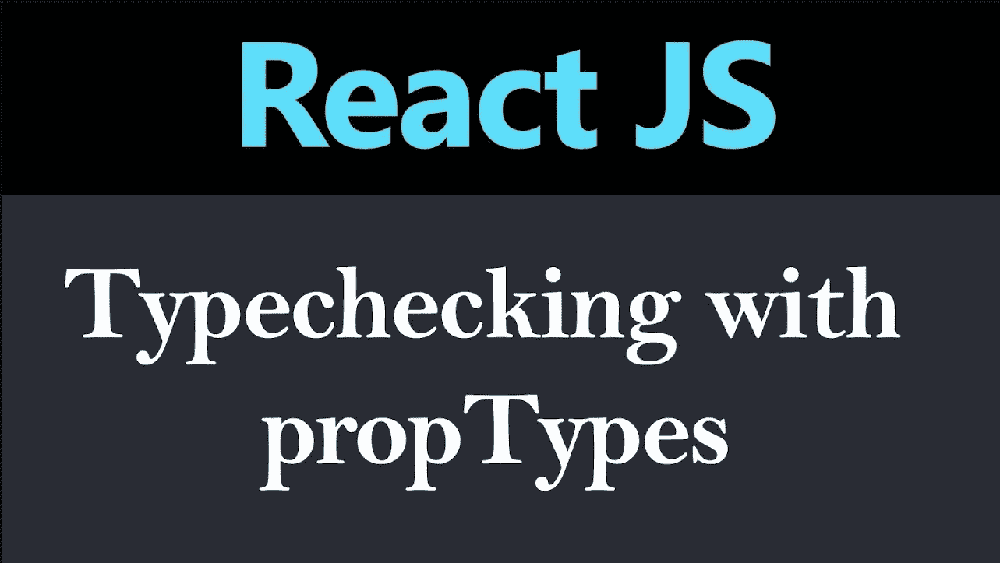
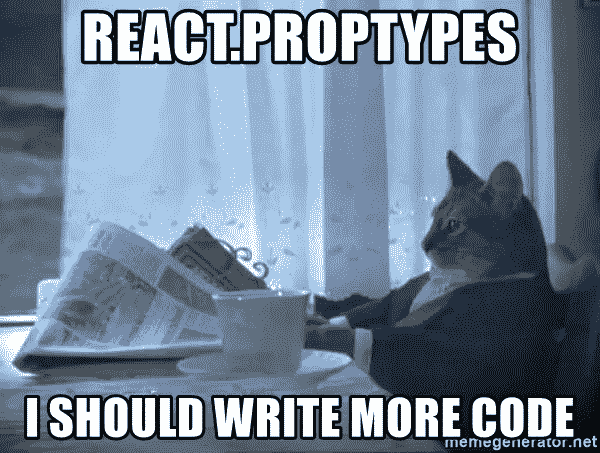
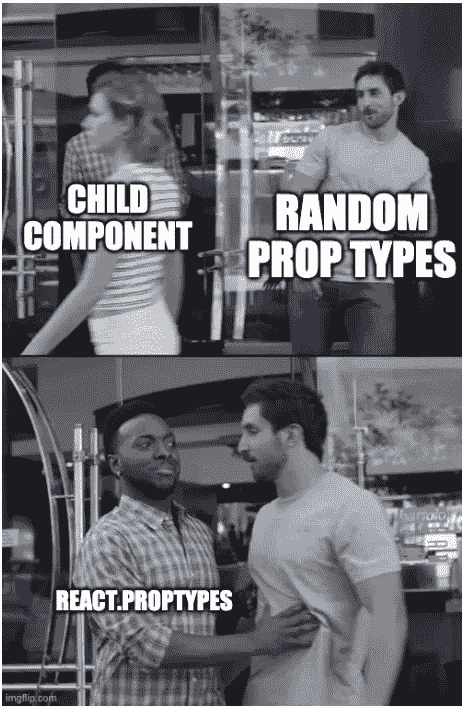

# 开始使用 React 属性类型

> 原文：<https://javascript.plainenglish.io/start-using-react-proptypes-676609f8069c?source=collection_archive---------16----------------------->

你们中的许多人可能没有使用 React prop 类型，但它们是一种很好的方式，可以在不使用 TypeScript 的情况下获得一些结构并简化传递到组件中的属性。

使用 prop 类型，您可以很容易地判断子组件期望的参数类型和数量，如果父组件没有以正确的格式传递这些参数，就会显示一个错误/警告。这些可以与类或功能组件一起使用，对于调试来说非常方便。

```
***Note*** *-: it will still let the code execute but this will be really helpful for developers to debug the issue and it will show an error in the console.*
```



## **设置**

它不再包含在 React 中，您可以通过 npm 安装它。

```
npm i prop-types
```

为了在组件内部使用它，只需导入并定义它。

```
import PropTypes from 'prop-types'function MyComponent({fName, lName, age}) {
  return `User ${fName} ${lName} will be ${age+5} years old in 5 years`}MyComponent.propTypes = {
  fName: PropTypes.string,
  lName: PropTypes.string,
  age: PropTypes.number
}
```

## **发放/使用**

假设在下面的示例中，父组件不是将年龄作为数字传递，而是将其作为字符串传递。现在在这种情况下，将不会有错误或警告，相反，它只会显示输出。

```
//**child component**
function DummyComponent ({fName, lName, age}) {
  return `User ${fName} ${lName} will be ${age+5} years old in 5 years`}
export default DummyComponent//**parent**
function App() {
  return (
    <div className="App">
      <header className="App-header">
        <DummyComponent fName="Sumeet" lName="Bhalla" age="30" />
      </header>
    </div>
  );
}//**OUTPUT**
User Sumeet Bhalla will be 305 years old in 5 years
//**instead of** 
User Sumeet Bhalla will be 35 years old in 5 years
```

使用类型检查肯定可以发现上述错误，但是如果您的组件是可重用的，并且第三方正在使用它，他们可能不知道要传递什么确切的类型，最终可能会出错。



这就是 prop 类型可以帮助揭示类型的错误和警告的地方。

```
//child component
import PropTypes from 'prop-types'function DummyComponent({fName, lName, age}) {
  return `User ${fName} ${lName} will be ${age+5} years old in 5 years`}DummyComponent.propTypes = {
  fName: PropTypes.string,
  lName: PropTypes.string,
  age: PropTypes.number
}
export default DummyComponent//parent
function App() {
  return (
    <div className="App">
      <header className="App-header">
        <DummyComponent fName="Sumeet" lName="Bhalla" age="30" />
      </header>
    </div>
  );
}
```

***输出***


因此，在这种情况下，用户将看到一个错误，指出 age prop 类型被传递了一个字符串而不是一个数字，以便最终用户可以纠正他的错误。

```
***Note*** *— if you do not pass a value defined in propTypes, it will not show you an error since by default all the values defined inside propTypes are optional.
If you want to make a prop mandatory you can add an isRequired property to the propType
e.g.*DummyComponent.propTypes = {
  fName: PropTypes.string.**isRequired**,
  lName: PropTypes.string,
  age: PropTypes.number.**isRequired**
}
```



## **其他道具类型**

```
PropTypes.**array**,// check if passed prop is an array
PropTypes.**bool**, // check if passed prop is a boolean
PropTypes.**func**, // check if passed prop is a function
PropTypes.**number**, // check if passed prop is a number
PropTypes.**object**, // check if passed prop is an object
PropTypes.**string**, // check if passed prop is s string
PropTypes.**symbol**, // check if passed prop is a [symbol](https://developer.mozilla.org/en-US/docs/Web/JavaScript/Reference/Global_Objects/Symbol)
```

这些是你也可以检查的其他基本道具类型。

## **高级道具类型**

所以除了上面提到的简单的原始道具类型，你还可以通过使用一些高级的 React 道具类型来使它变得更有趣。

对于以下所有示例，我已经在 DummyComponent 中定义了以下 propType，并且我将为每个示例更改 customProp 的 prop type。

```
DummyComponent.propTypes = {
  customProp: PropTypes.customProp
}
```

`- **PropTypes.node**`

你可以用它来检查道具类型是否是可渲染的

```
//**WORKS**
<DummyComponent customProp="30" />
<DummyComponent customProp={30} />
<DummyComponent customProp={[]} />
<DummyComponent customProp={[30]} />//**ERROR**
<DummyComponent customProp={{}} />
<DummyComponent customProp={{age:30}} />
```

`- **PropTypes.element**`

您可以使用它来检查传递的属性是否是 React 元素

```
//**WORKS**<DummyComponent customProp={<DummyComponent2/>} />//**ERROR**
<DummyComponent customProp="30" />
<DummyComponent customProp={30} />
<DummyComponent customProp={[]} />
<DummyComponent customProp={[30]} />
```

`- **PropTypes.elementType**`

检查基于组件名称传递的属性

```
//**WORKS** <DummyComponent customProp={DummyComponent} />//**ERROR**
<DummyComponent customProp="30" />
<DummyComponent customProp={30} />
<DummyComponent customProp={[]} />
<DummyComponent customProp={[30]} />
```

`- **PropTypes.any**`

它可以是任何值类型。一般来说，我们会在这里加上 *isRequired* ，但这不是强制的。

`- **PropTypes.oneOfType**`

如果属性的值可以是多种类型的值，则可以使用这种方法

```
DummyComponent.propTypes = {
  customProp: PropTypes.**oneOfType**([
    PropTypes.number,
    PropTypes.string,
    PropTypes.array
  ])
}//**WORKS** <DummyComponent customProp="30" />
<DummyComponent customProp={30} />
<DummyComponent customProp={[]} />
<DummyComponent customProp={[30]} />//**ERROR**
<DummyComponent customProp={false} />
<DummyComponent customProp={{}} />
```

`- **PropTypes.oneOf**`

这将检查传递的属性是否是这里定义的值之一，而不是检查类型之一。这非常像使用枚举。

```
DummyComponent.propTypes = {
  customProp: PropTypes.**oneOf**([
    "fetching",
    "loading",
    "done"
  ])
}//**WORKS** <DummyComponent customProp="fetching" />
<DummyComponent customProp="loading" />
<DummyComponent customProp="done" />//**ERROR** <DummyComponent customProp="rendering" />
<DummyComponent customProp="abcd" />
<DummyComponent customProp={false} />
<DummyComponent customProp={{}} />
```

`- **PropTypes.arrayOf**`

检查 props 是否是特定类型的数组

```
DummyComponent.propTypes = {
  customProp: PropTypes.**arrayOf**(PropTypes.string)
}//**WORKS** <DummyComponent customProp={["a", "b"]} />
<DummyComponent customProp={[]} />//**ERROR** <DummyComponent customProp="done" />
<DummyComponent customProp=[1,2] />
<DummyComponent customProp={false} />
<DummyComponent customProp={{}} />
```

***注意——你甚至可以将两个原型组合在一起***

```
DummyComponent.propTypes = {
  customProp: PropTypes.**arrayOf**(
    PropTypes.**oneOfType**([
      PropTypes.number,
      PropTypes.string
    ])
  )
}//**WORKS** <DummyComponent customProp={["a", "b"]} />
<DummyComponent customProp={["a", "b", 1, 2]} />
<DummyComponent customProp={[]} />
<DummyComponent customProp=[1,2] />//**ERROR** <DummyComponent customProp="done" />
<DummyComponent customProp={false} />
<DummyComponent customProp={{}} />
```

`- **PropTypes.shape**`

使用`**PropTypes.shape**`你可以定义道具中你期望的物体的结构。您甚至可以对它应用以前的属性来进一步限制它

```
DummyComponent.propTypes = {
  customProps: PropTypes.shape({
    fName: PropTypes.string,
    lName: PropTypes.string,
    age: PropTypes.number
  })
}//**WORKS** <DummyComponent customProps={{fName:"Sumeet", lName:"Bhalla", age:30}} /><DummyComponent customProps={{fName:"Sumeet", lName:"Bhalla", age:30, phoneNumber:"555555555", ssn:"123456"}} /><DummyComponent customProps={{fName:"Sumeet"}} />
<DummyComponent customProps={{}} />//**ERROR** <DummyComponent customProps={{fName:"Sumeet", lName:"Bhalla", age:"30"}} />
```

注意-如果您传递一个没有在 shape 内部定义的额外参数，它不会给你一个错误，因为 shape 只是定义了整个 shape，并没有限制用户只能使用那个 shape。如果希望精确，可以使用 next 属性

`- **PropTypes.exact**`

使用`**PropTypes.exact**`，你可以定义道具中你所期望的物体的精确结构。父级可以传递较少的参数而不出错，但是如果父级传递任何额外的参数，它将显示错误

```
DummyComponent.propTypes = {
  customProps: PropTypes.exact({
    fName: PropTypes.string,
    lName: PropTypes.string,
    age: PropTypes.number
  })
}//**WORKS** <DummyComponent customProps={{fName:"Sumeet", lName:"Bhalla", age:30}} />
<DummyComponent customProps={{fName:"Sumeet"}} />
<DummyComponent customProps={{}} />//**ERROR**<DummyComponent customProps={{fName:"Sumeet", lName:"Bhalla", age:30, phoneNumber:"555555555", ssn:"123456"}} />
<DummyComponent customProps={{fName:"Sumeet", lName:"Bhalla", age:"30"}} />
```

如前所示，您可以将 *isRequired* 或任何其他 proptypes 与 shape and exact 结合起来，使其成为传递的 props 的更精确的结构。


*更多内容请看*[***plain English . io***](http://plainenglish.io/)