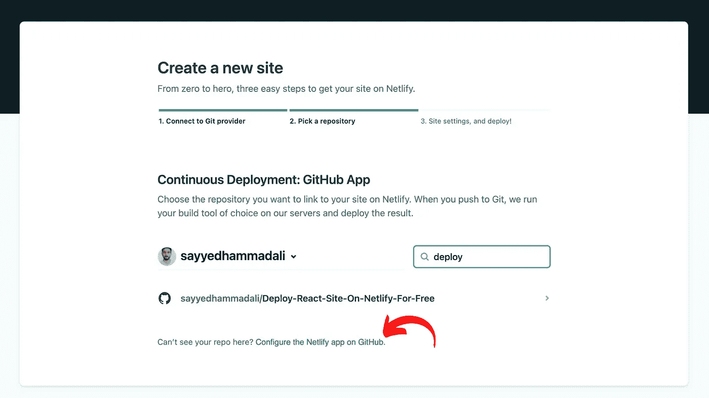

# 启动你的秒表！免费在不到 5 分钟的时间内部署 React 站点。

> 原文：<https://javascript.plainenglish.io/start-your-stopwatch-deploy-a-react-site-in-less-than-5-minutes-for-free-62b3f014255b?source=collection_archive---------14----------------------->

在本文中，我将向您展示如何在不到 5 分钟的时间内部署一个 [React](https://reactjs.org/) 站点。以及如何在[网上免费部署 React 网站。](https://www.netlify.com/)

# 如何在 5 分钟内部署一个 React 站点？

我将使用 [**GitHub**](https://github.com/) 和 [**Netlify**](https://www.netlify.com/) 使之成为可能。

Deploy React Site in Less Than 5 Minutes for FREE ([https://boring-tesla-b30e0f.netlify.app/](https://boring-tesla-b30e0f.netlify.app/))

> 为了在 5 分钟内部署 React 站点，我假设您已经有了一个工作的 React 站点，并且您的代码被推送到 GitHub 存储库。如果没有，请注册 [GitHub](https://github.com/) ，创建一个新的库，并将您的工作 React 站点代码推送到新创建的 GitHub 库。然后再回到这篇文章。

# **别忘了启动你的秒表(设置 5 分钟倒计时)**。

Start 5 Minutes Stopwatch To Deploy React Site For Free

# 我们开始吧

> 对于本文，我将使用我个人的 React GitHub 存储库在 Netlify 上进行部署。以下是我的存储库的链接:
> 
> [https://github . com/sayyedhammadali/Deploy-React-Site-On-net lify-Free](https://github.com/sayyedhammadali/Deploy-React-Site-On-Netlify-For-Free)

# **第一步:**

到 [Netlify](https://www.netlify.com/) 网站和 [**注册**](https://app.netlify.com/signup) 创建一个账户。我通过 GitHub 注册是为了让事情变得更快。

# **第二步:**

输入您的 GitHub 凭证，然后点击**授权网络生活**。

Authorize Netlify with Github

# **第三步:**

现在，在 Netlify 上成功创建帐户后，我们将从 Git 中点击**新站点。**

Create new site using git

# **第四步:**

选择 **GitHub** 上传你的 React 站点代码。正如我在文章开头提到的，我们需要在 GitHub 上有工作的 React 代码。您也可以选择其他选项，如 GitLab 或 Bitbucket，但对于本文，我使用的是 GitHub。

Select github to depoloy react site

# **第五步:**

现在点击**授权 Netlify** 让 Netlify 访问 GitHub 代码库。您可以选择选项来访问特定的存储库或所有的 GitHub 存储库。

Authorize Netlify to access react code from GitHub

# 第六步:

如果您在列表中看到所有的存储库，那么选择您想要部署的存储库。在我的例子中，我将选择[我的 React 代码库](https://github.com/sayyedhammadali/Deploy-React-Site-On-Netlify-For-Free)，这是我在本文前面提到的。

Select GitHub Repository to Deploy

**注意:**如果你没有看到所有的库，通过点击链接**在 GitHub 上配置 Netlify app**来配置 GitHub 显示所有的库(看下图)。

Set GitHub repository configs for Netlify Link

确保选项 **All repositories** 被**选中**并且**被保存**(看下图)。

GitHub configs to give access to all repositories by Netlify

# 斗牛中的最后一剑

现在，您可以在 Netlify 上看到 React 现场部署，不到 5 分钟完全免费。我希望你的秒表还有足够的时间。单击**部署站点**(其他设置保持不变，但可以根据您的需要进行更改)，然后等待 Netlify 部署过程完成。可能需要几分钟。我没有将这个时间包括在我们的 React 站点部署时间中。

Deploy Site on Netlify

# **搞定！请现在停止你的秒表。**

等等… Netlify 正在部署你的 React 站点，耐心点。这就是正在进行的 Netlify 部署过程中您的屏幕应该显示的样子。

Netlify Deploying Site In Process Screen

单击自动生成的 Netilfy 站点链接访问您的站点。我的情况是:[https://boring-tesla-b30e0f.netlify.app/](https://boring-tesla-b30e0f.netlify.app/)

Netlify Successfully Deployed Site Link

> 要查看**现场** [**点击此处**](https://boring-tesla-b30e0f.netlify.app/) 并获取我的**项目代码** [**点击此处**](https://github.com/sayyedhammadali/Deploy-React-Site-On-Netlify-For-Free) 。
> 
> 您不仅可以使用 Netlify 部署 React 站点，还可以部署任何其他静态站点。您也可以在这里设置自定义域，只需点击几下鼠标。如果你喜欢这篇文章，请留下一些掌声，这将激励我在未来写更多的内容。如果你有兴趣阅读更多的 React 文章，也可以看看我的其他文章。未来请关注我以获取更多内容。

# 关于作者

我在 [Lucid 担任全栈开发人员。工作室](https://medium.com/u/cb727ce3b3c0?source=post_page-----4ef4ecbdcc1b--------------------------------)我非常有兴趣学习并与社区分享我的知识。如果你喜欢我的工作，请随时在 LinkedIn 上联系我:Sayyed Hammad Ali 。

*更多内容看*[***plain English . io***](http://plainenglish.io/)