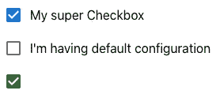

# React 中的状态管理介绍

> 原文：<https://javascript.plainenglish.io/state-management-in-react-48d16d162442?source=collection_archive---------7----------------------->

## React 中的状态管理概述，并确定状态管理是否完全必要。

[Photo](https://unsplash.com/photos/gNMVpAPe3PE) by Mourizal Zativa

*这篇文章是关于 React 中的状态管理。它由三章组成，回答了以下问题:什么是状态管理？国家管理解决哪些问题？解决方案和最佳实践是什么？本文不仅概述了 React 中的状态管理，还提供了是否需要状态管理的决策基础。*

🇩🇪版本你可以在这篇[博文](https://blog.codecentric.de/2021/12/state-management-in-react/)中找到。

状态管理是一个非常复杂的话题。所有前端开发人员都知道这一点。他们问自己，在组件之间共享和管理状态的最佳方法是什么。

不仅有许多外部状态管理库(比如最流行的 Redux 和 Mobx ),而且 React 已经内置了状态管理。这使得做决定更加困难。

在决定哪种状态管理方法最适合您之前，您应该问自己以下几个问题:

1.  我甚至需要状态管理吗？
2.  *哪种解决方案最适合我的使用案例？*
3.  *当我的应用程序变得更大更复杂时，我如何扩展和维护已实现的解决方案？*
4.  *如何测试状态管理？**

本文回答问题 1-3。我将回答问题 4 " *如何测试状态管理？"*下一篇。

# 1.我需要国家管理吗？

不幸的是，这个问题没有简单的答案。这取决于您的应用程序的规模和复杂程度，以及您使用 React 的经验。

“伟大的埃瓦，现在我更加困惑，仍然不知道我是否甚至需要一个国家管理”。

如果你的应用程序不是太大太复杂，而是很小很简单，你不必让它变得不必要的复杂。对于许多用例，您根本不需要任何状态管理库。

此外，如果你是一个初学者，开始学习 React，你不应该在开始时使用任何复杂的库。

重要的是，你从一开始就已经知道如何反应。

*   您的组件应该一次只负责一项任务。它们越大，测试起来就越复杂和困难。你可以把它们想象成乐高积木。
*   你应该知道*状态*和*道具的区别。*

这里我简单给大家解释一下*状态*和*道具的区别和相同之处。*

## **状态和道具**

*状态*和*道具*有什么共同点？它们是**确定性的**并且**一旦改变**就触发渲染更新**。*确定性*** 意思是如果你的组件对相同的状态和道具组合产生不同的输出，说明你做错了。

什么是**状态**？我们以复选框为例。复选框有两种状态- *真*和*假。*如果用户选中复选框，其状态将会改变。这种状态被称为*状态*。

以下是与**状态**相关的最重要的亮点:

*   用户事件经常会改变状态
*   国家是私有的。只有具有状态的组件才能改变它
*   状态有一个初始默认值

什么是**道具**？你可以把道具想象成一种配置。道具由父组件提供。让我们以前面的例子，一个复选框:它可以是可配置的，例如，它可以有一个名称或颜色。这些是道具。道具有 ***不可变*** 。这意味着组件不能改变它。

在这个 [React 指南](https://github.com/uberVU/react-guide/blob/master/props-vs-state.md#changing-props-and-state)里，你可以找到一个非常好甚至更详细的总结。

让我们分析下面的例子，在这里你可以看到 s *状态*和*道具*之间的区别:

您可以使用如下属性定义复选框的不同变体:

这是它呈现的样子:

Different configurations of a checkbox

你可能想知道为什么我解释并提到了道具和状态。在一些用例中，你只能使用道具和状态来代替状态管理。如果父子关系中有两个组件，这是有意义的。因此，这些组成部分非常相互依赖。所以你可以很好地封装一切。

如果直接子组件不需要数据，而只需要孙组件，就不应该使用 props。否则，组件只需转发道具，即使它们不需要也不应该知道任何关于它们的信息。这可能导致正确钻井。我将在下一章解释什么是道具训练。

也没有必要全局保存内部组件状态。如果父组件需要子组件状态已经改变的信息，你可以传递一个回调函数(例如 *TabIndexChange* )给父组件作为道具。

# 2.*哪个解决方案最适合我的用例*？

在这一章中，我解释了两种状态管理解决方案:Redux 和 useContext。我描述了每个解决方案解决了哪些问题，以及在每种情况下如何处理异步操作。我还解释了什么是道具钻井的意思。我们从 Redux 开始。

## **Redux**

我假设您熟悉 Redux 的概念。如果没有，你应该先了解一下它的[基本原理](https://redux.js.org/understanding/thinking-in-redux/three-principles)和[概念](https://redux.js.org/introduction/core-concepts)。

Redux 有助于减少**支柱钻孔。**

**Prop drilling** 发生在几个但不是所有组件(在组件树中)需要相同的信息时，例如 UI 主题、用户名或响应状态(加载/错误/成功)。问题是大的 props 对象被传递到组件树的其他部分。结果很多组件只是转发道具，根本不需要数据。它使得:

*   **代码更难理解** -最迟在应用程序变大时
*   **应用程序的扩展、重构和测试**更加困难。假设您有一个对象，您将它传递给许多组件:*{ username:string；名字:字符串；lastName:字符串；}.*现在有一个新的领域*年龄。*在这种情况下，您必须调整所有受影响的组件和测试。

React 文档建议将共享状态提升到下一个公共父组件:

> 通常，几个组件需要反映相同的变化数据。我们建议将共享状态提升到它们最近的共同祖先[1]。

“嗯，Ewa，我已经知道什么是道具钻探，这也是我们决定为我们的项目选择 Redux 的原因。Redux 需要大量样板代码。那有什么好处呢？”

这是正确的。因此，在下文中，我将描述 React 概念**use context**&**useReducer**作为状态管理解决方案。但是在我们进入那个部分之前，先说几句关于**Redux**Toolkit 的话。也许这对你来说是个不错的选择。

Redux 团队意识到了所有这些问题，比如样板代码和 Redux 的复杂使用。这就是他们试图简化 Redux 概念的原因。这个新概念叫做 **Redux Toolkit** ，根据 Redux 文档，这是编写 Redux 逻辑的新的推荐方法。

## **Redux 工具包:**

*   非常灵活
*   有助于避免最常见的错误
*   包含最佳实践
*   加速开发并简化 Redux 的使用
*   很容易测试

让我们看看下面的例子，你可以看到，你如何使用 redux 工具包从 Redux 状态定义一个分数:

如果你了解 Redux，你可能已经注意到代码更简单，更容易理解。现在只有 Redux 状态的一小部分，称为*片*，而不是动作和 reducers 的两个文件。reducers 的实现不太复杂，因为在幕后 *Immer 库*负责不可变的状态更新。

在 [Redux Toolkit 文档](https://redux-toolkit.js.org/usage/immer-reducers)中，你可以读到更多关于 *Immer 库*的内容。

发送动作和使用选择器也非常简单:

您一定想知道当发送一个像上面例子中的 *fetchUser* 这样的异步动作时会发生什么。如何发送请求、等待响应并最终相应地更新存储呢？理想情况下:处理错误，记录一些东西，向用户显示一个加载微调器，等等。您肯定不希望在每个组件中重复相同的事情(加载微调器、成功通知、错误处理……)。

你如何解决这个问题？答案是:“中间件来拯救！”

有了中间件，你可以拦截每一个发送的动作，进行修改，甚至取消动作。中间件有助于:

*   记录
*   错误处理
*   异步请求
*   还有更多…

最喜欢 [redux saga](https://redux-saga.js.org/) 。下面是一个如何发送异步请求和更新状态的例子。在 Saga 中，你可以做更多的事情，例如，将用户重定向到另一个页面。

## 使用上下文& useReducer

不过 Redux 说够了！如上所述，React 还提供了自己的实现状态管理的解决方案——不需要任何外部库，比如 Redux (Toolkit)。这个解决方案被称为*上下文*。

上下文在一组需要相同数据的组件之间共享数据。这意味着不需要手动将道具传递到每个树级。可以分组的数据例如是 UI 主题或登录用户。

**使用上下文&用户删除模式:**

*   没有额外的库，一切都基于 React
*   非常灵活，但是您必须自己实现一些模式(参见下面的例子)

让我们来看看这个例子:

这是定义上下文的方式。它非常类似于 Redux:您定义状态、reducers 和动作。

下面是一个非常简单的例子，说明如何使用*分派*和*状态*:

如果您按下“保存用户”按钮，会发送一个操作，然后用户名会被更新。

你必须记住只在提供者内部使用 *useUserDetails* 。正如你在这里看到的，子组件*用户表单*和*用户头像*不再需要道具。

“好吧，我明白这个模式了。我如何发送异步动作？有没有类似 Redux-Saga 的东西？”

可惜没有。但是你可以使用所谓的帮助函数。Kent C. Dodds 提出了一个解决此类问题的好模式，并在他的文章[中进行了解释。](https://kentcdodds.com/blog/how-to-use-react-context-effectively#what-about-async-actions)

# 3.当我的应用程序变得更大更复杂时，我如何扩展和维护实现的解决方案？

有了这三个基本规则，您可以灵活地扩展和维护您的应用程序:

**不要保存店内所有物品！**

如果只在父代和子代之间分发数据，则不应将它们保存在存储中。在这种情况下，如果只使用道具和内部组件状态就足够了。

**定义状态更通用！**

假设您的应用程序中有不同类型的模态或通知，例如 *ConfirmationModal* 、 *ReportProblemModal、*或 *UserFormModal* 。这些情态动词属于不同的特征。但是，您可以将所有必要的模态字段存储在一个通用的*模态*特征(切片)中，而不是重复并保存每个特征的模态状态。那会节省你很多时间。

这里您可以看到一个反模式。对于每个特性，模态的代码不必重复。这同样适用于测试:在这种情况下，您需要多次测试相同的功能(modalOpen)。

相反，您可以简化代码，使其更加通用。这同样适用于通知、错误和其他对话框。

**完善组件树的结构！**

在使用 Context 或 Redux 之前，你应该首先考虑**复合组件**是否能解决你的问题。

如果有两个高度依赖的组件(父组件和子组件)，可以使用**复合组件**。例如，这可以是下拉菜单或菜单列表:

*菜单列表*是*菜单项*的容器。这两个组件高度依赖于彼此。使用*菜单列表*而没有*菜单项目*是没有意义的，反之亦然。*菜单列表*有一个内部状态( *isOpen* )，也知道选择了哪个选项(*菜单项目* ) )。

如果您想了解更多关于复合组件的知识，您可以阅读 Kent C. Dodds 的这篇非常好的文章。

在这篇文章中，我提出并回答了三个关于国家管理的问题。在选择状态管理解决方案之前，您应该首先问自己是否需要状态管理。这取决于您的应用程序的规模和复杂程度，以及您使用 React 的经验。有时候只有道具和状态就够了。

如果您决定支持状态管理，您可以使用内置的 React 解决方案(上下文)或者选择一个外部库(例如 Redux Toolkit)。

尽管如此，您也应该遵循最佳实践:

*   如果可能，不要保存商店中的所有内容并定义状态 generic！
*   尝试改进组件树的结构，例如，如果可能的话，使用复合组件！

希望我的文章对你有帮助，回答了你的问题。我会很高兴你的反馈。

# 来源

1.  [React 文档](https://reactjs.org/docs/lifting-state-up.html)

*更多内容看* [*说白了。报名参加我们的*](http://plainenglish.io/) [*免费周报*](http://newsletter.plainenglish.io/) *。在我们的* [*社区*](https://discord.gg/GtDtUAvyhW) *获得独家写作机会和建议。*