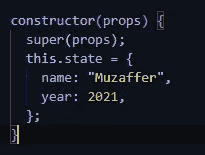
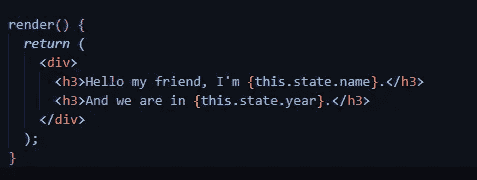
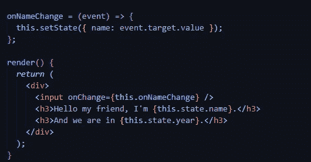
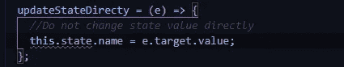
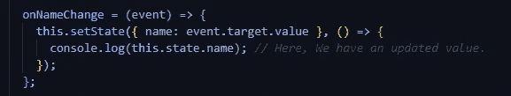
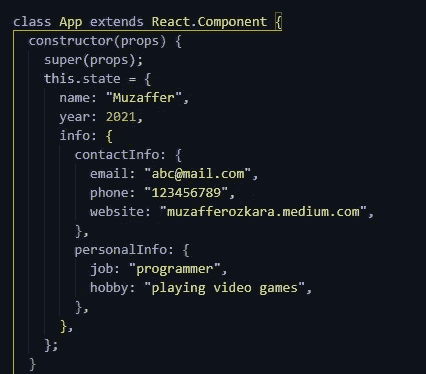
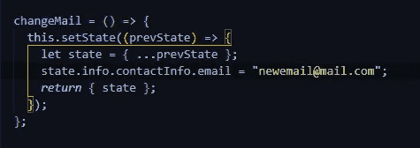
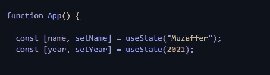
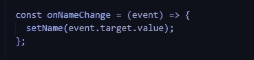
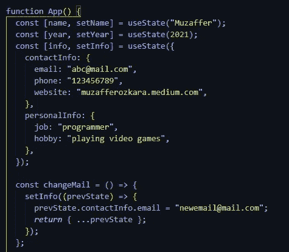

# React 中的状态管理介绍

> 原文：<https://javascript.plainenglish.io/state-management-in-react-e2c001815669?source=collection_archive---------9----------------------->

Photo by [Joshua Woroniecki](https://unsplash.com/@joshua_j_woroniecki?utm_source=medium&utm_medium=referral) on [Unsplash](https://unsplash.com?utm_source=medium&utm_medium=referral)

状态管理是 React 中最重要的主题之一，今天我们将在类组件和功能组件中使用状态。在此之前，我们先来学习一下什么是状态。

状态是一个 JavaScript 对象。它存储数据，对该数据的任何更改都将再次重新呈现页面。为什么这很重要？因为我们总是希望显示我们数据的最新版本，而有了 state，我们就能做到这一点。

## **类组件中的状态管理**

当使用状态时，我们要做的第一件事是创建对象。通常，状态是在类的构造函数中创建的。

接下来，让我们在 state 中定义一些数据，并在页面上显示它们。

我在我的州定义了姓名和年份。如您所见，名称是一个字符串，年份是一个数字。现在我们已经创建了我们的状态，我们可以显示它。

如果我们想在 HTML 中显示状态变量，我们用花括号把它括起来，如下所示。

我们的名称和年份值是静态的。但是在现实世界的项目中，我们通常不会这样使用它。状态值通常随着用户输入而改变。

为了调整用户输入状态的变化，我们使用 **setState()** 。

在使用 setState()时，有一些规则是我们应该注意的。其中一些如下:

*   不要直接更改状态值。React 给了我们一个巨大的能力来再现状态的可能性。如果我们直接改变一个状态值，不可避免的会遇到渲染问题。

*   您在状态中所做的更改可能是异步的。所以，在你改变状态值之后，如果你必须使用一个更新的值，使用一个回调函数。

*   如果您的状态中有嵌套对象，并且想要更改其中的特定值，请先复制上一个状态对象，然后更改想要更新的值。这样，您不会丢失任何未更新的值。

假设我们有一个如下所示的状态:

如果我们只想更新联系人信息中的电子邮件信息，我们应该这样更新它:

## **功能组件中的状态管理**

在功能组件中，我们对状态的定义和使用略有不同。我们必须使用 **useState()** 钩子来使用状态。

**useState()** 是一个将状态的初始值作为参数的函数。并返回包含两项的数组。第一项是状态的值，第二项是更新状态值的函数。如果我们想用用户输入改变状态值，我们可以这样改变它:

此外，我们可以更改嵌套对象的特定值，如下所示。

今天，我试图解释我们如何在 React 中管理类组件和功能组件的状态。我希望我的帖子对某人有所帮助。

我希望你有美好的一天。

参考资料:

 [## 状态和生命周期-反应

### 本页介绍了 React 组件中状态和生命周期的概念。你可以找到详细的组件 API…

reactjs.org](https://reactjs.org/docs/state-and-lifecycle.html)  [## 如何用 React 组件上的钩子管理状态| DigitalOcean

### React 钩子是 React 前端 JavaScript 库中的一组广泛的工具，当一个…

www.digitalocean.com](https://www.digitalocean.com/community/tutorials/how-to-manage-state-with-hooks-on-react-components) 

*更多内容看*[***plain English . io***](http://plainenglish.io/)