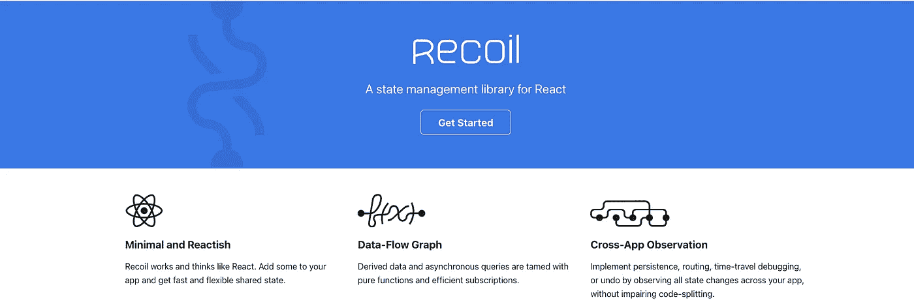

# 反冲反应中的状态管理

> 原文：<https://javascript.plainenglish.io/state-management-in-react-with-recoil-984cfc1fcd63?source=collection_archive---------4----------------------->

## 它会取代 Redux 吗？让我们看看！

Photo by [Tembela Bohle](https://www.pexels.com/@tbphotography?utm_content=attributionCopyText&utm_medium=referral&utm_source=pexels) from [Pexels](https://www.pexels.com/photo/grayscale-photography-of-assorted-apparels-on-shelf-rack-1884581/?utm_content=attributionCopyText&utm_medium=referral&utm_source=pexels)

状态管理是我们现代 web 应用程序的一个重要部分。从“反应”开始，人们就感觉到需要一个全球性的国家管理者。

然后 Redux 出现在照片中并赢得了它。它已经成为大多数大规模应用的状态管理解决方案。

但是 redux 远非完美。最近，redux 的受欢迎程度似乎在下降。许多新玩家加入了国家管理的**游戏**和**反冲**就是其中之一。

# 那么反冲是什么呢？

简单地说，反冲是 reaction 的另一种状态管理解决方案。推出反冲式安全气囊后，反应团体已经跳了起来。它以非常快的速度越来越受欢迎。

它由脸书的一个团队维护(他们也是 reaction 的维护者)。

Recoil Official Website

尽管请记住反冲是**而不是官方的状态管理库**用于反应。

# 你为什么关心？

反冲相对于其他州管理图书馆有一些明显的好处

*   它的样板文件**比**少(与 redux 相反)
*   **易学易懂(与 redux 相反)**
*   易于理解**数据流**(与 redux 相反)
*   更符合**现代反应**(支持并发模式)
*   出色的开发经验
*   性能不是问题

这里有很多承诺。但是这个图书馆真的有那么好吗？让我们浏览一下图书馆本身，找到答案吧！

# 反冲的主要概念

任何国家管理图书馆主要有 **3 个目的**

1.  创建状态
2.  从状态读取数据
3.  更新状态

## 1.创建国家

你可以用两个东西在反冲中创建一个商店。

*   原子
*   选择器

让我们看看如何使用它们。

## 1a .原子

根据[文件](https://recoiljs.org/docs/basic-tutorial/atoms)

> 原子包含我们应用状态的真理之源

简单地说，原子是一段你想存储在状态中的数据。它可以是应用程序的主题或待办事项列表。

如果您希望数据的某一部分被全局存储和访问，您必须为此创建一个原子。

## **1b。选择器**

按做[文件](https://recoiljs.org/docs/basic-tutorial/selectors)

> 选择器表示一段派生状态

这意味着如果

*   你想从其他州得到一些数据
*   或者想根据储存在原子中的数据来计算一些东西

您可以为此使用选择器。例如，您将 todos 保存在`todoListState`原子中。现在你要根据他们的状态过滤`todoList`。您可以为此使用选择器。

## 2.读取数值

反冲为我们提供了一些很好的钩子。其中一个是`useRecoilValue`，可用于从**原子**或**选择器**读取数据。

## 3.更新这些值

反冲的一个好处是它更`**Reactish**` **。**

我们已经把`useState`钩在反应堆里了。反冲为我们提供了一个类似的钩子，名为`useRecoilState`。它可以用来设置原子或选择器的状态。

还有一些其他实用程序可以在不同的情况下帮助您。你可以看一下[文档](https://recoiljs.org/docs/introduction/installation)

# 会取代 Redux 吗？

简短的回答是… **不**！让我解释一下

## 反冲不是解决所有问题的方法

反冲是为了解决一个非常具体的问题。如果你有很多很多相互依赖的组件，那么它可以帮助你提高性能。

另一方面，redux 更通用。甚至不具体到**反应**。

## 后坐力很大

如果你去**[**NPM**](https://www.npmjs.com/)**你可以看到这些包裹的大小。****

****反冲=**1.56 MB**
redux+react-redux =**448 Kb******

****所以后坐力明显比 Redux 大。在许多情况下，尤其是在束尺寸很重要的情况下，这成为一个重要的问题。****

## ****反冲还没有准备好…还没有****

****与 redux 相比，后坐力是相当新的。正在积极开发中。但是你可以预期在这个过程中会有很多意想不到的打嗝！它还没有被认为是生产就绪。****

****但是 Redux 是一个成熟的库，有许多其他库支持它。此外，它更加稳定，并得到了社区的大力支持。****

## ****Redux 越来越好****

****大多数问题都与 Redux 的冗长有关。redux 工具包的引入也解决了这个问题(差不多:p)。****

****并且在社区的大力支持和积极开发下，会一天比一天好。****

## ****许多大型项目已经在使用 Redux****

****Redux 哪儿也不去。至少在未来 2-3 年内不会。许多大型项目已经在使用 redux 运行，很难在一夜之间改变架构。****

****所以，如果你想找一份工作，Redux 在你的简历上会更受欢迎！****

## ****反冲没有中间件支持****

****目前，反冲不支持中间件。也许将来会到来。但是我认为你应该在收养之前考虑这个。****

# ****那么应该学习后座力吗？****

****绝对是！****

****它引入了一些有趣的新概念。也许可以尝试一下这个有趣的小项目。玩吧。知道什么时候有用。如果你的项目需要它，那就使用它。****

****最重要的是，继续学习！祝你有愉快的一天！****

******有话要说吗？通过** [**领英**](https://www.linkedin.com/in/56faisal/) 与我联系****

**** [## 任何大规模反应应用的 20 个关键部分

### 如果您正在编写企业级代码，您需要知道这一点

javascript.plainenglish.io](/20-essential-parts-of-any-large-scale-react-app-ee4bd35436a0)****