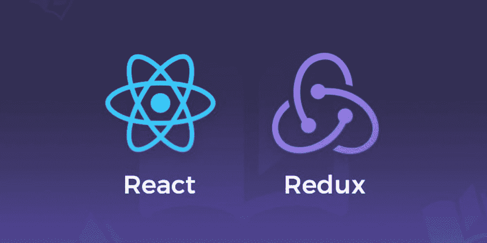

# React with Redux 工具包中的状态管理

> 原文：<https://javascript.plainenglish.io/state-management-in-react-with-redux-toolkit-ff290d3134c3?source=collection_archive---------6----------------------->

Redux 是 React 最流行的全局状态管理库。Redux 提供的工具和模式使得理解应用程序状态在何时、何地以及如何改变，以及当改变发生时内部逻辑将如何工作变得更加容易。



*在这篇文章中，我们将了解 React 中的状态管理是什么，我们为什么需要 Redux Toolkit，以及 Redux Toolkit 如何使您能够编写可预测和可测试的代码来使您的应用程序按预期工作。*

管理状态是前端应用程序开发中最难的部分。如果您正在使用 React 开发一个大型应用程序进行前端开发，那么 React 本身不足以处理复杂性。

为了解决这个问题，有许多州管理图书馆，而且每天都有更多的图书馆出现。开发人员更喜欢使用 React 钩子或 Redux 等状态管理库来管理状态。

在本文中，我们将了解 React 状态管理以及如何使用 Redux Toolkit 进行状态管理。

# 什么是反应状态？

状态是系统在给定时间的表示。React 组件有一个内置的状态对象。状态封装了以字符串、数组和对象等形式存储的数据。当用户与应用程序 UI 交互并执行任何导致 UI 改变的操作时，我们称之为状态改变。

用最简单的术语来说，状态是一个 JavaScript 对象，它表示 UI 组件中可以在执行用户操作时更改的部分。

例如，当用户登录 Gmail 帐户时，用户界面组件会发生变化。此外，当我们从一个页面导航到另一个页面时，UI 组件会发生变化。

组件状态的变化会影响其他组件，并且在简单的应用程序中很容易处理。然而，在复杂的应用程序中，跟踪所有的依赖关系变得更加困难。

# 为什么我们需要国家管理？

状态管理是管理状态的一种方法。随着应用程序的增长，状态管理的复杂性也在增加。

在这种情况下，如果开发人员没有考虑到可伸缩性，那么当出现问题时，弄清楚 UI 组件发生了什么可能会非常困难。维护和调试这样的应用可能是一场噩梦。

# 什么是 Redux &为什么我们需要 Redux Toolkit？

Redux 旨在处理状态管理问题。Redux 是 JavaScript 应用程序的可预测状态容器。它提供集中存储来保存应用程序的所有状态信息。每个组件都可以访问状态信息，而无需将其发送给其他组件。

# Redux 背后的理念

Redux 主要有三个组件:

**存储库**保存了应用程序的状态(带有 DOM 节点的树)。只有在对其执行操作时，才能对其进行更改。

**动作**是将数据从你的前端应用程序【用户界面】发送到你的商店的有效信息。

**reducer**指定当动作被执行时，应用状态如何改变。


**Simplified Visualization of how Redux Works**

使用 Redux，您可以编写行为一致并在不同环境(客户端、服务器和本机)中运行的应用程序，并且它们易于测试。

此外，它还提供了出色的开发人员体验，例如结合了时间旅行调试器的实时代码编辑。

Redux 是轻量级的，有一个庞大的插件生态系统，最重要的是，Redux 最初是为 React 设计的。这是我们在 React 中使用 Redux 的主要原因。

Redux React 绑定由 Redux 团队维护，并始终保持最新。因此，无论何时库被更新，我们都可以确信它仍然会像预期的那样运行。

# 为什么我们需要 Redux Toolkit？

尽管 Redux 在 React 开发人员中很受欢迎，但 Redux 存在一些主要问题。然而，Redux Toolkit 提供了许多功能来解决这些问题。

Redux Toolkit 主要用于解决 Redux 的三个主要问题:

1.  **配置一个 Redux store 太复杂:** Redux Toolkit 提供了 ***configureStore*** 函数来简化配置。
2.  **需要添加大量的包:** Redux Toolkit 减少了添加多个包来构建大型应用程序的需要
3.  **样板代码太多:** Redux 需要太多样板代码，这使得编写高效、干净的代码变得很麻烦。Redux Toolkit 有助于减少样板代码。

Redux Toolkit 预捆绑了以下特性:

*   immer.js = >一个处理商店中不变性的库/工具。
*   redux = >用于状态管理
*   对于异步任务，redux-thunk = >
*   重新选择= >用于从全局存储中选择切片
*   自动支持 Redux 开发工具扩展

# 安装以创建 React-Redux 应用程序

要创建一个 React-Redux 应用程序并编写 Redux 逻辑，您需要一些包和函数。Redux Toolkit 围绕 Redux 核心包装了所有这些要素。Redux Toolkit 简化了 Redux 任务，防止了常见错误，并简化了 Redux 应用程序的编写。

[Redux Toolkit](https://redux-toolkit.js.org/usage/usage-guide) 在 NPM 上以软件包的形式提供，可用于模块捆绑器或节点应用中。

# NPM

```
npm install @reduxjs/toolkit
```

#纱线

```
yarn add @reduxjs/toolkit
```

创建 React-Redux 应用程序的推荐方法是使用官方的 Redux+JS 模板，该模板利用了 Redux 工具包和 Reacts Redux 与 React 组件的集成。

# Redux +普通 JS 模板

```
npx create-react-app my-app — template redux
```

Redux 核心库在 NPM 上以软件包的形式提供，可用于模块捆绑器或节点应用程序:

# NPM

```
npm install redux
```

#纱线

```
yarn add redux
```

这都是关于 React 状态管理和 Redux 的。如果您正在开发一个大型应用程序，使用 Redux+ React 是简化前端开发的重要一步。

***“寻找简化应用开发的方法？开始使用***[***dhi wise***](https://hubs.la/H0T7djs0)***:一个开发人员友好的平台来加速您的 web 和移动应用程序开发。***

[DhiWise](https://hubs.la/H0T7djs0) 使用其高级特性和对 Node.js、React、Kotlin、MongoDB 等新边缘技术的支持，使开发人员能够构建高质量的应用。此外，对新技术的支持即将在 [DhiWise](https://hubs.la/H0T7djs0) 推出。

你是在用 React.js 搭建前端 app 吗？使用 DhiWise 和 React(支持所有主要库)加速您的前端应用程序开发。