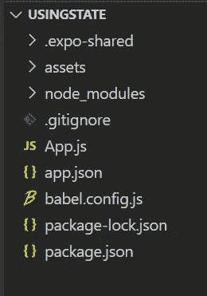

# 在 React Native 中使用 React 挂钩进行状态管理

> 原文：<https://javascript.plainenglish.io/state-management-using-react-hooks-in-react-native-5f12895d29a8?source=collection_archive---------9----------------------->

## 有了 React 钩子，我们可以使用 state、componentDidMount、componentDidUpdate 和其他 React 特性，而无需使用类组件。


Photo by [Evangeline Shaw](https://unsplash.com/@evangelineshaw?utm_source=medium&utm_medium=referral) on [Unsplash](https://unsplash.com?utm_source=medium&utm_medium=referral)

首先，我们谈一点 React 挂钩，然后我们将在 React Native 中实现它们。

2018 年，索菲·阿尔珀特和丹·阿布拉莫夫推出了 Hooks。你可以在这里看。强烈建议看。

## **什么是 React 钩子？**

根据 reactjs.org[的说法，钩子是让你从功能组件中“挂钩”反应状态和生命周期特性的功能。钩子在类内部不起作用——它们让你在没有类的情况下使用 React。](https://reactjs.org/docs/hooks-overview.html#:~:text=Hooks%20are%20functions%20that%20let,you%20use%20React%20without%20classes.&text=You%20can%20also%20create%20your,stateful%20behavior%20between%20different%20components.)

简单来说，React 钩子让我们不用类组件就可以使用 State、componentDidMount、componentDidUpdate 和其他 React 特性。

## **为什么有必要？**

在引入钩子之前，我们只能在类组件中使用状态。

我们不能使用功能组件进行状态管理。

## **有什么优势吗？**

是的，它使代码更短，可读性更好。更重要的是，我们可以在功能组件内部使用它。我将在这篇文章的后面进行比较。

# 理解和练习 React 挂钩

让我们用 React.js 文档提供的一个例子[来练习钩子。](https://reactjs.org/docs/hooks-state.html)

首先，从类组件开始。

**我们使用类组件来使用状态。**

```
class Example extends React.Component {
  constructor(props) {
    super(props);
    this.state = {
      count: 0
    };
  }

  render() {
    return (
      <div>
        <p>You clicked {this.state.count} times</p>
        <button onClick={() => this.setState({ count: this.state.count + 1 })}>
          Click me
        </button>
      </div>
    );
  }
}
```

这里，我们使用了带有构造函数的类组件来存储状态值。

在 render 函数中，我们放置了一个匿名函数来改变状态。

现在比较使用钩子的功能组件中的同一个例子。

```
import React, { useState } from 'react';

function Example() {
  // Declare a new state variable, which we'll call "count" 
 const [count, setCount] = useState(0);
  return (
    <div>
      <p>You clicked {count} times</p>
      <button onClick={() => setCount(count + 1)}>
        Click me
      </button>
    </div>
  );
}
```

在本例中，我们从 React 导入了 useState，因为我们将在功能组件中使用状态。

```
import React, { useState } from 'react';
```

现在在函数组件内部，我们传递两个变量名作为 count 和 setCount。

我们可以根据自己的喜好来命名。

然后，我们在 useState 中指定一个初始值为 0。简单来说，计数为 0。

```
[count, setCount] = useState(0);
```

现在在

标签中，我们将显示输出。当我们点击按钮时，计数增加 1。

```
 <p>You clicked {count} times</p>
      <button onClick={() => setCount(count + 1)}>
        Click me
      </button>
```

我相信你对 React 钩子有所了解。如果没有，那么你肯定可以再读一遍。

# 在 React Native 中实现状态管理

现在我们将使用钩子在 React Native 中实现 state。

为此，您需要[来设置您的 React Native](https://medium.com/javascript-in-plain-english/getting-started-with-react-native-for-beginners-958d39fee16a) 环境。

[](https://medium.com/javascript-in-plain-english/getting-started-with-react-native-for-beginners-958d39fee16a) [## 面向初学者的 React Native 入门

### 学习所有你想知道的关于 React Native 的知识。

medium.com](https://medium.com/javascript-in-plain-english/getting-started-with-react-native-for-beginners-958d39fee16a) 

想玩吗？我挑战你用 Expo 创建一个 React 本地项目。

您可以随意命名该文件夹。我将把它命名为 usingstate。



如果你不能成功，遵循上述指南。

App.js 是我们必须更改代码并运行的主要文件。

因此，单击 App.js 文件，并将完整的代码粘贴到其中。

```
import React, {useState} from ‘react’;
import { StyleSheet, Text, View, Button } from ‘react-native’;export default function App() {const [name, updateName] = useState(‘Nitin’);const buttonHandler = () => {
   updateName(‘John’);
}return (
<View style={styles.container}>
  <Text> My name is {name}.</Text>
  <View style = {styles.buttonContainer}>
     <Button title=’change state’ onPress={buttonHandler}/>
  </View>
</View>
);
}const styles = StyleSheet.create({
container: {
  flex: 1,
  backgroundColor: ‘#fff’,
  alignItems: ‘center’,
  justifyContent: ‘center’,
},
buttonContainer: {
  padding: 20
}
});
```

如果你明白了，就拍拍自己的背。否则，我在这里向你解释。我已经用一个简单的程序向大家解释过了。

首先，我已经从 React 和 React Native 导入了组件。

我们导入了 React，因为 React Native 在 React 上工作。类似地，useState 用于使用钩子。

用于应用样式的样式表。文本、视图和按钮组件分别用于添加文本、div 和按钮。

```
import React, {useState} from ‘react’;
import { StyleSheet, Text, View, Button } from ‘react-native’;
```

之后，我们使用了 React 钩子的概念。最初，名字等于 Nitin。

```
const [name, updateName] = useState(‘Nitin’);
```

在功能组件中，我们使用了视图、文本和按钮组件。

当我们使用视图组件时，我们已经对它应用了样式。

当我们单击按钮组件时，文本组件将改变它的名称。

最后，在 Button 组件中，我们添加了调用 buttonHandler 的 onPress 函数。

```
return (
<View style={styles.container}>
  <Text> My name is {name}.</Text>
  <View style = {styles.buttonContainer}>
     <Button title=’change state’ onPress={buttonHandler}/>
  </View>
</View>
);
```

## 【buttonHandler 是做什么的？

buttonHandler 将更新名称。

它看起来有些不同，对吧。因为它是一个箭头函数。

```
const buttonHandler = () => {
   updateName(‘John’);
}
```

最后，我们向容器和 buttonContainer 添加了一些样式。

```
const styles = StyleSheet.create({
container: {
  flex: 1,
  backgroundColor: ‘#fff’,
  alignItems: ‘center’,
  justifyContent: ‘center’,
},
buttonContainer: {
  padding: 20
}
});
```

使用`expo start`或`npm start`运行。

然后单击手机或模拟器上的按钮。你将会看到变化。

我希望你喜欢这篇文章，并从中学到一些东西。这就是我的意图！

***如果你喜欢我的工作，想要支持，可以*** [***请我喝杯咖啡！***](https://www.buymeacoffee.com/nitinfab)

谢谢你。

## 进一步阅读

[](https://medium.com/javascript-in-plain-english/getting-started-with-react-native-for-beginners-958d39fee16a) [## 面向初学者的 React Native 入门

### 学习所有你想知道的关于 React Native 的知识。

medium.com](https://medium.com/javascript-in-plain-english/getting-started-with-react-native-for-beginners-958d39fee16a) [](https://medium.com/javascript-in-plain-english/80-free-resources-for-web-designers-and-web-developers-in-2021-f400be2875ea) [## 2021 年为网页设计师和网页开发者提供 80+免费资源。

### 成为网页开发者的完整指南。

medium.com](https://medium.com/javascript-in-plain-english/80-free-resources-for-web-designers-and-web-developers-in-2021-f400be2875ea) [](https://medium.com/javascript-in-plain-english/a-beginners-guide-to-react-router-34b4e86fded3) [## React 路由器初学者指南

### 使用 react-router-dom 轻松导航到不同的屏幕。

medium.com](https://medium.com/javascript-in-plain-english/a-beginners-guide-to-react-router-34b4e86fded3)