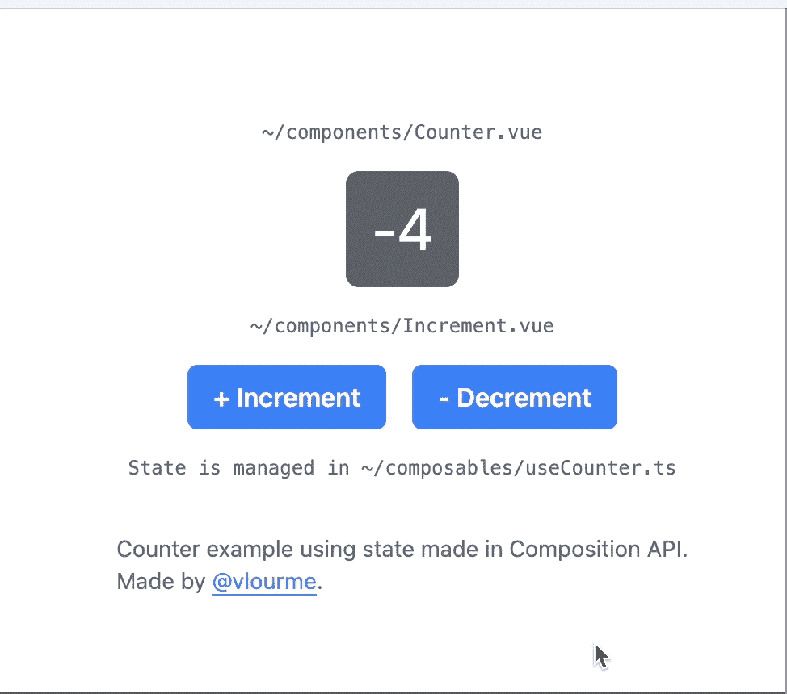
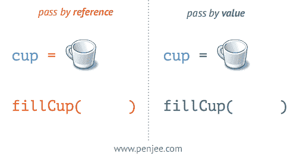

# 如何使用 Vue.js 中的组合 API 进行状态管理

> 原文：<https://javascript.plainenglish.io/state-management-using-vue-composition-api-e38ce24bc8af?source=collection_archive---------7----------------------->

Photo by [Florian Olivo](https://unsplash.com/@florianolv?utm_source=medium&utm_medium=referral) on [Unsplash](https://unsplash.com?utm_source=medium&utm_medium=referral)

我最近测试了 Vue 3 的新合成 API 特性。一开始我很沉默，但一旦我习惯了，它就超出了我的预期。

正如 Vue 3 宣布的那样，Composition API 是为了解决多个问题:

*   组件代码被分割成许多区域，使得阅读和维护变得困难。
*   组件逻辑很难拆分成多个文件。
*   TypeScript 支持不好。

除了修复这些问题，Vue 3 还带来了一个新的东西，称为反应 API，这就是我们今天要谈论的内容。

实际上，大多数 Vue.js 项目使用 Vuex 来管理状态，请放心，Vuex 仍然是最新的。但几个月来，有几种替代方案可供选择:

*   使用组合 API 和反应 API 创建我们自己的状态。
*   [皮尼亚](https://pinia.esm.dev/)，这个我们这里就不说了。但我想提一下，因为它很有前途。

为什么我们应该使用这些解决方案而不是 Vuex？其实 Vuex 还是很不错的，因为它的插件和 dev-tools 支持。但我也认为 Vuex 是多余的，因为代码看起来重复，大部分是因为突变。

让我们深入研究代码。我们以此为例，一个计数器分为两个部分:显示值的计数器和增加值的增量(看起来合乎逻辑)。

The final result. The code is available on my GitHub, link at the end.

首先，我们将定义我们的状态。我通常把它定义到一个叫做`composables`或者`stores`的目录里。

我在注释中解释了一切，但是这里要记住的重要事情是声明状态远离函数，然后返回状态的引用。

正如在 Vue.js 文档中解释的，如果我们不指定`toRefs`，它将通过值传递，正如你在下面看到的，第一个杯子没有更新。

Pass by reference VS pass by value.

一旦我们的可组合状态被定义，我们就可以在 Vue.js 组件中毫无问题地使用它。

`Counter.vue`将显示计数器值。

我在这里尽可能地简化了代码。GitHub 上有更好看的渲染(使用 TailwindCSS)。

`Increment.vue`将增加或减少数值。

如你所见，我们可以使用可组合的方法(如`increment`)或者直接改变状态。

吸气剂等其他功能呢？当然有可能。我们可以在状态(`useCounter.ts`)中定义它们，并使用新的`computed`函数。

让我们结束这篇文章。因此，我们在这里可以看到，使用 Composition API 创建一个状态非常简单，并且不需要任何依赖。

我们还应该使用 Vuex 吗？看情况。我实际上正在使用 Firebase 和 Vue 3 开发一个类似 CRM 的应用程序，我还在使用 Vuex 进行身份验证，因为它工作得很好，并且与 Firebase 很好地实现了。

但是，相比之下，我现在将组合 API 状态用于不太复杂的情况，比如多个组件需要相同的数据。

建立一个新的 Vuex 存储，getters，突变，动作对于小块的数据来说是很累人的，这就是为什么我使用这两种方法。

你可以在我的 GitHub 上找到我用来写这篇文章的代码，就在这里:

 [## vlourme/composition-api-state

### 这个存储库是为一篇中型文章制作的，它解释了如何创建一个真正简单的状态，甚至不需要…

github.com](https://github.com/vlourme/composition-api-state) 

您也可以在这里找到预览:

 [## Vite 应用

### 编辑描述

vu E3-composition-state . net lify . app](https://vue3-composition-state.netlify.app/) 

有什么建议就留言评论吧。

*更多内容尽在*[*plain English . io*](http://plainenglish.io/)