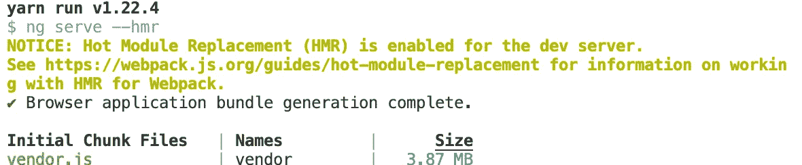
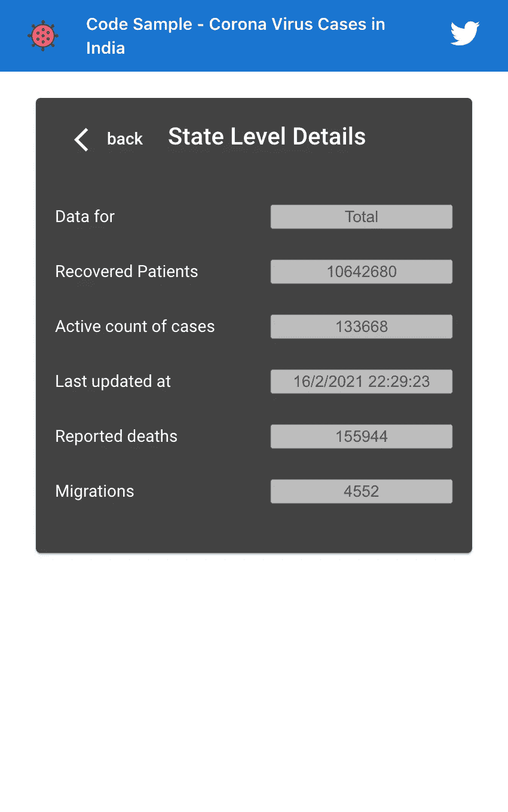

# 棱角分明的 HMR

> 原文：<https://javascript.plainenglish.io/state-of-hmr-in-angular-b3c19b4ebc54?source=collection_archive---------4----------------------->

## Angular 11.x 中热模块更换的好与坏

## 热模块替换加速了开发和调试。它是一个 Webpack 特性，可以更新已更改的模块，而无需重新加载整个页面。Angular 11 通过在 CLI 中提供开箱即用的 HMR，使其易于使用。

在开发和调试前端应用程序时，我们经常编辑组件样式、HTML 模板、标签、文本等。在 Angular 中，我们习惯使用文件监视器，每次保存都会自动刷新页面。这是传统工具的升级，但我们失去了背景。我们可能需要重复几个步骤才能到达 works 中的屏幕。

HMR 有点神奇。Webpack Dev 服务器特性在应用程序运行时添加/删除模块。它允许有选择地更新开发人员更改的屏幕部分，而不会丢失状态/重新加载整个页面。

虽然在版本 11 之前可以在 Angular 中配置 HMR，但是这个过程很麻烦。在最近的主要版本(11)中，Angular CLI 提供了开箱即用的功能。

## 如何在你的项目中设置 HMR？

要在启用 HMR 的情况下运行项目，请使用带有`ng serve`的`--hmr`标志。HMR 只对开发版本有用。当我们用 HMR 进行调试实验时，在 package.json 中创建一个新的脚本来以传统方式运行应用程序是一个好主意。它提供了忽略 hmr 的选择。请考虑 package.json 中脚本下的以下代码片段。

```
"start": "ng serve --hmr",  "// 1": "// yarn start (or npm start) uses HMR by default","start:no-hmr": "ng serve", "// 2": "// if you choose to not use HMR, use this script.",
```

注意，默认情况下，我们使用启动脚本启用了 HMR。我更喜欢这个选项，因为我们习惯于运行纱线启动(或 npm 启动)。将显示一条消息，表明 HMR 已启用。



Figure 1: Run Angular project with HMR enabled

在某些情况下，HMR 可能会令人讨厌。在这些情况下，使用纱线开始:no-hmr。

## HMR 在行动

为了演示 HMR，构建了一个有两个屏幕的小应用程序。它按州列出了冠状病毒病例。单击一个州会出现一个详细信息屏幕，显示所选州的案例的附加信息。



Figure 2: Sample Application

想象选择一个州，导航到第二个屏幕。它预先填充了数据。对样式或模板的更改会刷新整个页面。对于每一项更改，我们都必须导航到该屏幕，以查看反映的更改。只有两个屏幕可能看起来不是问题。如果上下文是用几个先前的屏幕设置的，那么效率不高，而且很费时间。

使用 HMR，无需重置表单即可刷新屏幕。它有助于更快地调试和开发屏幕。变化是实时可视化的。考虑以下短视频(演示)

## 有棱角的 HMR 还不完美呢！

*   在引擎盖下，对风格的改变会重新初始化整个应用程序。这导致服务调用再次触发，服务状态丢失并重新初始化。这种行为在某些情况下违背了 HMR 教的宗旨。点击[此链接](https://github.com/angular/angular-cli/issues/19867)查看 Angular CLI Github repo 中打开的问题。监控问题以获取功能更新。
*   在 Angular 应用程序中，重要的是取消订阅 rxjs observables，关闭组件的 ngOnDestory()中的 websocket 连接。如果不遵循良好做法，HMR 会放大问题。由于 HMR 不会重新加载整个页面，因此可能会创建重复订阅，从而导致意外行为。阅读[这篇博客](https://dev.to/this-is-angular/things-to-watch-out-for-when-using-hmr-with-angular-50j7)了解更多。

## 代码示例

点击[这个链接](https://github.com/kvkirthy/covid-sample)，克隆、安装并运行[https://github.com/kvkirthy/covid-sample](https://github.com/kvkirthy/covid-sample)一文中描述的代码示例

## 参考

1.  关于 https://webpack.js.org/concepts/hot-module-replacement/ HMR 的 Webpack 文档—
2.  Angular 博客:Angular 第 11 版发布，[https://Blog . Angular . io/Version-11-of-Angular-now-available-74721 b 7952 f 7](https://blog.angular.io/version-11-of-angular-now-available-74721b7952f7)
3.  Angular CLI 问题记录 https://github.com/angular/angular-cli/issues/19867 HMR 重新初始化整个应用程序
4.  文章:使用带 Angular - [的 HMR 时要注意的事项 https://dev . to/this-is-Angular/this-to-watch-out-for-when-using-hmr-with-Angular-50j 7](https://dev.to/this-is-angular/things-to-watch-out-for-when-using-hmr-with-angular-50j7)