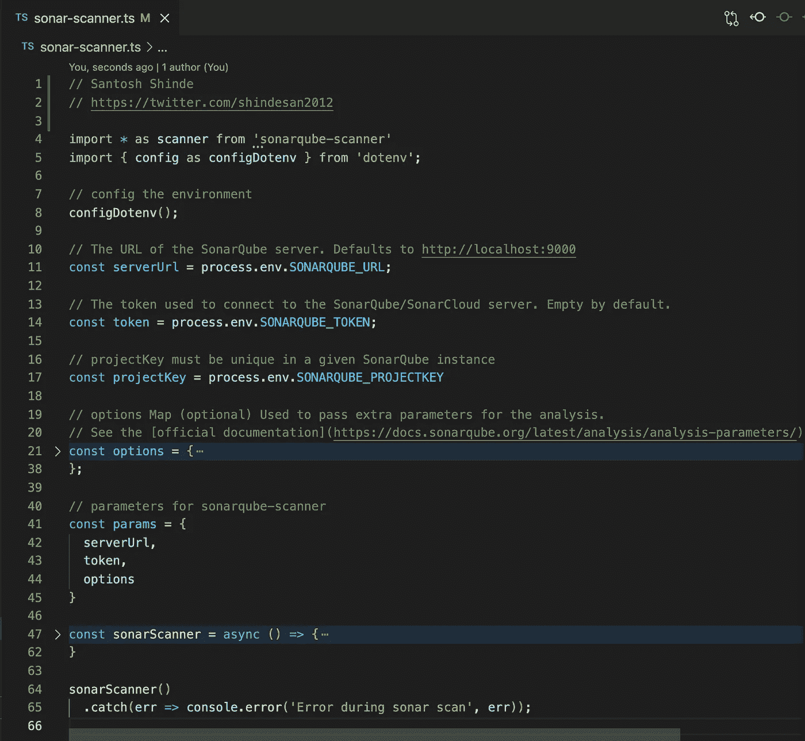
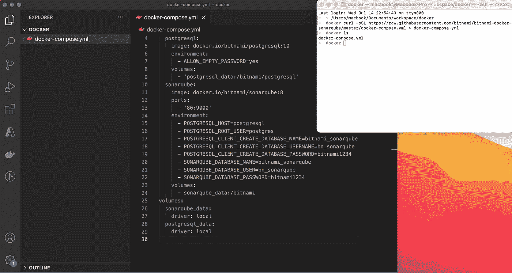
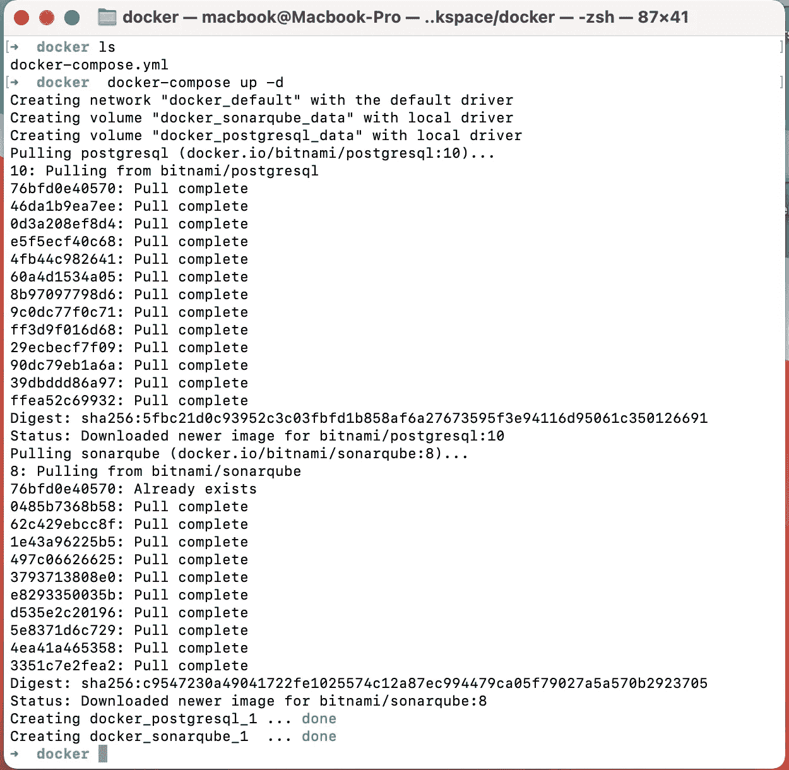
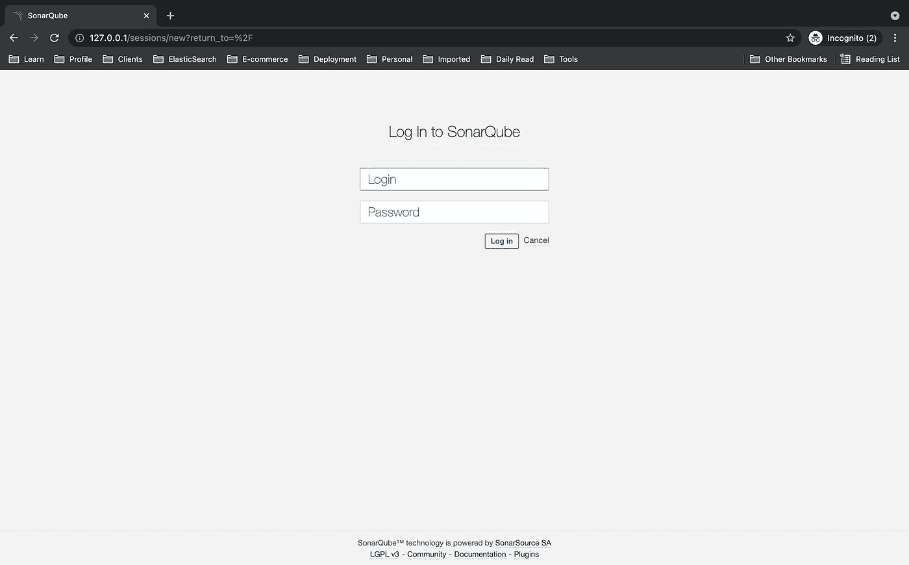
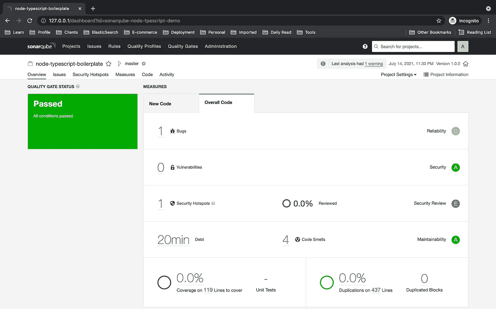
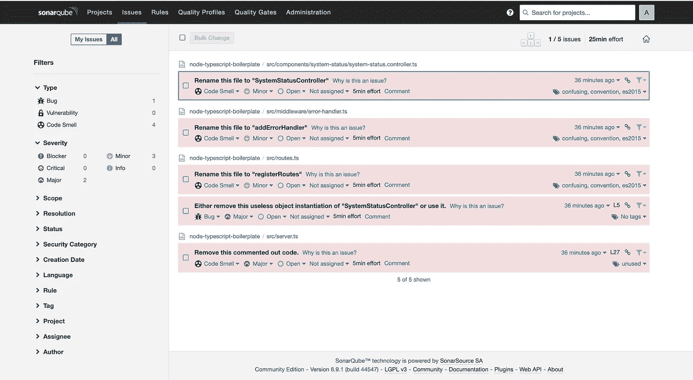

# 使用 SonarQube 对 Node.js 和 TypeScript 项目进行静态代码分析

> 原文：<https://javascript.plainenglish.io/static-code-analysis-for-node-js-and-typescript-project-using-sonarqube-8f90799add06?source=collection_archive---------0----------------------->

# SonarQube 是什么？

SonarQube 是一个开源的质量管理平台，致力于从项目组合到方法不断地分析和测量技术质量。

[](https://www.sonarqube.org/) [## 代码质量和代码安全性| SonarQube

### 数以千计的自动化静态代码分析规则，在多个方面保护您的应用程序，并指导您的团队。接住…

www.sonarqube.org](https://www.sonarqube.org/) 

# SonarQube 基础

*   SonarQube(以前只是“Sonar”)是一个基于服务器的系统。当然，您可以将它安装在本地机器上(对硬件的要求很低)。但它是一个带有数据库的中央服务器。
*   SonarQube 是 SonarSource 开发的一个开源平台，用于持续检查代码质量。Sonar 做静态代码分析，提供错误、代码味道、漏洞、代码重复的详细报告。
*   SonarQube 还强调了单元测试较少涉及的复杂代码区域。

# 基本亮点

**发布质量代码**:捕捉棘手的错误，防止未定义的行为影响最终用户。

**应用安全**:修复危及应用安全的漏洞，并通过安全热点了解 AppSec。

技术债务:确保你的代码库是干净的和可维护的，以提高开发者的速度！

# 在本地机器上设置 Sonarqube

我们将使用一个[bitnami-docker-sonar cube](https://hub.docker.com/r/bitnami/sonarqube/)映像在本地机器上设置 sonar cube。

要了解更多细节，您可以查看一个[bitnami-docker-sonar qube](https://github.com/bitnami/bitnami-docker-sonarqube)GitHub 库。

[](https://github.com/bitnami/bitnami-docker-sonarqube) [## 比特纳米/比特纳米-docker-sonar cube

### SonarQube 是一个开源质量管理平台，致力于持续分析和测量技术…

github.com](https://github.com/bitnami/bitnami-docker-sonarqube) 

## 使用 Docker Compose 运行应用程序

[Docker Compose](https://docs.docker.com/compose/) 是一个定义和运行多容器 Docker 应用的工具。使用 Compose，您可以使用 YAML 文件来配置应用程序的服务。

使用以下命令获取本地机器上的`docker-compose`配置。

```
$ curl -sSL https://raw.githubusercontent.com/bitnami/bitnami-docker-sonarqube/master/docker-compose.yml > docker-compose.yml
$ docker-compose up -d
```



bitnami image

或者您可以创建`docker-compose.yml`文件，并使用下面的配置通过`docker-compose up -d`命令运行 Sonarqube。

```
version: '2'

services:
  postgresql:
    image: docker.io/bitnami/postgresql:10
    environment:
      - ALLOW_EMPTY_PASSWORD=yes
    volumes:
      - 'postgresql_data:/bitnami/postgresql'
  sonarqube:
    image: docker.io/bitnami/sonarqube:8
    ports:
      - '80:9000'
    environment:
      - POSTGRESQL_HOST=postgresql
      - POSTGRESQL_ROOT_USER=postgres
      - POSTGRESQL_CLIENT_CREATE_DATABASE_NAME=bitnami_sonarqube
      - POSTGRESQL_CLIENT_CREATE_DATABASE_USERNAME=bn_sonarqube
      - POSTGRESQL_CLIENT_CREATE_DATABASE_PASSWORD=bitnami1234
      - SONARQUBE_DATABASE_NAME=bitnami_sonarqube
      - SONARQUBE_DATABASE_USER=bn_sonarqube
      - SONARQUBE_DATABASE_PASSWORD=bitnami1234
    volumes:
      - sonarqube_data:/bitnami
volumes:
  sonarqube_data:
    driver: local
  postgresql_data:
    driver: local
```



Run the application using Docker Compose

通过 [http://127.0.0.1](http://127.0.0.1) 访问您的应用程序，并使用以下凭证登录应用程序。

```
**Username** - **admin**
**Password** - **bitnami**
```



[http://127.0.0.1](http://127.0.0.1)

# 分析项目

*   点击**创建新项目**按钮。
*   给你的项目一个**项目键**和一个**显示名**，点击**设置**按钮。
*   在**下提供令牌**，选择**生成令牌**。给你的令牌起个名字，点击**生成**按钮，然后点击**继续**。
*   复制生成的令牌并粘贴到我们的与变量`SONARQUBE_TOKEN`对应的`.env`文件中。
*   例子:`SONARQUBE_TOKEN=generated-token`
*   确保在`.env`文件中设置环境变量。

```
SONARQUBE_URL=http://127.0.0.1
SONARQUBE_PROJECTKEY=sonarqube-node-tpescript-demo
SONARQUBE_TOKEN=43b915a482ba1dce4b36c215718e56e37ad9e910
```

# 在我们的节点和类型脚本项目上配置 SonarQube

首先，您需要克隆用 TypeScript 编写的 Node.js 应用程序的框架

[](https://github.com/santoshshinde2012/node-boilerplate) [## Santosh shinde 2012/node-样板文件

### 用 TypeScript 编写的 Node.js 应用程序的框架我们使用这个框架的主要目的是启动服务器…

github.com](https://github.com/santoshshinde2012/node-boilerplate) 

```
// clone the repository
git clone [https://github.com/santoshshinde2012/node-boilerplate.git](https://github.com/santoshshinde2012/node-boilerplate.git)// install the npm modules
npm install
```

使用`sonarqube-scanner` npm 模块运行 sonar cube/sonar cloud 分析。

要将代码分析添加到您的构建文件中，只需将包添加到您的项目开发依赖项中:

```
npm install --save-dev sonarqube-scanner
```

# SonarQube 配置文件

在项目的根目录下，我们将创建一个包含 SonarQube 扫描仪配置源代码的文件`sonar-scanner.ts`。

```
import * as scanner from 'sonarqube-scanner'
import { config as configDotenv } from 'dotenv';

// config the environment
configDotenv();

// The URL of the SonarQube server. Defaults to http://localhost:9000
const serverUrl = process.env.SONARQUBE_URL;

// The token used to connect to the SonarQube/SonarCloud server. Empty by default.
const token = process.env.SONARQUBE_TOKEN;

// projectKey must be unique in a given SonarQube instance
const projectKey = process.env.SONARQUBE_PROJECTKEY

// options Map (optional) Used to pass extra parameters for the analysis.
// See the [official documentation](https://docs.sonarqube.org/latest/analysis/analysis-parameters/) for more details.
const options = {

  'sonar.projectKey': projectKey,

  // projectName - defaults to project key
  'sonar.projectName': 'node-typescript-boilerplate',

  // Path is relative to the sonar-project.properties file. Defaults to .
  'sonar.sources': 'src',

  // source language
  'sonar.language': 'ts',

  'sonar.javascript.lcov.reportPaths' : 'coverage/lcov.info',

  // Encoding of the source code. Default is default system encoding
  'sonar.sourceEncoding': 'UTF-8'
};

// parameters for sonarqube-scanner
const params = {
  serverUrl,
  token,
  options
}

const sonarScanner = async () => {

  console.log(serverUrl);

  if (!serverUrl) {
    console.log('SonarQube url not set. Nothing to do...');
    return;
  }

  //  Function Callback (the execution of the analysis is asynchronous).
  const callback  = (result) => {
    console.log('Sonarqube scanner result:', result);
  }

  scanner(params, callback);
}

sonarScanner()
  .catch(err => console.error('Error during sonar scan', err));
```

**如何修复** `**“parserOptions.project” has been set for @typescript-eslint/parser**` **？**

只需将`ignorePatterns`选项添加到`.eslintrc` : `"ignorePatterns": ["sonar.js"]`中，就可以指示`eslint`忽略它们

```
{
  "parser": "@typescript-eslint/parser",
  "extends": [
    "airbnb/base",
    "plugin:@typescript-eslint/recommended",
    "plugin:import/errors",
    "plugin:import/warnings",
    "plugin:import/typescript",
    "prettier"
  ],
  "parserOptions": {
    "ecmaVersion": 2018,
    "project": "./tsconfig.json"
  },
  "ignorePatterns": ["sonar-scanner.ts"], // This line should be add in configuration
  "plugins": ["prettier"],
  "rules": {}
}
```

示例—[https://raw . githubusercontent . com/Santosh shinde 2012/sonar qube-node-tpescript-demo/master/。eslintrc](https://raw.githubusercontent.com/santoshshinde2012/sonarqube-node-tpescript-demo/master/.eslintrc)

```
// source code with all files needed for the demo
git clone [https://github.com/santoshshinde2012/sonarqube-node-tpescript-demo.git](https://github.com/santoshshinde2012/sonarqube-node-tpescript-demo.git)
```

# 如何运行 SonarQube 扫描仪

请在`package.json`中添加以下脚本来运行 SonarQube 扫描仪，确保您已经在本地或全局安装了`ts-node`。

`"sonar": "ts-node sonar-scanner.ts"`

使用终端上的命令启动 SonarQube 扫描器

```
npm run sonar
```

运行`npm run sonar`后的输出

```
➜  node-boilerplate git:(master) ✗ npm run sonar

> sonarqube-node-tpescript-demo@1.0.0 sonar
> ts-node sonar-scanner.ts

http://127.0.0.1:80
[23:30:35] Starting analysis...
[23:30:35] Getting info from "package.json" file
[23:30:35] Checking if executable exists: /Users/macbook/.sonar/native-sonar-scanner/sonar-scanner-4.5.0.2216-macosx/bin/sonar-scanner
[23:30:35] Platform binaries for SonarScanner found. Using it.
INFO: Scanner configuration file: /Users/macbook/.sonar/native-sonar-scanner/sonar-scanner-4.5.0.2216-macosx/conf/sonar-scanner.properties
INFO: Project root configuration file: NONE
INFO: SonarScanner 4.5.0.2216
INFO: Java 11.0.3 AdoptOpenJDK (64-bit)
INFO: Mac OS X 10.16 x86_64
INFO: User cache: /Users/macbook/.sonar/cache
INFO: Scanner configuration file: /Users/macbook/.sonar/native-sonar-scanner/sonar-scanner-4.5.0.2216-macosx/conf/sonar-scanner.properties
INFO: Project root configuration file: NONE
INFO: Analyzing on SonarQube server 8.9.1
INFO: Default locale: "en_IN", source code encoding: "UTF-8"
INFO: Load global settings
INFO: Load global settings (done) | time=150ms
INFO: Server id: FD2E0B99-AXqmE06gm3W0APi1RPSm
INFO: User cache: /Users/macbook/.sonar/cache
INFO: Load/download plugins
INFO: Load plugins index
INFO: Load plugins index (done) | time=71ms
INFO: Load/download plugins (done) | time=4641ms
INFO: Process project properties
INFO: Process project properties (done) | time=6ms
INFO: Execute project builders
INFO: Execute project builders (done) | time=3ms
INFO: Project key: sonarqube-node-tpescript-demo
INFO: Base dir: /Users/macbook/Documents/workspace/node-boilerplate
INFO: Working dir: /Users/macbook/Documents/workspace/node-boilerplate/.scannerwork
INFO: Load project settings for component key: 'sonarqube-node-tpescript-demo'
INFO: Load project settings for component key: 'sonarqube-node-tpescript-demo' (done) | time=101ms
INFO: Load quality profiles
INFO: Load quality profiles (done) | time=100ms
INFO: Load active rules
INFO: Load active rules (done) | time=4058ms
INFO: Indexing files...
INFO: Project configuration:
INFO:   Excluded sources: node_modules/**, bower_components/**, jspm_packages/**, typings/**, lib-cov/**
INFO: 12 files indexed
INFO: 0 files ignored because of inclusion/exclusion patterns
INFO: 0 files ignored because of scm ignore settings
INFO: Quality profile for ts: Sonar way
INFO: ------------- Run sensors on module node-typescript-boilerplate
INFO: Load metrics repository
INFO: Load metrics repository (done) | time=81ms
INFO: Sensor CSS Rules [cssfamily]
INFO: No CSS, PHP, HTML or VueJS files are found in the project. CSS analysis is skipped.
INFO: Sensor CSS Rules [cssfamily] (done) | time=1ms
INFO: Sensor JaCoCo XML Report Importer [jacoco]
INFO: 'sonar.coverage.jacoco.xmlReportPaths' is not defined. Using default locations: target/site/jacoco/jacoco.xml,target/site/jacoco-it/jacoco.xml,build/reports/jacoco/test/jacocoTestReport.xml
INFO: No report imported, no coverage information will be imported by JaCoCo XML Report Importer
INFO: Sensor JaCoCo XML Report Importer [jacoco] (done) | time=3ms
INFO: Sensor TypeScript analysis [javascript]
INFO: Found 1 tsconfig.json file(s): [/Users/macbook/Documents/workspace/node-boilerplate/tsconfig.json]
INFO: Analyzing 12 files using tsconfig: /Users/macbook/Documents/workspace/node-boilerplate/tsconfig.json
INFO: 12 source files to be analyzed
INFO: Load project repositories
INFO: Load project repositories (done) | time=105ms
INFO: 12/12 source files have been analyzed
INFO: Sensor TypeScript analysis [javascript] (done) | time=11441ms
INFO: Sensor JavaScript/TypeScript Coverage [javascript]
WARN: No coverage information will be saved because LCOV file cannot be found.
WARN: Provided LCOV file path: coverage/lcov.info. Seek file with path: /Users/macbook/Documents/workspace/node-boilerplate/coverage/lcov.info
WARN: No coverage information will be saved because all LCOV files cannot be found.
INFO: Sensor JavaScript/TypeScript Coverage [javascript] (done) | time=1ms
INFO: Sensor C# Project Type Information [csharp]
INFO: Sensor C# Project Type Information [csharp] (done) | time=1ms
INFO: Sensor C# Properties [csharp]
INFO: Sensor C# Properties [csharp] (done) | time=1ms
INFO: Sensor JavaXmlSensor [java]
INFO: Sensor JavaXmlSensor [java] (done) | time=1ms
INFO: Sensor HTML [web]
INFO: Sensor HTML [web] (done) | time=3ms
INFO: Sensor VB.NET Project Type Information [vbnet]
INFO: Sensor VB.NET Project Type Information [vbnet] (done) | time=1ms
INFO: Sensor VB.NET Properties [vbnet]
INFO: Sensor VB.NET Properties [vbnet] (done) | time=0ms
INFO: ------------- Run sensors on project
INFO: Sensor Zero Coverage Sensor
INFO: Sensor Zero Coverage Sensor (done) | time=13ms
INFO: SCM Publisher SCM provider for this project is: git
INFO: SCM Publisher 12 source files to be analyzed
INFO: SCM Publisher 0/12 source files have been analyzed (done) | time=66ms
WARN: Missing blame information for the following files:
WARN:   * src/server.ts
WARN:   * src/environments/environment.constant.ts
WARN:   * src/lib/logger.ts
WARN:   * src/abstractions/ApiResponses.ts
WARN:   * src/middleware/error-handler.ts
WARN:   * src/components/system-status/system-status.controller.ts
WARN:   * src/components/system-status/system-status.types.ts
WARN:   * src/routes.ts
WARN:   * src/environments/environment.ts
WARN:   * src/components/BaseApi.ts
WARN:   * src/abstractions/ApiError.ts
WARN:   * src/App.ts
WARN: This may lead to missing/broken features in SonarQube
INFO: CPD Executor 3 files had no CPD blocks
INFO: CPD Executor Calculating CPD for 9 files
INFO: CPD Executor CPD calculation finished (done) | time=13ms
INFO: Analysis report generated in 68ms, dir size=124 KB
INFO: Analysis report compressed in 51ms, zip size=35 KB
INFO: Analysis report uploaded in 159ms
INFO: ANALYSIS SUCCESSFUL, you can browse http://127.0.0.1/dashboard?id=sonarqube-node-tpescript-demo
INFO: Note that you will be able to access the updated dashboard once the server has processed the submitted analysis report
INFO: More about the report processing at http://127.0.0.1/api/ce/task?id=AXqmLdoG21WQGzQaFi7o
INFO: Analysis total time: 25.450 s
INFO: ------------------------------------------------------------------------
INFO: EXECUTION SUCCESS
INFO: ------------------------------------------------------------------------
INFO: Total time: 32.270s
INFO: Final Memory: 12M/50M
INFO: ------------------------------------------------------------------------
[23:31:08] Analysis finished.
Sonarqube scanner result: undefined
➜  node-boilerplate git:(master) ✗
```

让我们在 [http://127.0.0.1/dashboard 上查看结果？id = sonar qube-node-tpescript-demo](http://127.0.0.1/dashboard?id=sonarqube-node-tpescript-demo)



Result

让我们在“**问题**”选项卡上查看 SonarQube 分析指出的问题的详细列表。



Issues

# 参考

节点 JS 和 Typescript 项目的 SonarQube 的源代码

[](https://github.com/santoshshinde2012/sonarqube-node-typescript-demo) [## Santosh shinde 2012/sonar qube-node-typescript-demo

### 在本地为节点运行 sonar cube 的演示 type script Project-Santosh shinde 2012/sonar cube-Node-type script-demo

github.com](https://github.com/santoshshinde2012/sonarqube-node-typescript-demo) [](https://github.com/bitnami/bitnami-docker-sonarqube) [## 比特纳米/比特纳米-docker-sonar cube

### SonarQube 是一个开源质量管理平台，致力于持续分析和测量技术…

github.com](https://github.com/bitnami/bitnami-docker-sonarqube)  [## 尝试 SonarQube

### 您已经听说了 SonarQube 如何帮助您编写更干净、更安全的代码，现在您已经准备好为……

docs.sonarqube.org](https://docs.sonarqube.org/latest/setup/get-started-2-minutes/) 

Setup SonarQube for Node JS Typescript Project

*更多内容尽在*[***plain English . io***](http://plainenglish.io/)