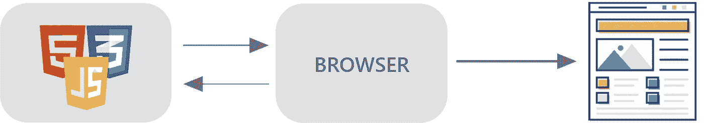
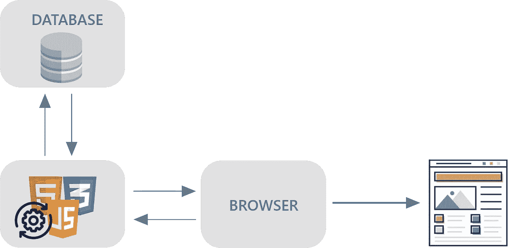
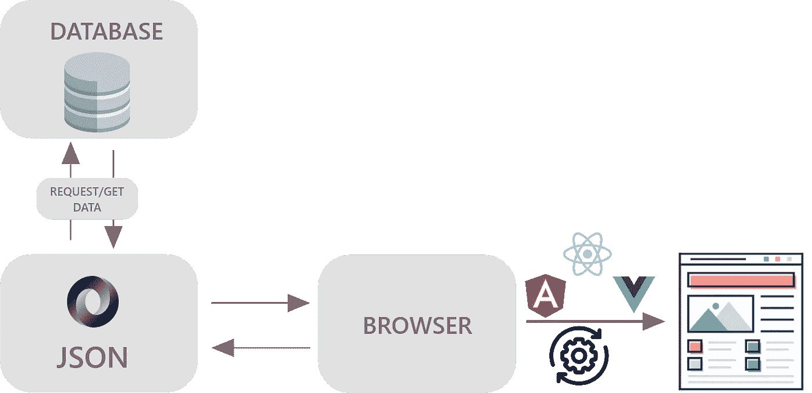

# 静态与动态网站

> 原文：<https://javascript.plainenglish.io/static-vs-dynamic-websites-c2a4e373b720?source=collection_archive---------14----------------------->

## 主要差异、优点和缺点。

Photo by [Annie Spratt](https://unsplash.com/@anniespratt?utm_source=unsplash&utm_medium=referral&utm_content=creditCopyText) on [Unsplash](https://unsplash.com/s/photos/developer?utm_source=unsplash&utm_medium=referral&utm_content=creditCopyText)

虽然现在网络与脸书和谷歌这样的亿万美元公司联系在一起，但它开始时非常简单。早期的网站是静态的，只有简单的文本和图像，向每个用户显示相同的内容。

自从 **Web 2.0** 时代以来，我们开始看到越来越多的动态网站，它们开始允许网站所有者和网站访问者之间的互动。

在本文中，您将了解这两大类别之间的主要区别，以及静态和动态网站是如何运行的。

# 什么是静态网站？

静态网站是最基本的网站类型。静态网页按照其存储的原样传送到用户的浏览器。最终“准备好”的文件，通常包含 HTML、CSS 和 JavaScript，被发布到**网络服务器上。**当网站被请求时，这些完全相同的文件被从服务器发送到浏览器，浏览器按原样呈现它们。因此，静态网页为所有用户显示相同的信息。

值得注意的是，当我们说“动态”时，我们指的是当新的请求进来时网站的构建方式。

页面上的动态效果，比如动画，可以在静态网站上使用 JavaScript 实现。在这种情况下，我们引用了一个**客户端动态网页，**，但这仍然意味着服务器上没有任何工作。

静态网站有几个优点:首先，开发速度快。一个专业的 web 开发人员可以比动态网站更快地设计和构建一个静态网站。此外，一个静态网站通常是比较便宜的建设。最后，搜索引擎可以很容易地索引一个静态网站，因为它通常只由一系列 HTML 和 CSS 文件组成。

说到缺点，从长远来看，静态网站不是最好的选择。任何企业都需要通过网站和计划更新与客户频繁沟通。做出这些改变可能非常昂贵，也不容易。

此外，静态网站不能提供动态网站所能提供的所有可能性和功能。即使是新功能的实现也可能是一个小问题，并且不太经济。在一个静态网站中，你可以添加文本、图像、视频，但几乎没有任何其他特殊功能。

# 什么是动态网站？

动态网页是由服务器生成的，使得每次有请求时内容都是不同的。这允许与用户进行交互。

动态网站通常包含一个数据库和一个从数据库获取数据的应用程序。每次浏览器请求一个页面时，这个页面都是用来自数据库的数据在服务器上动态构建的。

动态网站最大的优势在于有用户交互，为不同的访问者显示定制的内容。此外，一个动态的网站给你开发特色的机会。
缺点之一是网站设计和结构创建更加复杂，难以开发。

传统上，静态和动态网站是仅有的两种类型的网站，但是在最近几年，越来越多的网站是基于 API 的。

# 什么是基于 API 的网站？

API 支持的网站的工作方式类似于动态网站:有一个数据库和一个应用程序，每次客户端发出请求时，都会从数据库中获取数据。

主要区别在于，对于 API，发送给浏览器的是 JSON 格式的数据，而不是准备显示的网站。然后，该网站被构建在客户端。从 API 接收的数据被插入到某种模板中，通常使用像 reactor、Vue 或 Angular 这样的框架。

然后，我们可以确定两个不同的步骤:构建 API，然后在客户端使用它。这就是为什么应用编程接口支持的网站经常被称为客户端渲染的原因。

这种方法的最大优点是后端和前端完全独立。事实上，除了浏览器之外，其他客户端也可以使用 API，比如移动或桌面应用。

# 哪一个是最好的选择？

静态、动态和 API 支持的网站有其优势和局限性。根据您的目标和需求，您可以找到最适合您的解决方案。

例如，对于一个简单的网站来说，实现一个动态的结构可能不方便，但是如果你想创建一个具有特殊功能的网站，一个动态的或者 API 驱动的网站可能是最好的选择！

*考虑* [***成为***](https://ebelinggianmarco.medium.com/membership)**中的一员，如果你欣赏阅读这样的故事并想帮助我成为一名作家。它每月花费 5 美元，让您可以无限制地访问 Medium 内容。如果你通过我的链接* [***注册，我会得到一点佣金。***](https://ebelinggianmarco.medium.com/membership)*

**更内容见于* [*中*](http://plainenglish.io/)*