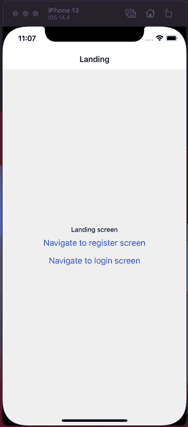
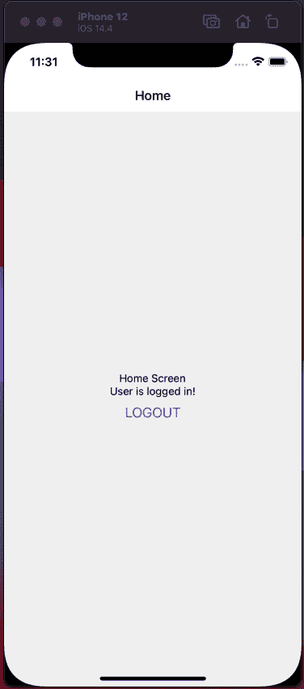

# React Native 中的身份验证和入职流程:分步指南

> 原文：<https://javascript.plainenglish.io/step-by-step-guide-to-authentication-and-onboarding-flow-in-react-native-32663b80eefc?source=collection_archive---------1----------------------->

对任何应用程序来说，最常见的要求之一是拥有一个同时包含入职的身份验证流程。流程如下所示:

auth-onboarding flow

*   当用户打开 app 时，我们首先需要检查用户是否是我们系统中的登录用户，根据这个条件他们可以去两个不同的流程；
*   如果用户之前已经登录，他们将进入应用程序屏幕。例如-主屏幕、个人资料屏幕等。
*   如果用户是新用户或已注销用户，他们将转到身份验证屏幕，例如登录页面、注册页面等。
*   对于一个全新的用户，当他们第一次注册时，我们也希望向他们展示一个入门屏幕，通常我们会在那里展示应用的主要功能/优势或应用的操作指南。完成入职培训屏幕后，他们将继续进入应用程序的主屏幕。(登录流程)

# 设置屏幕

我们将创建几个虚拟屏幕来正确显示流程。我们会有-

1.  登陆屏幕
2.  登录屏幕
3.  注册屏幕
4.  入职屏幕
5.  主屏幕

如果我们想要描述屏幕流，那么它看起来会像下面这样-

screens

# 授权上下文

为了管理用户认证流，我们将使用上下文。让我们从创建我们的 AuthContext 开始。

为了举例，我们将尽量保持简单。我们创建 auth context，并从上下文提供者向整个应用程序传递 2 个值。这些值是

*   `isLoggedIn` -这是一个布尔值，让我们知道我们的用户是否登录。
*   `setIsLoggedIn` -根据登录流程将`isLoggedIn`状态设置为真或假。

让我们用 AuthProvider 包装这个应用程序。

app.js

# 根组件

设置完成后，我们现在将设置我们的屏幕。我们的初始组件是 Root。在我们的根目录中，我们将检查用户是否登录。根据我们上下文中的 isLoggedIn 值，我们将把用户重定向到正确的流。

最初，我们的根组件看起来像这样

root component

# 注册

我们将首先设置登录流程。在我们的登录界面。

1.  我们将有一个名为登录的按钮，当按下该按钮时，我们将使用`setIslogged`将我们上下文中的`isLoggedIn`状态设置为`true`。
2.  当`isLoggedIn`变为真时，用户将自动导航到`HomeScreen`。我们已经在`Root`中设置好了。
3.  我们还使用`AsyncStorage`来持久化一个虚拟令牌值，这样当用户关闭应用程序时，我们可以使用持久化值来知道他们是否已经登录。

login

login

# 注册和入职

对于新用户，我们希望他们注册并完成入职流程。一旦他们完成入职流程，我们希望他们转到主应用程序。

signup

*   假设我们在注册屏幕上有一个按钮，单击该按钮注册成功，我们将用户导航到入职屏幕

onboarding

*   入职屏幕与登录屏幕完全相同。它使 isLoggedIn 值为真，并在我们的异步存储中保存一个虚拟令牌。当它将“isLoggedIn”设置为 true 时，用户将自动转到主应用程序。

signup — onboarding

# 主页和注销

在我们的主屏幕上，我们将有一个注销按钮。如果用户点击注销按钮，我们将做两件事

1.  使`isLoggedIn`为假
2.  从我们的异步存储中删除虚拟令牌
3.  当我们将`isLoggedIn`设为假时，用户将自动转到`LandingScreen`

home

home-logout

# 检查用户是否从异步存储登录

每当用户登录或注册时，我们都在我们的中保存一个虚拟令牌来保存它。我们希望保留令牌，因为如果用户关闭应用程序并在稍后返回我们的应用程序，我们希望让他们保持相同的状态。我们将在根组件中进行这种检查。

1.  当我们的组件第一次加载时，我们试图从异步存储中获取令牌，如果找到令牌，那么我们通过调用`setIsLoggedIn(true)`使`isLoggedIn`值为真
2.  我们还使用加载器状态，因为获取令牌是异步的，我们需要等待并显示一个加载指示器，直到检查完成。

现在，让我们来看看实际情况，我们将首先登录，关闭应用程序，然后再次返回应用程序。我们的用户应该仍然在主屏幕上，而不是在登陆屏幕上。

full-flow

这样我们的完整流程就完成了！这里是零食[链接](https://snack.expo.dev/@saad-bashar/authentication-flow)如果有人想抢码。谢谢！

*更多内容请看*[***plain English . io***](http://plainenglish.io/)