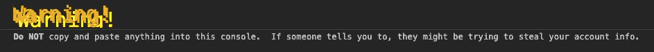

# 用这些技巧增加你的控制台日志

> 原文：<https://javascript.plainenglish.io/step-up-your-console-logs-with-these-tricks-41e90368fe5f?source=collection_archive---------7----------------------->

## 变得有创意和时尚

## 所有的网络开发人员。这是给你的。

Photo by [Nikita Kachanovsky](https://unsplash.com/@nkachanovskyyy?utm_source=medium&utm_medium=referral) on [Unsplash](https://unsplash.com?utm_source=medium&utm_medium=referral)

是时候展示你的`console.log()`技能了！等等，我知道你在说什么。控制台？那是调试用的。还有你的右边。是调试用的。这就是上图的由来。跳出框框思考。它也可以用于不同的事情。

# 1.我们正在招聘信息

继续前进，使用开发工具看到这个网站的控制台— [媒体](https://liraz-amir.medium.com/)。你在那里看到了什么？标志，我们正在招聘信息:

Medium console message

[BBC 新闻](https://www.bbc.com/news)也做到了:

BBC News console message

[SoundCloud](https://soundcloud.com/) 做了一个很好的简单消息:

SoundCloud console message

# 2.向用户发出警告

就像[脸书](https://www.facebook.com/ShakaBlakaZulu)做的那样，警告用户如果有人告诉他们在控制台中复制粘贴一些东西，他们可能会被黑客攻击。

Facebook console message

[谷歌](https://www.google.com/search?q=text+adventure&oq=text+adventure&aqs=chrome..69i57j0j0i20i263i395j0i395j46i395j0i395l2j69i60.869j1j4&sourceid=chrome&ie=UTF-8)也有一个:

Google console message

# 3.比赛

人人都爱游戏。如果你是一个优秀的开发者，你可以在游戏机内部构建一个游戏。就像谷歌一样:

Google console game

如果你想知道如何开始玩它，这里有一些方法:

1.  去[谷歌](https://www.google.co.il/)网站。
2.  搜索:文字冒险。
3.  右键单击网站并点击检查。
4.  单击控制台选项卡。
5.  键入 yes。
6.  享受:)。

# 4.复活节彩蛋

许多网站都把复活节彩蛋藏在它们的控制台里，不管是笑话、日常用语还是谜语。

看看 [TNW](https://thenextweb.com/) 网站:

TNW easter-egg

## 做一名特工

是的，你听到了！情报机构因在其网站和控制台上隐藏复活节彩蛋和谜语来招募人员而闻名。摩萨德和 Shabak(以色列)做到了。我肯定其他机构也这么做了。

## 开发商的投资组合

不需要解释为什么。npm 包也是一样。有些软件包会向开发人员显示“雇用我”的信息。

# 那么，你如何设计你的主机呢？

很高兴你问了。是时候来点造型代码了:)

`%C` —它允许您使用 CSS 设置文本在控制台中的显示样式。

看看我们如何在下面的代码块中使用它:

[https://gist.github.com/blakazulu/67f7391120c813095ca47be76a733a69](https://gist.github.com/blakazulu/67f7391120c813095ca47be76a733a69)

这段代码将为您提供以下结果:

console log styled result

## 结论

尽情享受，尽情发挥创造力！