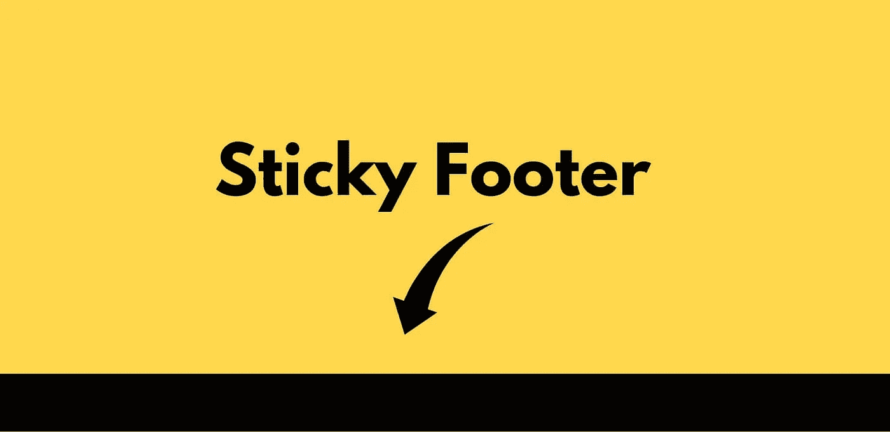
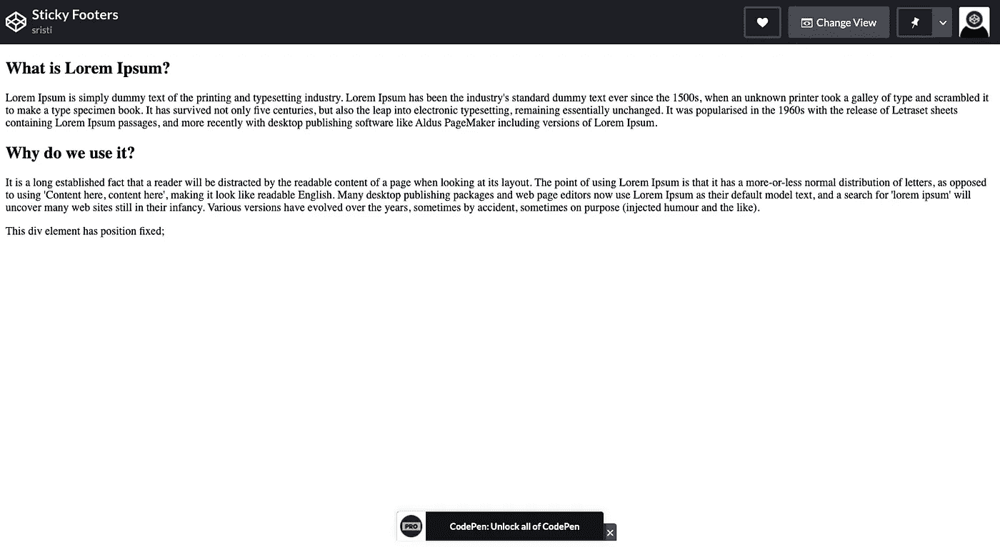
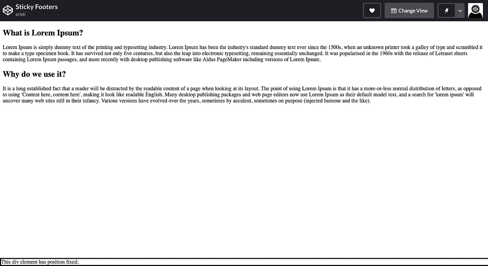

# 在 CSS 中创建一个粘性页脚

> 原文：<https://javascript.plainenglish.io/sticky-footers-in-css-a25911d26c2a?source=collection_archive---------2----------------------->

## 通过这篇文章了解如何增强您的应用程序 UI！！



## 你知道如何在你的网页上添加粘性页脚吗？

我将分享一个解决这个问题的简单方法。使用它来构建您的页脚，并确保即使当您向上或向下滚动时，它们也保持在相同的位置。

首先:

1.  在 VS 代码中创建一个 HTML 文件**【index.html】T4**(或者任何其他代码编辑器)
2.  创建一个 CSS 文件 ***style.css***

## HTML 代码

```
 <!DOCTYPE html><html lang="en"><head><meta charset="UTF-8"><meta http-equiv="X-UA-Compatible" content="IE=edge"><meta name="viewport" content="width=device-width, initial-scale=1.0"><title>Sticky Footer</title><link rel="stylesheet" href="styles.css"></head><body><h2>What is Lorem Ipsum?</h2><p> Lorem Ipsum is simply dummy text of the printing and typesetting industry. Lorem Ipsum has been the industry's standard dummy text ever since the 1500s, when an unknown printer took a galley of type and scrambled it to make a type specimen book. It has survived not only five centuries, but also the leap into electronic typesetting, remaining essentially unchanged. It was popularised in the 1960s with the release of Letraset sheets containing Lorem Ipsum passages, and more recently with desktop publishing software like Aldus PageMaker including versions of Lorem Ipsum.</p><h2>Why do we use it?</h2><p>It is a long established fact that a reader will be distracted by the readable content of a page when looking at its layout. The point of using Lorem Ipsum is that it has a more-or-less normal distribution of letters, as opposed to using 'Content here, content here', making it look like readable English. Many desktop publishing packages and web page editors now use Lorem Ipsum as their default model text, and a search for 'lorem ipsum' will uncover many web sites still in their infancy. Various versions have evolved over the years, sometimes by accident, sometimes on purpose (injected humour and the like).
</p><footer class="fixed">
This div element has position: fixed;
</footer></body></html>
```



## 这是我们的网页目前的样子

注意，包含`class=”fixed”`的页脚元素就在段落的正下方，就像任何其他普通的 div 元素一样。

这是我们需要修复的元素，这样它在用户浏览网页的过程中总是出现在同一个位置。

给你的页脚元素添加一些样式。

## CSS 代码

```
.fixed {
  position: fixed;
  bottom: 0;
  right: 0;
  width: 100%;
  border: 3px solid black;
}
```



## 你现在能看到变化吗？

你的页脚元素**移动到了屏幕的底部**并且占据了整个屏幕的宽度。

这个魔术是由 CSS 属性`{ position: fixed }`创造的

通过**位置属性，我们可以使用**顶部、左侧、右侧和底部属性。

为了将**固定到屏幕的底部**，我们使用了**底部和右侧**属性。

将 bottom 设置为 0，right 设置为 0，确保 div 固定在页面的最底部，并且尽可能靠右。

如果您希望页脚占据整个屏幕宽度，请确保您使用的 bottom 属性的宽度设置为 100%。除此之外，您可以使用任何左侧或右侧属性。两者都会给你想要的结果。

## 添加一些填料和更多的造型，你就可以走了！

```
.fixed {
  position: fixed;
  bottom: 0;
  left: 0;
  width: 100%;
  font-size:1.5em;
  border: 3px solid black;
  text-align:center;
  padding:16px;
  background-color:white;
}
```

## **最终结果**

让我向您展示另一个滚动片段:

运行这支笔并留意页脚位置。你会发现它仍然固定在屏幕的底部！

使用这段代码添加页脚到你的网站，这将提高网页的外观。

许多网站使用`<footer>`元素来收录:

*   作者信息
*   版权信息
*   联系信息
*   网站地图
*   到顶部链接
*   相关文件

你可以在这里找到密码本:【https://codepen.io/sristi27/pen/vYyLQVo 

[](https://github.com/Sristi27) [## srist 27-概述

### 网页开发者和设计师。Sristi27 有 54 个存储库可用。在 GitHub 上关注他们的代码。

github.com](https://github.com/Sristi27) 

希望这篇文章对你有所帮助。感谢阅读！

*更多内容看* [***说白了就是***](https://plainenglish.io/) *。*

*报名参加我们的* [***免费周报***](http://newsletter.plainenglish.io/) *。关注我们关于*[***Twitter***](https://twitter.com/inPlainEngHQ)，[***LinkedIn***](https://www.linkedin.com/company/inplainenglish/)*，*[***YouTube***](https://www.youtube.com/channel/UCtipWUghju290NWcn8jhyAw)*，以及* [***不和***](https://discord.gg/GtDtUAvyhW) ***。***

***有兴趣缩放你的软件启动*** *？检查* [***电路***](https://circuit.ooo?utm=publication-post-cta) *。*