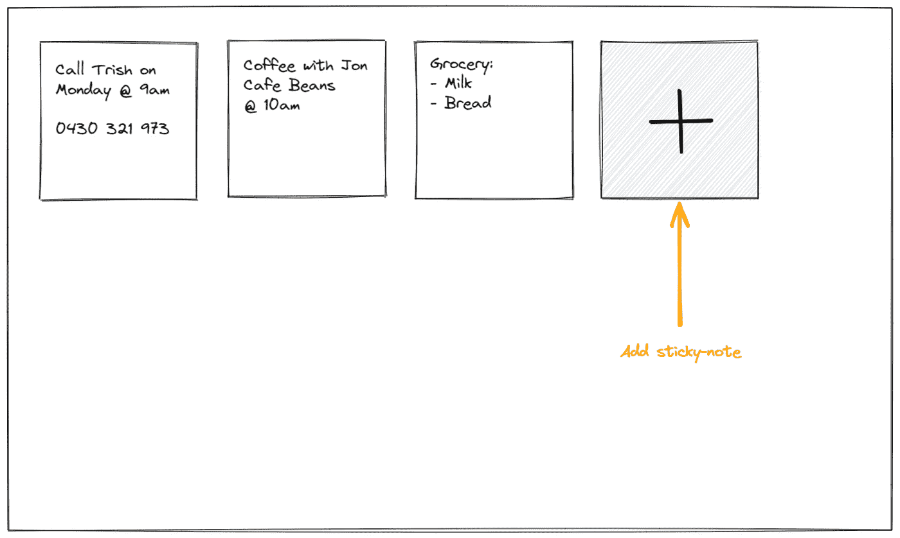
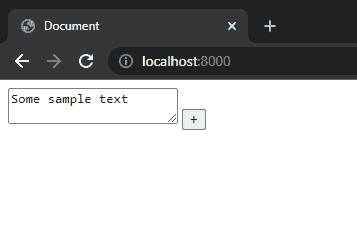
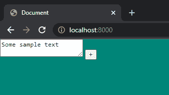
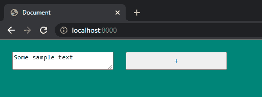
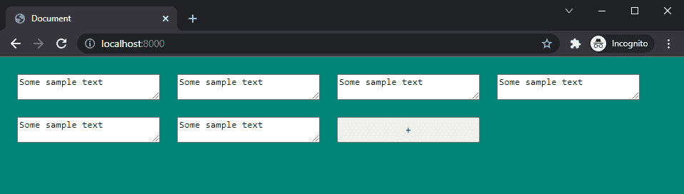
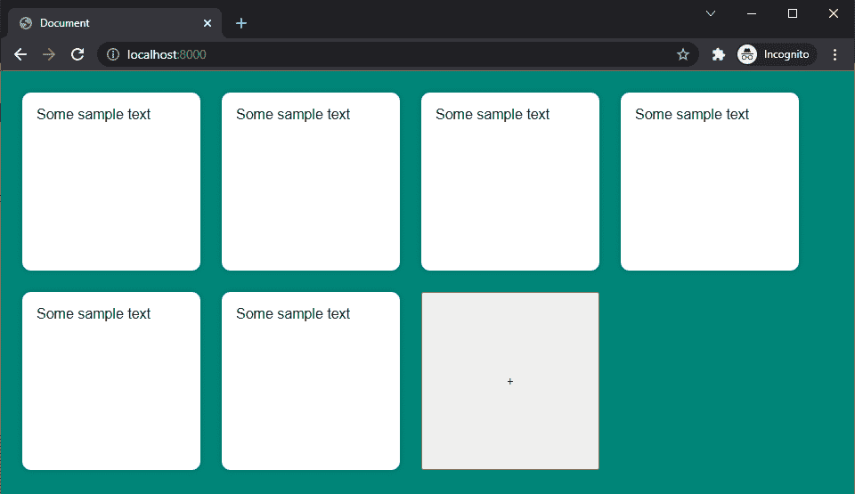
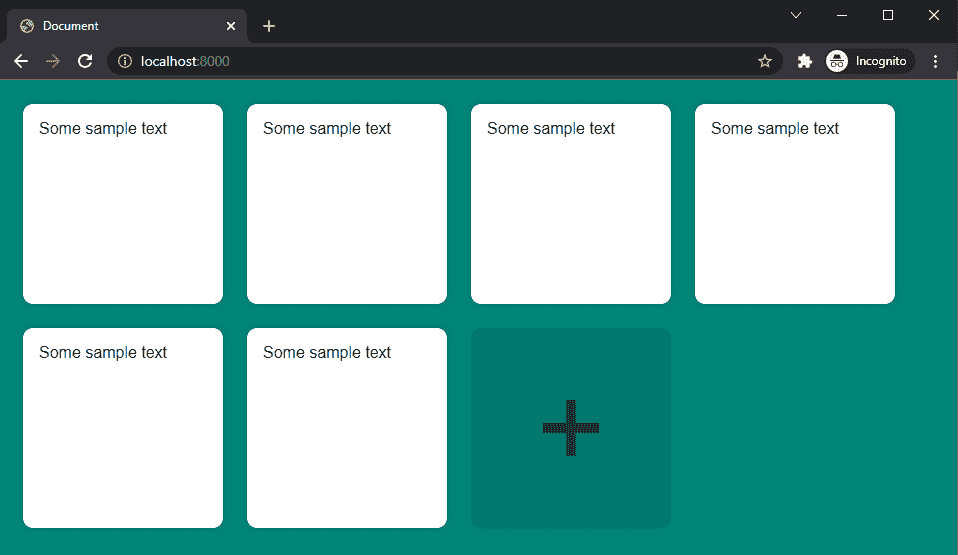

# 便笺——构建视觉结构

> 原文：<https://javascript.plainenglish.io/sticky-notes-building-the-visual-structure-ba9a7bf66e0e?source=collection_archive---------17----------------------->

## 第 1 部分:没有框架的 JavaScript 应用程序


Photo by [AbsolutVision](https://unsplash.com/@freegraphictoday?utm_source=medium&utm_medium=referral) on [Unsplash](https://unsplash.com?utm_source=medium&utm_medium=referral)

*Live dev 笔记由*[*dcode*](https://www.youtube.com/channel/UCjX0FtIZBBVD3YoCcxnDC4g)*——*[*如何使用 JavaScript 构建一个便签 App(初学者项目)*](https://www.youtube.com/watch?v=Efo7nIUF2JY&ab_channel=dcode)

> *在第 1 部分中，我们来看看如何设置一个便笺应用程序。从规划核心功能到*为 *HTML 结构和样式编写文件。*

# 介绍

## 我们为什么要建设这个项目？

*   伟大的初学者项目
*   一个有用的项目，你可以自定义，使自己的
*   理解一个简单 CRUD 应用程序的来龙去脉
*   熟悉通过界面处理数据

## 我们要学什么？

*   如何使用 localStorage API
*   如何引用 JavaScript 文件以在运行时正确运行
*   如何在没有任何库或框架的情况下创建一个具有 CRUD 功能的普通 JavaScript 应用程序
*   处理用 JavaScript 动态创建的元素

## 我们应该对以下内容有一个基本的了解:

*   超文本标记语言
*   半铸钢ˌ钢性铸铁(Cast Semi-Steel)
*   Java Script 语言

# 工具

*   谷歌浏览器
*   终端—当前使用命令提示符
*   代码编辑器—当前使用 Sublime 文本

# 设置本地服务器

因为我已经安装了 Python 所以我使用了`http.server`模块。

> 然而，我们非常欢迎您使用任何其他工具来设置本地服务器，比如 [browsersync](https://browsersync.io/) 。

## 如何启动 python 本地服务器:

1.  将您的终端导航到您想要托管的文件夹
2.  运行以下命令，如果需要，在命令末尾添加一个自定义端口。

```
python -m http.server <port>
```

# 设计界面



## 应用程序的核心功能

1.  ***点击加号添加注释。*** *添加带有占位符内容的便笺*
2.  ***点击进入便签书写自定义内容。*** *点击退出便签保存自定义内容*
3.  ***双击便笺条进行删除。*** *提醒用户是否确认删除*
4.  ***自定义内容保存在本地存储器中。*** *刷新或加载页面将重新生成已经存储在浏览器中的注释*

# 文件结构

我们将使用 3 个文件:`index.html`、`styles.css`和`main.js`

下面是我遵循的文件夹结构，这样我引用文件时就有意义了。

```
stickynotes
├── index.html
└── src
     ├── styles.css
     └── main.js
```

在`index.html`中，我们将建立一个基础结构

```
<!DOCTYPE html>
<html lang="en">
<head>
 <meta charset="UTF-8">
 <meta name="viewport" content="width=device-width, initial-scale=1.0">
 <title>Document</title>
</head>
<body>

</body>
</html>
```

让我们也链接 CSS 和 JS 文件。

为`styles.css`包含一个`defer`属性是非常重要的。这将确保 JS 文件随着页面的加载而加载，并且只有在 JS 中加载了 HTML 之后才执行。它将防止未定义元素的错误。

```
<head>
 ... **<link rel="stylesheet" type="text/css" href="src/styles.css">
 <script type="text/javascript" src="src/main.js" defer></script>**...
</head>
```

# 构建视觉结构

在`<body>`标签中，我们将创建一个单独的`div`，它将包含整个应用程序，并为其分配一个 id“app”。然后在里面，我们将包括一个示例文本区域和按钮。

```
<body> **<div id="app">
  <textarea class="note">Some sample text</textarea>
  <button class="add-note" type="button">+</button>
 </div>**</body>
```



# 应用程序样式

为了对应用程序进行样式化，我们将跳转到 styles.css，从移除一些默认样式开始。

```
body {
 margin: 0;
 background: #008578;
}
```



## 使用 CSS 网格

为了设计应用程序，我们将使用 CSS Grid。

该应用程序将具有以下样式:

*   `width`200 px
*   `padding`共 24px
*   `gap`共 24px

```
#app {
 display: grid;
 grid-template-columns: repeat(auto-fill, 200px);
 padding: 24px;
 gap: 24px;
}
```

使用`auto-fill`是指当另一张 200px 宽的便利贴能装下时，它会填充应用程序右侧的空隙，否则，它会掉到下一行。你可以在这里了解更多。



让我们复制示例文本区域，看看音符网格会发生什么。

```
<div id="app">
 <textarea class="note">Some sample text</textarea>
 **<textarea class="note">Some sample text</textarea>
 <textarea class="note">Some sample text</textarea>
 <textarea class="note">Some sample text</textarea>
 <textarea class="note">Some sample text</textarea>
 <textarea class="note">Some sample text</textarea>**
 <button class="add-note" type="button">+</button>
</div>
```



## 设计便笺的样式

*   `height`200px
*   `border-box`的框尺寸意味着填充不会增加便笺条的宽度和高度
*   `padding`共 16px
*   否`border`
*   `border-radius`共 10px
*   `box-shadow` 15%不透明黑色阴影
*   移除`resize`功能
*   `font-family`无衬线字体
*   `font-size`共 16px

```
.note {
 height: 200px;
 box-sizing: border-box;
 padding: 16px;
 border: none;
 border-radius: 10px;
 box-shadow: 0 0 7px rgba(0, 0, 0, 0.15);
 resize: none;
 font-family: sans-serif;
 font-size: 16px;
}
```



## 设置添加按钮的样式

*   `height`共 200px
*   否`border`
*   否`outline`
*   `background`10%的不透明黑色，让背景色渗透进来
*   `border-radius`共 10px
*   `font-size`120 px
*   `color`50%的不透明黑色
*   `cursor`指针之分
*   悬停在效果上，使按钮的背景变暗，并使其平滑渐变

```
.add-note {
 height: 200px;
 border: none;
 outline: none;
 background: rgba(0, 0, 0, 0.1);
 border-radius: 10px;
 font-size: 120px;
 color: rgba(0, 0, 0, 0.5);
 cursor: pointer;
 transition: background 0.2s;
}.add-note:hover {
 background: rgba(0, 0, 0, 0.2);
}
```



接下来，我们研究将内容存储到本地存储 API 中并增加交互性。

*更多内容看* [***说白了. io***](http://plainenglish.io/) ***。*** *报名参加我们的**[***免费每周简讯这里***](http://newsletter.plainenglish.io/) ***。****