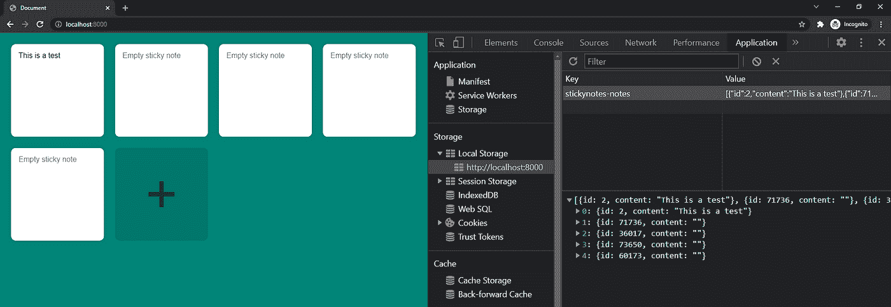

# 便笺——业务逻辑

> 原文：<https://javascript.plainenglish.io/sticky-notes-business-logic-f69253fb45fd?source=collection_archive---------11----------------------->

## 第 2 部分:没有框架的 JavaScript 应用程序


Photo by [AbsolutVision](https://unsplash.com/@freegraphictoday?utm_source=medium&utm_medium=referral) on [Unsplash](https://unsplash.com?utm_source=medium&utm_medium=referral)

*Live dev 笔记由*[*dcode*](https://www.youtube.com/channel/UCjX0FtIZBBVD3YoCcxnDC4g)*——*[*如何使用 JavaScript 构建一个便签 App(初学者项目)*](https://www.youtube.com/watch?v=Efo7nIUF2JY&ab_channel=dcode)

> 在第 2 部分中，我们将研究如何集成 JavaScript，从引用 HTML 元素到在与 localStorage API 交互时添加 CRUD 功能。

简单地说，CRUD 是以下内容的缩写:

*   创造
*   阅读
*   更新
*   删除

粘滞便笺应用程序将需要能够对 localStorage API 运行这些函数。

# 如何访问本地存储

要打开本地存储，请使用以下命令检查页面:

```
ctrl + shift + i
```

接下来，打开默认情况下可能隐藏的应用程序选项卡。


转到本地存储，在那里您会发现一个键和值列。在这里，我们可以看到应用程序运行时数据发生了什么变化。目前，没有存储任何值。


本地存储允许您将数据作为字符串存储在键值对中。因为 JSON 可以转换成字符串，所以它允许你存储数据。

下面是一个示例，展示了便笺数据保存在本地存储时的样子。每个注释都是一个 JSON 对象，带有 id(数字)和内容(字符串)的键

## **键:**

```
stickynotes-notes
```

## **值:**

```
[{
	id: 1234,
	content: "Make some coding tutorials"
},
{
	id: 4321,
	content: "Hello World"
}]
```

# 在 JavaScript 中设置 HTML 引用

在我们开始与 localStorage API 交互之前，我们需要在`main.js`中获得对主应用程序 div 容器的引用

使用容器引用，我们可以访问添加注释按钮。

```
const notesContainer = document.getElementById("app");
const addNoteButton = notesContainer.querySelector(".add-note");
```

此时，有必要从 HTML 中删除示例便笺，因为便笺内容现在将来自本地存储，并通过 JavaScript 动态添加。

```
<div id="app">
  <button class="add-note" type="button">+</button>
</div>
```

# 读取—从本地存储中获取笔记

`getNotes()`函数的目的是返回一个注释数组。它将首先尝试从本地存储中获取所有笔记。然而，如果这是用户第一次运行您的应用程序，它将返回一个空数组。无论它返回什么值，都会被转换成一个 JSON 对象。

```
// retrieves all of the existing notes from local storage in the client's browserfunction getNotes() {
  return JSON.parse(localStorage.getItem("stickynotes-notes") || "[]");
}
```

当我们第一次跳转到控制台并运行`getNotes()`函数时，我们将得到一个空数组。


如果我们跳转到本地存储并将一些数据分配给正确的键名…


…再次运行`getNotes()`函数意味着我们获得了新的数据，而不是一个空数组。


# 更新—将注释保存到本地存储

`saveNotes()`函数将用一些数据填充本地存储字段。

在这里，音符数组被转换为字符串，并覆盖存储在本地存储器的`stickynotes-notes`键中的现有值。

```
// takes an array of notes
// save the new notes to the local storage in the client's browserfunction saveNotes(notes) {
  localStorage.setItem("stickynotes-notes", JSON.stringify(notes))
}
```

为了测试这一点，我们将在控制台中运行`saveNotes()`函数来存储一些数据。确保该函数接受一个 JSON 对象数组。

```
saveNotes([id: 2, content: "This is a test"])
```

接下来，我们将运行`getNotes()`函数，看看它返回什么。

> 请注意，`saveNotes()`函数会覆盖原来存储在本地存储中的任何数据。


# 创建—创建 HTML 注释元素

在`createNoteElement()`函数中，我们想要创建一个新的文本区域来表示一个新的便笺。使用 JavaScript 我们可以创建一个新的 HTML 元素，默认情况下它还没有被附加到 DOM 中。

这个新元素现在可以被分配一个“note”类来获得在`styles.css`中定义的 CSS 属性。我们在函数的第二个参数中提供的 textarea 内容也将被传递给新的注释。

但是，如果没有提供内容，将使用占位符值(我们需要定义它)。

```
// builds a new HTML element to represent a notefunction createNoteElement(id, content) {
  const element = document.createElement("textarea"); element.classList.add("note");
  element.value = content;
  element.placeholder = "Empty sticky note"; // Add event listeners here return element;
}
```

## 事件监听器 1 —更新内容

在返回元素之前，我们必须在与每个便笺交互时包含一些事件侦听器。

第一个事件侦听器将侦听 textarea 内容的任何更改。当发生变化时，它将运行`updateNote()`功能。

```
element.addEventListener("change", () => {
  updateNote(id, element.value);
})
```

出于演示的目的，让我们更新`updateNote()`函数来登录控制台。

```
// updates existing notefunction updateNote(id, newContent) {
  console.log("Updating note...")
  console.log(id, newContent)
}
```

## 事件监听器 2 —删除注释

第二个事件监听器将监听双击便笺。当双击它时，它会要求确认删除该笔记。如果确认为真，将运行`deleteNote()`功能。

```
element.addEventListener("dblclick", () => {
  // returns a boolean value after you confirm whether to delete
  const doDelete = confirm("Are you sure you wish to delete?")

  // if true, delete the note
  if (doDelete) {
    deleteNote(id, element);
  }
})
```

同样，出于演示目的，让我们更新`deleteNote()`函数来登录控制台。

```
// deletes an existing note from the HTML and local storagefunction deleteNote(id, element) {
  console.log("Deleting note...")
  console.log(id, element)
}
```

# 测试功能

## 测试— createNoteElement()

为了测试它，我们将在控制台中运行`createNoteElement()`函数。我们必须包含参数值，特别是 id 的数值和内容的字符串。


## 测试— getNotes()

现在`createNoteElement()`函数已经工作了，让我们添加一个初始加载函数，它创建并显示应用程序中的所有便笺。

在脚本的开始，在查询选择器之后，我们将包括以下内容:

```
getNotes().forEach(note => {
  // create the HTML note element using the JSON data
  const noteElement = createNoteElement(note.id, note.content); // inside the app, insert the HTML note element before the add note button
  notesContainer.insertBefore(noteElement, addNoteButton);
});
```


## 测试—更新注释()

如果我们点击便笺，更新文本区域并点击离开，则`updateNote()`功能将运行并登录到控制台。


## 测试—删除注释()

如果我们双击便笺，我们会得到一个确认提示。


如果我们单击确定，则`deleteNote()`功能将运行并登录到控制台。


# 创建——向 DOM 添加新的注释元素

说到添加注释，我们将首先获取对所有现有注释的引用。获取所有现有注释的原因是为了能够将新注释添加到数组的末尾，并最终重新保存数组。

此外，在向数组添加注释的过程中，我们还会将它附加到 DOM 中的 add 按钮之前。

```
// adds a new note to the HTML and local storagefunction addNote() {
  // retrieves all existing notes from local storage
  const notes = getNotes()

  // construct a base note object
  const noteObject = {
    id: Math.floor(Math.random() * 100000),
    content: ""
  }

  // create the HTML note element
  const noteElement = createNoteElement(noteObject.id, noteObject.content);

  // add the HTML note element to the DOM
  notesContainer.insertBefore(noteElement, addNoteButton);

  // add the note object to the existing notes
  notes.push(noteObject);

  // overwrite value currently in local storage with new array
  saveNotes(notes)
}
```

让我们通过在控制台中运行`addNote()`来添加一个新的注释。这将创建一个带有占位符内容的空白便笺。刷新页面时，空的便笺条仍然会出现，因为在创建时，它也会保存到本地存储中。


# 创建—通过添加按钮创建注释

让我们为 add note 按钮附加一个事件监听器。就像让点击运行`addNote()`功能一样简单。

```
addNoteButton.addEventListener("click", () => { addNote() });
```

现在添加一个新的便笺会将它添加到本地存储和 DOM 中。



# 更新—更新现有注释

与所有改变本地存储数据的函数一样，我们需要获取现有笔记的列表。然后，我们将过滤对象数组，找到具有相同 id 的对象。内容的值随后被覆盖并保存回本地存储。

```
// updates existing notefunction updateNote(id, newContent) {
  // retrieves all existing notes from local storage
  const notes = getNotes() // filters through all the notes based on a set of criteria
  // since it returns an array, select the first item
  const targetNote = notes.filter(note => note.id == id)[0]; // update the content of the note
  targetNote.content = newContent; // overwrite value currently in local storage with new array
  saveNotes(notes);
}
```

如果我们更新应用程序中的注释，单击注释并刷新页面将会保留注释。

# 删除—删除现有注释

从从本地存储中获取所有现有的笔记开始，我们将应用一个过滤器来返回除已删除的笔记对象(通过其 id 引用)之外的所有内容。然后，新数组被保存到本地存储中，元素被从 DOM 中删除。

```
function deleteNote(id, element) {
  // deletes an existing note from the HTML and local storage

  // retrieves all existing notes from local storage
  // filter to return all except the note to be deleted
  const notes = getNotes().filter(note => note.id != id); // overwrite value currently in local storage with new array
  saveNotes(notes); // remove the HTML note element from the DOM
  notesContainer.removeChild(element);
}
```

这就完成了便签应用——没有框架！

*更多内容看* [***说白了. io***](http://plainenglish.io/) ***。*** *报名参加我们的**[***免费每周简讯点击这里***](http://newsletter.plainenglish.io/) ***。****