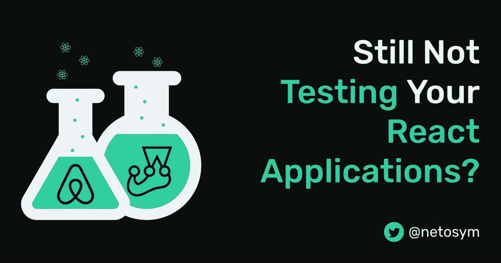
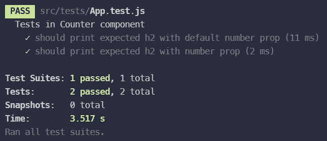
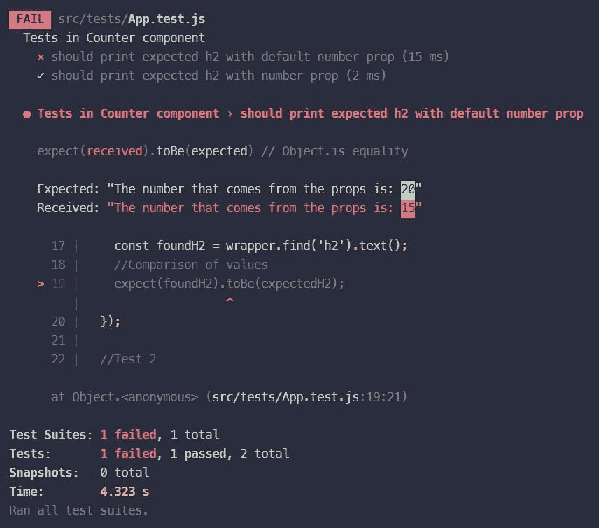
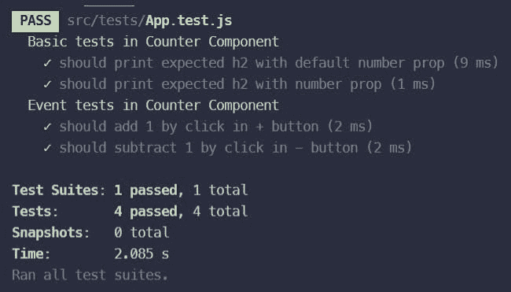

# 仍然没有测试您的 React 应用程序？

> 原文：<https://javascript.plainenglish.io/still-not-testing-your-react-applications-ac12744e52b?source=collection_archive---------8----------------------->



假设你想去法国旅行。你会乘坐未经测试的飞机旅行吗？没有对吗？那会很可怕。

如果那架飞机有引擎问题或其他影响其功能并导致事故的问题怎么办？测试是一个必不可少的过程，不仅在软件开发中如此，在许多不同的领域也是如此。

在开发领域，当开发、维护或重构我们的应用程序时，我们很有可能会添加一些可能导致生产问题的错误。这就是为什么自动化测试过程是强制性的；它有助于我们防止错误和其他可能引发的问题。

嗨！我是 Ernesto，在这篇文章中，我将向您介绍 React 中的测试；所以你可以预防以后的很多问题。

# 什么是软件测试？

它是在将应用程序或软件产品投入生产之前对其进行测试的过程。它包括评估和验证你的应用程序是否做了它应该做的事情。有两种主要的测试类型，单元测试和集成测试。

## 单元和集成测试

单元测试关注应用程序的单个模块(一个组件)，而集成测试关注多个模块以及它们如何协同工作。

> 单元测试更容易编写，执行起来也更快。记住，在进行集成测试之前，要单独测试所有的组件。

# 设置环境

现在是我们感谢 [create-react-app](https://create-react-app.dev/) 存在的时候了。它完成了设置我们工作空间的大部分工作，包括测试的大部分配置，为我们节省了大量时间。

## 玩笑

它是一个基于节点的 JavaScript 测试框架，这意味着它允许我们运行快速并行测试。Jest 默认出现在每个`create-react-app`项目中。

Jest 有一些我们可以用来创建测试的方法。

*   `test()`:这个函数拥有我们测试的所有逻辑。
*   `expect()`:当我们想要测试一个值时，我们使用这个函数。它通常在测试函数内部使用。
*   我们与`expect()` :
    `toBe(value)`一起使用其他函数:这是一个允许我们比较原始值的函数。
    `toEqual(object)`:是允许我们比较物体的函数。
*   这是一个允许我们创建测试包的功能。它需要两个参数:测试包和实际测试的描述。

你可以在文档中找到方法的完整列表。

## 酶

它是由 Airbnb 开发的 React 测试工具。默认情况下，React 自带测试套件，但管理起来可能会有些乏味。酶使我们更容易测试我们的反应成分。与 Jest 不同的是，`create-react-app`中不包含 Enzyme，所以我们必须安装它。

> **注意:**酶还不支持 React 17(最新版本)。这就是为什么我们将使用由 [Wojciech Maj](https://github.com/wojtekmaj) 制造的[非官方适配器](https://github.com/wojtekmaj/enzyme-adapter-react-17)。
> 
> 如果你用的是 React 16，没有问题。您可以按照文件中的[安装酶。](https://enzymejs.github.io/enzyme/docs/installation/)

运行以下命令将 Enzyme 添加到您的项目中。

```
# If using React 17
npm install --save-dev enzyme @wojtekmaj/enzyme-adapter-react-17# If using React 16
npm install --save-dev enzyme enzyme-adapter-react-16
```

像 Jest 一样，酶与方便的测试方法捆绑在一起:

*   `shallow(component)`:返回一个模拟的组件，我们可以从中选择所有的元素或道具。
*   `simulatedComponent.find('query')`:这个函数帮助我们找到模拟组件包含的元素。
*   如果它找到多个元素，我们可以使用`at(number)`函数从列表中选择一个。

你可以在文档中找到方法的完整列表。

# 设置配置

如前所述，`create-react-app`默认包括 Jest，但不包括酵素。在`setupTest`文件中，添加以下几行。

```
//Setup for Jest
import '@testing-library/jest-dom';//Setup for Enzyme
import Enzyme from 'enzyme';
import Adapter from '@wojtekmaj/enzyme-adapter-react-17';Enzyme.configure({ adapter: new Adapter() });
```

现在一切都准备好了，让我们开始有趣的部分吧。

*下面的例子我就用* `*create-react-app*` *。*

# React 中的测试

我们的大多数测试文件都有相同的结构。

```
//React
import React from 'react';//Shallow will simulate a component rendering
import { shallow } from 'enzyme';//The component we want to test
import YourComponentName from 'route-to-your-component';//Test bundle
describe('Test bundle description', () => {
  //Test
  test('should do something', () => {
    //Test logic
    expect(received_value).toBe(expected_value);
  }); //Test
  test('should ...', () => {
    //...
  });
});
```

## 基本测试

我们来看一个经典的例子，计数器组件。

```
const Counter = ({ number }) => {
  const [counter, setCounter] = useState(number); const handleAddition = () => {
    setCounter((prevCounter) => prevCounter + 1);
  }; const handleSubtraction = () => {
    if (counter > 5) {
      setCounter((prevCounter) => prevCounter - 1);
    }
  }; return (
    <div className="main-comp">
      <h1 className="title">INTRO TO TESTING IN REACT</h1>
      <div className="counter">
        <div className="controls">
          <button onClick={handleSubtraction}>-</button>
          <p>{counter}</p>
          <button onClick={handleAddition}>+</button>
        </div>
      </div>
      <h2>The number that comes from the props is: {number}</h2>
    </div>
  );
};//Default props
Counter.defaultProps = {
    number: 15
};
```

我们有一个计数器组件，其中我们使用`useState`钩子来管理计数器值。此外，它还接收一个数字属性，默认值为 15。这个值将是我们计数器的初始值。

让我们创建我们的测试文件并将其命名为`Counter.test.js`。

> 命名约定是`YouComponentName.test.js`。

```
//React
import React from 'react';
//Shallow will simulate a component rendering
import { shallow } from 'enzyme';
//The component we want to test
import Counter from '../Counter';

//Test bundle
describe('Basic tests in Counter Component', () => {

  //Test 1
  test('should print expected h2 with default number prop', () => {
    //Expected h2
    const expectedH2 = `The number that comes from the props is: ${15}`;
    //Simulation of the component rendering (with no props)
    const wrapper = shallow(<Counter />);
    //h2 that our component renders
    const foundH2 = wrapper.find('h2').text();
    //Comparison of values
    expect(foundH2).toBe(expectedH2);
  });

  //Test 2
  test('should print expected h2 with number prop', () => {
    //Number that we will sent as number prop
    const sentProp = 25;
    //Expected h2
    const h2 = `The number that comes from the props is: ${sentProp}`;
    //Simulation of the component rendering (with number prop)
    const wrapper = shallow(<Counter number={sentProp} />);
    //h2 that our component renders
    const foundH2 = wrapper.find('h2').text();
    //Comparison of values
    expect(foundH2).toBe(h2);
  });

});
```

我们正在测试计数器组件接收的数字属性，特别是包含该属性的 h2 标签。

在第一次测试中，我们没有通过任何道具；因此，它将采用默认值(15)。我们创建一个变量，它就是我们期望的 h2。然后我们模拟组件渲染并选择我们想要测试的 h2 标签。最后，我们将得到的值与期望值进行比较。在第二个测试中，我们做了类似的事情。但是在这种情况下，我们将数字 prop 传递给组件。因此，预期的 h2 不会呈现默认值，而是我们发送的值。

要运行所有测试，请执行以下命令:

```
npm run test
```

*   按“a”重新运行所有测试。
*   按“w”查看更多选项。



Test passes

我们的两个测试都通过了，因为我们发送的值与预期值相匹配。在第一次测试中，尝试将值 15 更改为任何其他数字，比如 20，然后重新运行测试。您将会看到第一个测试失败了，因为我们期望的是 15(默认值)，而收到的是 20。



Test fails

## 事件测试

现在，如果我们想测试我们的点击事件是否正常工作。Enzyme 使得模拟点击这样的事件变得容易。让我们添加另一个测试包，它将包含我们对这两个按钮的测试。

```
//Test bundle
describe('Event tests in Counter Component', () => { //Test 3
  test('should subtract 1 by clicking - button', () => {
    //Expected value after clicking (15 - 1 = 14)
    const expectedValue = '14';
    //Simulation of the component rendering (with no prop)
    const wrapper = shallow(<Counter />);
    //Button that will be clicked
    const addButton = wrapper.find('button').at(0);
    //Simulate click event
    addButton.simulate('click');
    //Found value after clicking
    const foundValue = wrapper.find('p').text();
    //Comparison of values
    expect(foundValue).toBe(expectedValue);
  }); //Test 4
    test('should add 1 by clicking + button', () => {
    //Expected value after clicking (15 + 1 = 16)
    const expectedValue = '16';
    //Simulation of the component rendering
    const wrapper = shallow(<Counter />);
    //Button that will be clicked
    const addButton = wrapper.find('button').at(1);
    //Simulate click event
    addButton.simulate('click');
    //Found value after clicking
    const foundValue = wrapper.find('p').text();
    //Comparison of values
    expect(foundValue).toBe(expectedValue);
  });});
```

对于这两个测试，首先，我们创建一个包含我们期望的值的变量。然后，我们模拟渲染，并为我们想要测试的每个动作选择相应的按钮。最后，我们模拟对每个按钮的点击，获得点击后的值，并与期望值进行比较。

我们的计数器从 15 开始，因为我们没有通过任何道具。尝试添加它，并根据您要模拟的按钮来更改预期值。



Test passes

就是这样！做测试就是这么简单。

# 额外收获:我在哪里保存我的测试文件？

我喜欢将它们保存在测试文件夹中，但是许多人更喜欢将它们保存在组件本身旁边。我推荐你阅读[这篇文章](https://hackernoon.com/structuring-projects-and-naming-components-in-react-1261b6e18d76)。它是命名和存储组件的优秀指南。

# 结论

现在，您对如何在 React 中进行测试有了一个概念。这将是你工具箱中的一个奇妙的补充。这将为您省去一些寻找隐藏 bug 的麻烦。

如果您想知道，我如何对定制钩子或 HTTP 请求进行测试？别担心，我会发表一篇文章来讨论这个问题。

感谢阅读！如果这篇文章对你有帮助，请为它鼓掌。如果您有任何贡献、疑问或建议，请告诉我，随时发表评论。对我提高内容帮助很大。

下一篇文章再见。

# 资源

*   https://jestjs.io/docs/en/getting-started
*   【https://enzymejs.github.io/enzyme/ 
*   [https://www.ibm.com/topics/software-testing](https://www.ibm.com/topics/software-testing)

*原载于*[*https://ernesto angulo . hash node . dev .*](https://ernestoangulo.hashnode.dev/are-you-still-using-cmd-let-me-introduce-you-to-wsl)

*更多内容请看*[*plain English . io*](http://plainenglish.io/)