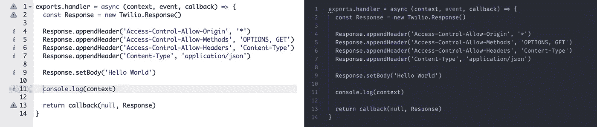

# 还在用 Twilio Functions Classic？以下是您应该迁移到 CLI 的 8 个原因

> 原文：<https://javascript.plainenglish.io/still-using-twilio-functions-classic-here-are-8-reasons-why-you-should-migrate-to-the-cli-8dcbec8b46a?source=collection_archive---------12----------------------->

## 命令行界面是现代的，易于管理，完全可定制。这是显而易见的。


Photo by [Who’s Denilo ?](https://unsplash.com/@whoisdenilo?utm_source=medium&utm_medium=referral) on [Unsplash](https://unsplash.com?utm_source=medium&utm_medium=referral)

与标准 API 相比，运行函数是与 Twilio 交互的一种很好的方式，该公司最近的开源命令行界面(CLI)进一步展示了传统 UI (Functions Classic)的众多优势。

对于那些还没有过渡到 CLI 的人来说，这里有 8 个你应该迁移 Twilio 函数的理由。

## 1.节省时间和创造效率

如果您在多种环境下运行代码，您会理解即使是最简单的更新也是如此耗时。

你在你的一个函数中发现了一个 bug。您在您的开发环境中进行并确认修复。然后将它部署到试运行和生产环境中。首先，您必须复制您修复的函数的整个代码，然后登录到临时环境，导航到函数，找到适当的部分并粘贴更新。接下来，您需要花时间验证您在 staging 中的修复，以确保您的更新没有破坏任何东西。完成所有这些后，冲洗并重复进行生产。

这个例子涵盖了一个函数中的一个 bug。在一切顺利的最佳情况下，这个过程可能需要 15 分钟以上。但是如果你在多个不同的功能中有多个变化，你可能会浪费几个小时。

相比之下，使用 CLI 时，工作流要简单得多。您在代码编辑器中进行了更改，并启动了一个本地实例来验证修复。然后你写一些单元测试，推送到 Github 审核。一旦合并，拉动主分支，用一条线就可以部署到任何环境。任务完成。

## 2.复制和粘贴容易出错

在不同环境之间复制和粘贴时，很容易产生错误，这种风险会随着更改数量的增加而成倍增加。

您在暂存环境中拥有的阻止事件发送到统计和监控仪表板的一行程序很容易在您忘记其重要性时被覆盖，从而导致进一步升级和更多麻烦。


Photo by [Yancy Min](https://unsplash.com/@yancymin?utm_source=medium&utm_medium=referral) on [Unsplash](https://unsplash.com?utm_source=medium&utm_medium=referral)

## 3.改进的版本控制

想象一下这样的场景:您刚刚点击了保存按钮，部署了一个小的更改，应该可以解决您的所有问题，但却意识到这个小的更改已经破坏了您的整个会议基础架构，现在代理无法拨打或接听电话。现在，您必须遍历所有代码，试图找出问题所在。

如果你幸运的话，浏览器窗口可能仍然是打开的，也许 cmd + z 可以工作。或者，您可以在本地使用代码编辑器进行编辑，这样您就可以通过历史记录进行循环。如果没有，这将是一个漫长的夜晚，而你通过工作的错误。

Twilio 的 Functions UI 没有任何版本控制，所以如果出现问题，没有恢复到工作版本的选项。如果你在凌晨 4 点回复页面，很难知道谁做了最后的更新，他们修改了什么，什么时候发布的。

如果您使用的是 CLI，您可以从 Git 中调出以前的版本，在几秒钟内重新部署，然后就可以睡觉了。

## 4.更好的代码突出显示和林挺

第 4 点和第 5 点是一脉相承的，目标是开发人员在函数编辑器中的体验。

一个好的代码编辑器(比如 VS 代码)最有用的部分之一是语法高亮和代码完成。虽然函数 UI 提供了一些代码完成功能，但它并不接近代码编辑器中可用的标准。代码高亮也是静音的，不可定制，限制了它的有效性。

定制的方式也延伸到了林挺。使用函数 UI，编辑器显示警告和潜在的错误，但它们通常不是很有用。没有办法自定义警告或禁用你认为不必要的通知。



Side by side comparison of the Twilio Functions Classic UI (left) vs The same code in VS code (right). Being able to customise appearance and styles makes working with functions much nicer. VS code supports dark mode and allows you to disable warnings for missing semicolons (if that’s your code style).

## 5.使用 CLI 实现更好的日志记录

当试图编写代码或调试问题时，使用简单的`console.log`调用是查看变量当前状态的有效方法。在 Functions Classic 中，这些控制台日志出现在日志记录窗口中，并且经常被截断，使得处理大型对象或数据集成为一项挑战。每次会话结束时，日志也会被清除，这限制了您离开后的访问。

```
{"PATH":"/helloWorld","WORKFLOW_ABSENCE_VOICEMAIL_SID":"WWxxxxxxxxxxxxxxxxxxxxxxxEXAMPLE","CHAT_TASKCHANNEL_SID":"TCxxxxxxxxxxxxxxxxxxxxxxxEXAMPLE","TWILIO_WORKFLOW_EMERGENCYROUTING_SID":"WWxxxxxxxxxxxxxxxxxxxxxxxEXAMPLE","OUTBOUND_TASK_CHANNEL":"outboundcall","CHAT_BACK_END_DOMAIN":"[https://example.com](https://chat-demo.ta-kube-d.com)","ENV":"DEV","RUNTIME_DOMAIN":"[https://funky-kangeroo-1823.twil.io](https://byzantine-caterpillar-1773.twil.io)","JAPANESE_C...
```

使用 CLI 时，您可以使用端点旋转本地实例并对其进行调用。Console.logs 完全按照它们应该的方式工作，将带有堆栈跟踪的完整日志打印到终端中。这意味着您可以比在 UI 上更快地迭代修复，因此您可以找到破坏您的构建的打字错误，并继续进行重要的工作。

## 6.用于更新包的改进工具

维护安全代码的一个重要部分是在代码中保持与包更新同步的过程。Twilio 函数依赖项可以在环境变量下的配置选项卡中找到，但是没有办法知道哪些已经过时，更重要的是，哪些由于安全漏洞需要更新。

配置后，CLI 允许您使用 dependabot 监控过时的依赖关系。在 Github 的 pull 请求中，会自动标记和修复过期的包。如果你有很好的测试覆盖率，这些更新可以很快合并，让你完全放心。如果你愿意，你也可以使用`npm outdated`和`npm audit`在本地显示过时的包。

## **7。没有本地单元测试**

在部署到生产环境时，测试代码让您高枕无忧。如果测试通过，您可以相当自信地认为您的代码将继续运行良好，并且不太可能在凌晨 4 点中断(显然这取决于具有良好覆盖率的编写良好的测试)。对于每天被调用数百次甚至数千次的函数来说，知道您的修复没有破坏所有东西是很重要的。

Twilio Functions 经典 UI 不提供单元测试。是的，您可能会创建类似于 API 测试的东西，在那里您调用端点并查看返回的内容，但是这是次优的。

## 8.这是一个传统工具

自从 Twilio [在 2019 年 8 月宣布其新的无服务器 API](https://www.twilio.com/changelog/new-serverless-api-deploy-functions-and-assets) 以来，Functions UI 的日子已经屈指可数，该 API 允许工程师通过 CLI 部署功能。

2020 年 8 月 31 日[，Twilio 更新了函数 UI](https://www.twilio.com/changelog/all-new-functions-and-assets-ui-now-available) ，增加了一系列新功能，使 CLI 版本更好，将原始版本重命名为“函数经典”，并将其命名为 Legacy。这意味着 Twilio 将不再推送该版本的更新，因此不会对之前的 7 个问题进行修复。考虑到这一点，没有任何理由说明 Functions Classic 应该放在开发人员的工具箱中。

## 更好的选择

开始使用 CLI 真的非常容易。只需前往由传奇人物菲尔·纳什和其他人维护的[Create-Twilio-Function repo](https://github.com/twilio-labs/create-twilio-function)，然后运行`npm init twilio-function your-directory-name-here`。这将安装和配置一个工作函数环境，您可以在其中构建和运行函数。

如果你缺乏想法或者被一个 bug 卡住了，那么[函数模板 repo](https://github.com/twilio-labs/function-templates) 有一个知识宝库可以帮助你。

使用 CLI 意味着您拥有在 Git 中运行项目的所有优势，这对跨团队工作非常有用。您还可以在本机编辑器中编码，该编辑器带有语言突出显示和代码完成功能。通过扩展，这也允许您轻松地配置林挺，以符合编码标准。

在 TripActions，我们还使用 Jest 和 Sonarcloud 为我们的函数环境设置了单元测试[，目前代码覆盖率约为 96%。我们现在可以安心地进行部署，因为我们知道我们的更改不会导致严重的问题。](/making-sonarcloud-play-nicely-with-jest-fa271f559024)

以这种方式工作是一种非常愉快的经历。

[Create-Twilio-Function repo](https://github.com/twilio-labs/create-twilio-function)是[无服务器工具包](https://github.com/twilio-labs/serverless-toolkit)的一部分。这为终端带来了 Twilio APIs 的强大功能，并允许开发人员无缝、无压力地构建代码并将其部署到多个环境中。

Twilio 还继续为新版本的 Twilio 函数带来新的功能，使其成为一个充满活力的地方。

所以就去做吧。进行跳跃。你不会后悔的。

感谢您花时间阅读本文

大卫

高级前端开发者@ [TripActions](https://tripactions.com/) (通常是[雇佣](https://grnh.se/cbeb241d1)！)

*更多内容请看*[*plain English . io*](http://plainenglish.io/)