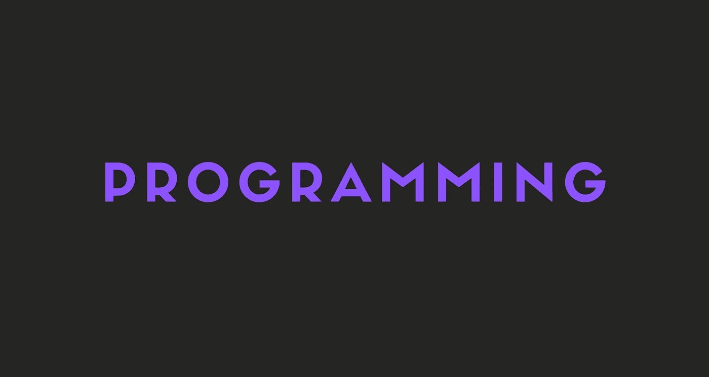

# 停止编码，学习编程

> 原文：<https://javascript.plainenglish.io/stop-coding-learn-programming-92de720e1baa?source=collection_archive---------28----------------------->

停止编写代码。学习如何计划和运用你的想法。

在这个故事中，我将解释编码和编程之间的区别。我也将谈论如何真正成为一名程序员，而不仅仅是一名程序员。

我们开始吧！

# 有什么不同？

## 基础

编码是编程的一部分，它处理编写机器可以翻译的代码。

编程是创建遵循特定标准并执行特定任务的程序的过程。

## 工具

程序员不需要很多工具。程序员需要的工具通常只是网络浏览器和代码编辑器。作为一名程序员，您只需要知道编程语言语法的细节。

不过，编程是不同的。程序员应该能够使用数据库，规划和绘制路线图，设计应用程序的架构等。对于程序员来说，网络浏览器和代码编辑器通常是不够的。

## 专业知识

程序员应该对编程语言及其语法和关键词有基本的了解。

程序员应该有创建算法、建模问题、处理数据和管理项目等方面的经验。

程序员也运用他们的想象力和分析技能来帮助他们解决特定的问题。

## 结果

在编码时，您的预期结果是一个简单的解决方案或项目的一小部分。该代码充当一组给予计算机的指令。

另一方面，编程产生了整个应用程序、软件产品或一个随时可用的网站。

# 你是程序员还是程序员？

要知道你是一个程序员还是一个程序员，只要想一想像不和谐或脸书这样的应用程序，以及你将如何构建它。

如果除了你最喜欢的编程语言和最简单的数据库之外，你想不出其他任何东西，那么你可能是一个程序员。

但是，如果你能为应用程序想出最好的编程语言、框架、架构和数据库，并列出它们的优点和缺点，你可能是一个程序员！

# 编程难吗？

不。编程比编码难，但并不像你想象的那么难。

有些人只是想放弃，继续做一名程序员。请不要。

学习编程会让你的生活更简单，你会对你的技能更有信心。

有些人不相信这一点，但你也将能够找到更多的工作或在目前的工作中取得更大的成功。

# 如何成为一名程序员？

我刚刚给了你一个思考如何建立不和或脸书的例子，记得吗？好吧，来吧。试着思考一些技术并制定一些计划。

然后，将它们与其他大型应用程序进行比较，看看你是否做得很好。例如，不和谐组织有一个博客和一个工程部门，他们在那里解释了很多他们是如何管理这么多用户的，等等。

完成了吗？不错。

现在创建您自己的项目！找到你喜欢的想法，并付诸实施。但是这次，不要使用经典的堆栈，尽量避免教程。

这样你也将获得一些真实生活的经验，并真正成为一名真正的程序员！

# 最后的想法

我希望这个故事对你有所帮助，如果你还不是一名程序员，我希望你已经决定成为一名程序员。

## 谢谢你

2021 年 7 月，我赚了 113.13 美元，还获得了 100 美元的中型作家奖金。

谢谢大家的支持！

# 仅此而已。感谢您阅读这个故事！

如果你喜欢这个故事，一定要为它鼓掌！你想问我什么都可以。

在 Twitter 上关注我:

 [## re _ ally 边缘

twitter.com](https://twitter.com/Re_allyedge) 

在 Patreon 上支持我:

 [## 阿里木阿尔斯兰卡亚是创造编程故事和教程。帕特里翁

### 今天就成为阿里木阿尔斯兰卡亚的赞助人:在世界上最大的…

www.patreon.com](https://www.patreon.com/allyedge) 

*更多内容看*[***plain English . io***](http://plainenglish.io/)