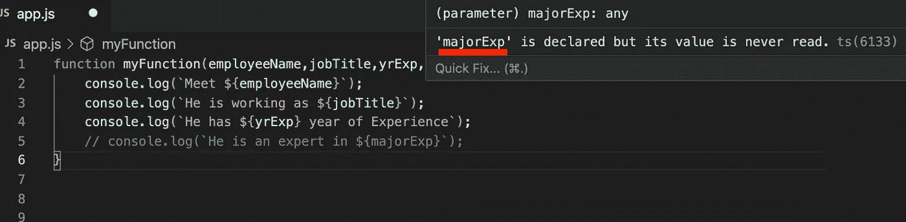

# 不要给你的函数太多的参数

> 原文：<https://javascript.plainenglish.io/stop-giving-too-many-parameters-to-your-functions-a93f6a4d8d9e?source=collection_archive---------7----------------------->

## 这是一种清理函数参数的方法


Photo by [Curology](https://unsplash.com/@curology?utm_source=unsplash&utm_medium=referral&utm_content=creditCopyText) on [Unsplash](https://unsplash.com/s/photos/clean?utm_source=unsplash&utm_medium=referral&utm_content=creditCopyText)

函数并将值传递给函数是我们在软件工程生涯中每天都要做的事情。

这篇文章试图帮助优化函数的参数传递。

# 场景

考虑下面这个函数。这个函数接受四个参数。

```
function myFunction(employeeName,jobTitle,yrExp,majorExp){
 console.log(`Meet ${employeeName}`);
 console.log(`He is working as ${jobTitle}`);
 console.log(`He has ${yrExp} year of Experience`);
 console.log(`He is an expert in ${majorExp}`);
}
```

我们将这样调用这个函数

```
myFunction("John","Project Manager",12,"Project Management");
```

输出是:

```
Meet John
He is working as Project Manager
He has 12 year of Experience
He is an expert in Project Management
```

# 问题是

## 违反“干净代码”原则

这个原则表明一个函数不应该有超过两个参数**。**

## 参数排序很重要

如果我们没有按照正确的顺序传递参数，我们可能会出错。

例如:

```
myFunction("John","Project Manager","Project Management"); 
// Missing experience params
```

输出是:

```
Meet John
He is working as Project Manager
He has **Project Management** year of Experience
He is an expert in **undefined**
```

为了避免这种情况，你必须做一些像下面这样看起来不标准也不干净的事情。此外，这段代码容易出错。

```
myFunction("John","Project Manager",undefined,"Project Management");
// Undefined as experience
```

## 未使用的参数

如果你没有使用函数中的任何参数，你的 **ESLint** 就会抱怨。



majorExp is declared but not used

## 测试边缘案例

你必须用每一个单独的论点来测试大量不同的案例。

# 以下是解决方案

**创建一个更高级别的对象作为参数。**创建一个更高级别的对象并使用 ES2015/ES6 **析构**语法是克服上述问题的好方法。

考虑这个 **mockTechPeople** ，它将包含我们的函数可能需要的所有必要值。

```
const mockTechPeople = {
   employeeName:"John",
   jobTitle:"Project Manager",
   yrExp:12,
   majorExp:"Project Management"
}
```

现在将函数重写为

```
function myFunction({employeeName,jobTitle,yrExp,majorExp}){

     // destructure what value you need !

     console.log(`Meet ${employeeName}`);
     console.log(`He is working as ${jobTitle}`);
     console.log(`He has ${yrExp} year of Experience`);
     console.log(`He is an expert in ${majorExp}`);
}
```

现在就这样打电话吧:

```
myFunction(mockTechPeople); // Only One argument
```

就这样，我们解决了我们的问题！

感谢阅读，我希望你发现这是有用的！