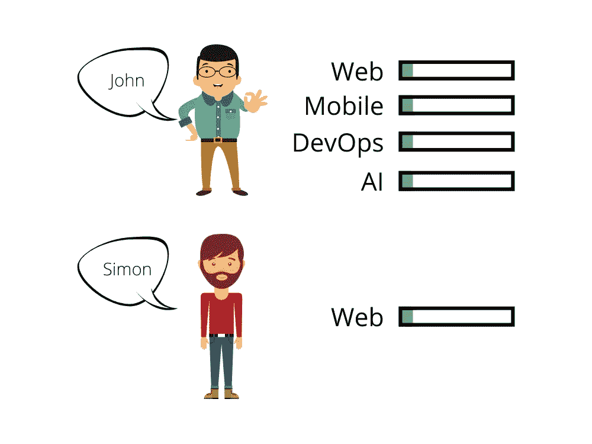
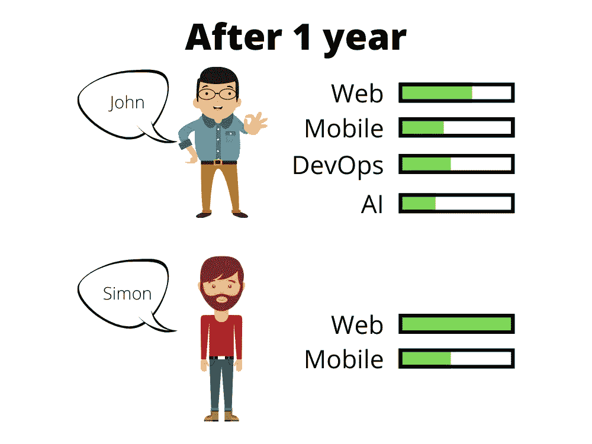

# 停止同时学习所有的东西！

> 原文：<https://javascript.plainenglish.io/stop-learning-everything-simultaneously-c0c5eae70394?source=collection_archive---------10----------------------->

## 它减缓了你作为开发者的进度！

Photo by [Gabriella Clare Marino](https://unsplash.com/@gabiontheroad?utm_source=medium&utm_medium=referral) on [Unsplash](https://unsplash.com?utm_source=medium&utm_medium=referral)

**本文主要针对应届毕业生、大三学生以及想在软件开发领域起步的人。**

我知道我们在小学和中学同时学习许多其他科目。一次学多件东西并不太难。但是，作为开发人员，您应该这样做吗？相信大部分初学者都在做。

如果你想学习后端的 Go，数据库的 MySQL，前端的 Vue.js，这很正常，因为这些都被归类为 **web 开发。**我说的是一开始就同时学习**网页开发**和**手机 app 开发**。

Graphic created by [Oyster Lee](https://blog.oysterlee.dev) with [Canva](https://www.canva.com/)

约翰和西蒙都是编程初学者。John 想同时学习 web、mobile 和 DevOps，而 Simon 只选择了 web。

Graphic created by [Oyster Lee](https://blog.oysterlee.dev) with [Canva](https://www.canva.com/)

一年后，John 没有掌握任何技能，半年后，他意识到 web 开发与人工智能的结合非常罕见，所以他决定暂时停止学习。

约翰知道的技能很难帮助他在职业生涯中取得进步。一个公司不需要一个什么都懂却不能解决某个特定领域困难挑战的人。

Simon 成功掌握了他的 web 开发技能，并且他已经掌握了一半的移动应用程序开发技能。西蒙更容易获得晋升，因为他可以解决最困难的挑战，并知道确切的细节。

# 我的故事

我刚毕业的时候，在 web 开发技能提升之前，想学手机 app 开发和 DevOps。作为一个刚毕业的学生，什么都知道，这是一种很酷的感觉。最终，两年后这些都没有掌握。我什么都知道一点点。

之后从全栈 web 开发者转行做前端开发者，主要专注于前端。我比以前学得快多了。现在，我已经掌握了我的前端技能。我将和 Kotlin 一起从事桌面和移动应用开发。

一个刚毕业的律师和博士懂得很多。在这个行业工作几年后，他们可能会开始忘记他们没有关注的知识。和程序员一样，选择未来五年你唯一希望工作的道路。

作为一名有经验的开发人员，你是通过专注于特定的事情还是通过并行学习来学习的？

*更多内容请看*[***plain English . io***](http://plainenglish.io/)