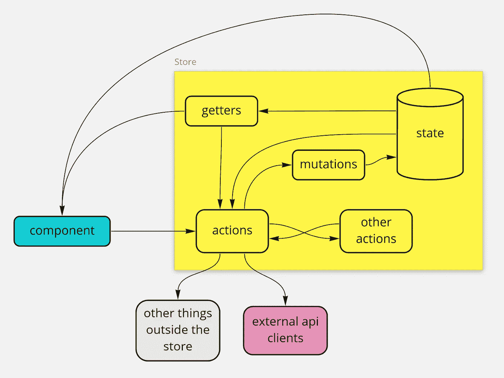
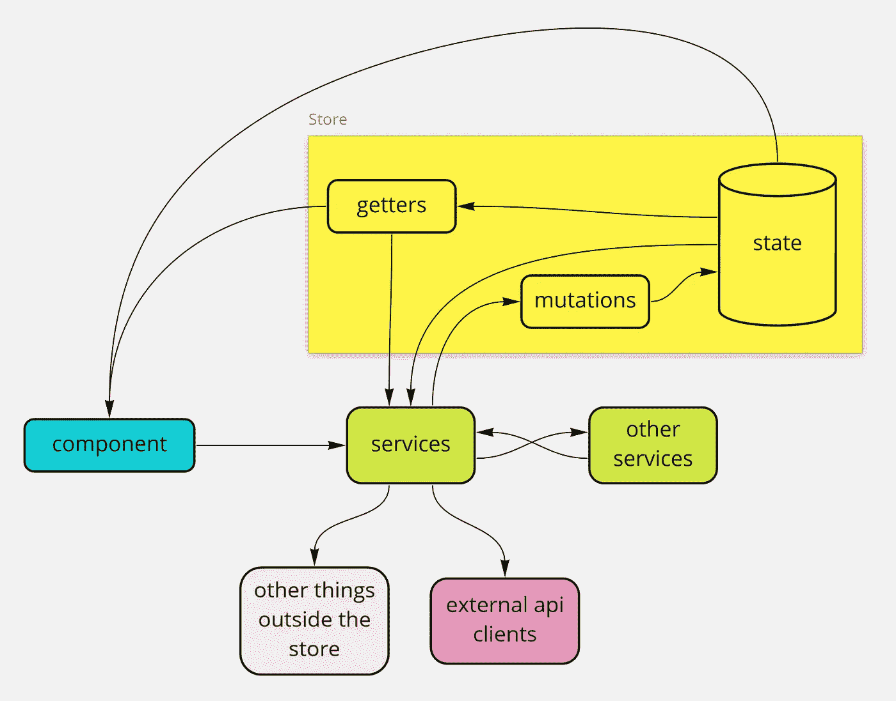

# 停止在 Vuex 中使用动作

> 原文：<https://javascript.plainenglish.io/stop-using-actions-in-vuex-a14e23a7b0e6?source=collection_archive---------0----------------------->

## 通过将所有“业务逻辑”转移到常规功能中，将其从 Vuex 商店中移除

## 问题是

如果您使用的是 Redux 或 Vuex 之类的状态管理库，您很可能会编写大量包含您的业务逻辑的“action”方法。(本文对 Vuex 和 Redux 都适用。但由于这几天在用 Vuex，我就用 Vuex 举例)

以下是 Vuex 中常见的简化商店定义示例。

```
// STORE **
import * as searchApiClient from '@/apiClients/searchApiClient';**
... 
{
  namespaced: true,
  state: {
    isSearchInProgress: false,
    searchResults: {},
  },
  getters: {
    [getterNames.resultsCount]: (state) =>
      (state.searchResults.results || []).length,
  },
  mutations: {
    [mutationNames.searchStarted](state) {
      state.isSearchInProgress = true;
      state.searchResults = {};
    },
    [mutationNames.searchCompleted](state, { results }) {
      state.isSearchInProgress = false;
      state.searchResults = results;
    },
  },
  *actions: {* ***async [actionNames.getSearchResultsAsync](context, { query })*** *{* ***if (!query) {
        return;
      }*** *context.commit(mutationNames.searchStarted);* ***const results = await searchApiClient.searchAsync(query);*** *context.commit(mutationNames.searchCompleted, { results });
    },
  },*
}
```

为了使示例完整，当您拥有这个商店时，您可以在 Vue 组件中使用它，如下所示:

```
// COMPONENT 
computed: {
  ...mapState(moduleNames.search, {
    searchResults: (state) => state.searchResults.results,
    isSearchInProgress: (state) => state.isSearchInProgress,
  }),
  ...mapGetters(moduleNames.search, [getterNames.resultsCount]),
},
methods: {
  async searchAsync() {
    await **this.$store.dispatch**(
      **`${moduleNames.search}/${actionNames.getSearchResultsAsync}`**,
      { query: this.query }
    );
  },
},
```

> **什么是业务逻辑** 这里的`async getSearchResultsAsync(context, params)`方法就是你的业务逻辑。它包含:
> 
> *验证`if (!query) {return;}` *外部 api 交互`await searchApiClient.searchAsync(query)` *此处不可见，但主要包含其他业务逻辑的编排`context.dispatch('tracking/trackAsync', ....)`

上面的示例代码表示了一个依赖关系图，如下所示:



An app using Vuex generally looks like this

如您所见，商店很快就变成了“应用程序”。你很有可能对州立图书馆深恶痛绝，但仍然需要使用它们。因为这种代码组织带来了一些问题:

*   **很难读懂并遵循**
    你不直接调用“动作”，而是调用一个`dispatch` 方法，并给出你的“动作方法”的名称。您依赖于与名称匹配的*字符串。调用代码和被调用函数之间没有直接关系。IDE 不能帮助您导航到该操作。您需要对姓名进行字符串搜索，并找到正确的匹配项。❌*
*   **调试困难**
    同上但调试时。调用堆栈被额外的“管道”层弄得错综复杂。❌
*   **商店是个怪物**
    商店直接依赖于外部 API 的客户端。业务逻辑通常依赖于外部 API 访问和其他业务逻辑(碰巧也依赖于其他一些外部 API 访问)。当一个全局对象包含你的业务逻辑时，它自然会依赖于所有这些。 ❌
*   **测试难**
    你在开始写测试的时候就体会到了这种“依赖”问题带来的悲哀。尝试在一个非平凡的应用程序中模仿你的商店(或你的商店的一部分)。你开始嘲笑你的整个系统，甚至只是为了测试一个微小的功能。❌
*   **很难组织**
    商业逻辑一般与你的“状态”的不同“子模块”的组合有关。所以有时候，无论你把你的商业逻辑放在哪里，感觉它都不属于那里。(提示:因为它属于别的地方)❌

此外，“store”是您的大型全局单例数据对象。它已经包含了一个对象中的所有数据。当你把你所有的逻辑也放入那个物体时，它就变成了一个热气腾腾的意大利面条/怪物/上帝物体的完美例子。

# 解决方案

存储本质上是一个“内存数据库”,您可以对其进行读写操作。状态管理库在用`mapState`和`mapGetters`连接从数据库到 UI 组件的通知机制方面做得很好。这些都是很棒的使用机制，Vuex 让它变得特别简单和直观。继续使用**，但停止使用** `**actions**`。将您的业务逻辑转移到普通的旧功能中，并从代码库中完全删除存储操作。

下面是它的样子:



Actions moved out of the store to become “services”

上面的例子会变成这样:

```
// STORE 
{
  namespaced: true,
  state: () => createInitialState(),
  getters: {
    [getterNames.resultsCount]: (state) =>
      (state.searchResults.results || []).length,
  },
  mutations: {
    [mutationNames.searchStarted](state) {
      state.isSearchInProgress = true;
      state.searchResults = {};
    },
    [mutationNames.searchCompleted](state, { results }) {
      state.isSearchInProgress = false;
      state.searchResults = results;
    },
  },
};
```

您可以在常规函数中定义您的业务逻辑:

```
// SERVICE **
import * as searchApiClient from '@/apiClients/searchApiClient';**export async function searchAsync (store, query) {
  if (!!query == false) {
    return;
  } **store.commit(mutationNames.searchStarted);** const results = await searchApiClient.searchAsync(query); **store.commit(mutationNames.searchCompleted, { results });** 
};
```

尽可能简单地编写您的所有逻辑，并通过突变与您的存储(数据库)进行交互(这是一种“存储库”模式)。干净、简单、整洁。

为了使示例完整，您可以在 Vue 组件中使用商店和服务，如下所示:

```
// COMPONENT **
import * as searchService from '@/services/searchService';**
computed: {
  ...mapState(moduleNames.search, {
    searchResults: (state) => state.searchResults.results,
    isSearchInProgress: (state) => state.isSearchInProgress,
  }),
  ...mapGetters(moduleNames.search, [getterNames.resultsCount]),
},
methods: {
  async searchAsync() {
    ***await searchService.searchAsync(this.$store, this.query);***
  },
},
```

好了，好处:

*   **更容易阅读和跟随**
    无字符串匹配。组件对业务逻辑的调用是直接的。IDE 又是你的朋友了。它将让您导航到定义，显示智能感知和参数。所有的好东西。你对其他“业务逻辑方法”的调用也是直接的。代码导航又回到了它应该的样子。✔️
*   **更容易调试** 没有管道层。电话是直拨的。调用堆栈是干净的。✔️
*   **存储要简单得多**
    它不依赖于外部 API 调用，也不依赖于动作方法中复杂的交互。(*不过，请注意，如果你的业务逻辑本来就很复杂，那么这种基本的复杂性不会因为你把它从一个地方移到另一个地方而消失😃但至少你的“商店”会更容易管理* ) ✔️
*   **更容易测试**
    我们将存储简化为一个没有外部依赖性的内存对象。**再也不用嘲笑商店了。对于每个测试，您可以创建一个您的原始存储的副本并直接使用它。当您需要模拟您的业务逻辑方法时，您可以使用测试库的标准实用程序以更简单的方式模拟它们。✔️**
*   **现在更容易组织**
    了，因为业务逻辑功能现在不必坐在商店里靠近一堆数据，可以随意以任何方式组织它们。✔️

# 不利方面？

```
export async function searchAsync (**store,** query) {
```

您需要将商店实例传递给业务逻辑方法。向每个方法添加额外的参数可能看起来是重复和枯燥的。随意把它当作一个问题，用“全局存储提供者”或“参数依赖注入”机制来解决它。

我喜欢直截了当。也更容易测试。所以我不认为这是一个缺点。代码写一遍，读一百遍。我为了更大的利益而优化。

**下面是一个工作实例:**[https://github.com/veyselozdemir/vuex-no-actions](https://github.com/veyselozdemir/vuex-no-actions)

# 结论

好了，非常感谢你读到这里。你读了 1000 多字。这是一项成就😃

**关键要点:**不要用动作。

**更多要点:**保持你的商店精简和吝啬。将交互限制在 getters 和 variation(setter)上。用常规方法编写您的业务逻辑。当您依赖于存储时，将存储作为显式参数传递到那里，而不是使用神奇的管道库。

## **TLDR**

将所有的“业务逻辑”移至普通的旧函数中，从 Vuex 存储中删除它们，并从存储中删除所有的 `**action**` **方法**。您的代码将更容易编写，更容易测试，最重要的是更容易阅读。

如果你想直接跳到一个例子:[https://github.com/veyselozdemir/vuex-no-actions](https://github.com/veyselozdemir/vuex-no-actions)

*更多内容请看*[***plain English . io***](http://plainenglish.io)