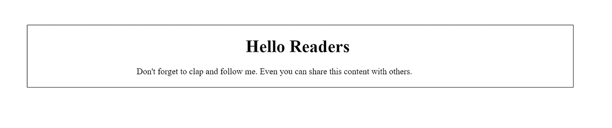

# 停止使用 CSS 和 Bootstrap，改用 Tailwind CSS

> 原文：<https://javascript.plainenglish.io/stop-using-css-and-bootstrap-use-tailwind-css-instead-94c689ec3b8a?source=collection_archive---------5----------------------->

## 顺风 CSS 给你更多的灵活性，节省你的时间。


Source: [Pexels](https://www.pexels.com/photo/woman-in-red-long-sleeve-shirt-looking-at-her-laptop-3765132/)

大家好。当我刚接触 web 开发时，我不得不学很多东西，花很多钱，按很多键，做很多工作。

先是 HTML，CSS，Bootstrap，JavaScript。然后 React，Vue.js，或者 Angular 还有很多。要了解更多这方面的内容，你可以阅读[如果我不得不重新开始，我将如何学习前端 Web 开发](/how-i-would-learn-front-end-web-development-if-i-had-to-start-over-again-24e6228050d0)。

与其深入探讨，不如把重点放在 CSS 框架上。嗯，有很多东西，你不可能每一样都学会。

因此，最好专注于学习一个框架，帮助你成为一个更好的 web 开发人员，而不要浪费你的时间。

但是我们不知道选择哪个框架。不要紧张，我会指导你选择一个。

> **注:**这里我不隶属，比较是基于他们的使用和一些证据。

让我们从头开始。

我曾与一家总部位于英国的公司合作，他们只使用 Next.js 开展业务。我参加了一个在线会议，会上一名男子向我解释了相关要求。他们想在他们的网站上使用 Next.js 和 Tailwind CSS。

是的，Next.js 对我来说是新的，现在他们也在使用顺风的行话。

我告诉他们我已经准备好了。

不到一个小时，我就学会了 Tailwind CSS，这要归功于它格式良好的文档。

在浏览了 Tailwind 文档之后，我在每个项目中都使用过它。

这就是我学习顺风 CSS 的方法。

# 但是我之前用的是什么？

在学习 Tailwind CSS 之前，我在所有的项目中都使用了 CSS、BootStrap 和 Materialize。这实际上是在浪费你的时间。

我甚至在我的一些项目中使用了 Material UI。

之后，我学习了 Tailwind CSS，它改变了我的 web 开发体验。

# 为什么要用 Tailwind CSS？

在这里，我不会使用行话，保持简单。

## 1.它节省你的时间

假设你正在使用 CSS 创建一个作品集网站。为此，您将使用外部 CSS。简单地说，您将创建一个名为 **style.css** 的文件，并将您的所有 css 添加到其中。

在那之后，假设你想改变`<h1>`标签。

你会怎么做？尝试在 HTML 文件中找到`h1`标签，然后转到 style.css 并更改其样式。

如果你想创建一个响应式网站呢？在 HTML 文件中找到需要响应的部分，然后在 CSS 文件中搜索它们的样式。如果出现问题，你必须多次修改 CSS 文件。

假设你创建了一个错误，那么你必须消耗大量的时间。

我们在这里做什么？把简单的任务变成乏味的任务。

但是我们可以使用内联 CSS 来实现。但是这不是一个好的做法，你的 HTML 文件看起来会很奇怪。

现在来说说 Bootstrap。是的，使用 Bootstrap 为 CSS 创建文件没有问题。您可以通过 Bootstrap 使用内联样式。

但是与顺风相比，Bootstrap 很难学，甚至很难用。

相比之下，Tailwind 很容易学习，有很好的文档。此外，它还能减轻你的负担，避免大量的 CSS。

你可以直接在 HTML 中使用 Tailwind CSS，这样可以节省你的时间。

## 2.提供灵活性


Photo by [Rawan Yasser](https://unsplash.com/@rawanyasser?utm_source=medium&utm_medium=referral) on [Unsplash](https://unsplash.com?utm_source=medium&utm_medium=referral)

当我使用 CSS 时，我必须分屏显示 HTML、CSS 和 localhost。要在 HTML 中找到标签，请在 CSS 中更改样式并在 localhost 中查看。

老实说，我不喜欢 Bootstrap，所以这可能是 Bootstrap 不能为我提供灵活性的原因。

所以我提到我必须花一个小时学习顺风。就这样，我学会了帮助我处理 HTML 文件和本地主机各种命令。

## 3.更少的错误和失误

在 CSS 中，我们要写很多代码。因为我们必须处理媒体的询问和所有的事情，所以甚至很难做出回应。

但是创建 Tailwind 是为了避免大量的 CSS 代码，这些代码帮助我们犯更少的错误。

甚至我们都不需要在 Tailwind 中使用媒体查询。

## 4.小代码

假设我想创建一个 80%的 div 并添加内容 init。

下面是使用 CSS 的代码。

在 HTML 文件中，

```
<div class=”style”>
 <h1 class=”heading”> Hello Readers</h1>
 <p class=”para”> Don’t forget to clap and follow me. Even you can      share this content with others</p>
</div>
```

在 CSS 文件中，

```
.style{
  margin: 0 auto 0;
  width:80%;
  border: 1px solid 
}
.heading{
  width: 20%;
  margin: 0 auto 0;
}.para{
  width: 60%;
  margin: 20px auto 20px;
}
```

这是输出结果，



这里我没有让它响应，因为它需要更多的代码。

现在让我们使用顺风 CSS，

```
<div className="w-4/5 mt-24 mx-auto"><h1 className="w-1/5 mt-5 border-2 mx-auto">Hello Readers</h1>
<p className="w-3/5 my-5 mx-auto">Don't forget to clap and follow    me. Even you can share this content with others.
</p></div>
```

输出完全相同，但代码更少。

> w-4/5 表示宽度:80%，w-1/5 表示宽度:20%，
> 
> mt-24 的意思是 margin-top: 6rem(由于顺风主要对付 rem)，
> 
> mx-auto 表示沿 x 轴的边距是自动的，
> 
> 还有其他类似的命令。

## 5.容易理解/学习


Photo by [Chris Benson](https://unsplash.com/@lordmaui?utm_source=medium&utm_medium=referral) on [Unsplash](https://unsplash.com?utm_source=medium&utm_medium=referral)

我同意，因为我已经知道了 CSS 和 Bootstrap，所以学习 Tailwind CSS 对我来说很容易。

但是我通过 Tailwind CSS 学到了一些 CSS 概念，这真的很容易。

文档足够简单并且格式良好。

还有什么？当我想使用一个新概念时，Tailwind 会在他们网站的顶部提供一个快速搜索选项。

这里是[文档，](https://tailwindcss.com/docs)如果你想跟随它。

# 结论:

我不得不花很多时间使用 CSS 和 Bootstrap，但当我学会了 Tailwind，我就不用花这么多时间了。使用 TailwindCSS 也可以节省时间。

是的，我知道我们要学习 CSS，但是有了顺风 CSS 就可以避免使用。这会节省你的时间和精力，提高你的工作效率。

就这样——谢谢！

你也可以[关注我](https://nitinfab.medium.com/)或者阅读我的一些故事。这会增加我的信心，帮助我写更多。

[](/5-ways-to-earn-money-as-a-developer-1e42e694a078) [## 开发人员挣钱的 5 种方法

### 从新手到专家:成功的深度指南

javascript.plainenglish.io](/5-ways-to-earn-money-as-a-developer-1e42e694a078) [](https://medium.com/code-blog/top-12-youtube-channels-every-web-developer-should-follow-4b5a4f6ee1e4) [## 每个网络开发者都应该关注的 12 个 YouTube 频道。

### 为网络开发者提供免费的 YouTube 资源。

medium.com](https://medium.com/code-blog/top-12-youtube-channels-every-web-developer-should-follow-4b5a4f6ee1e4) 

[*更多内容参见*](http://plainenglish.io/)