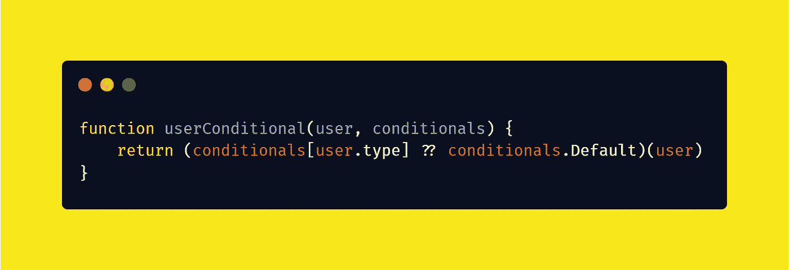
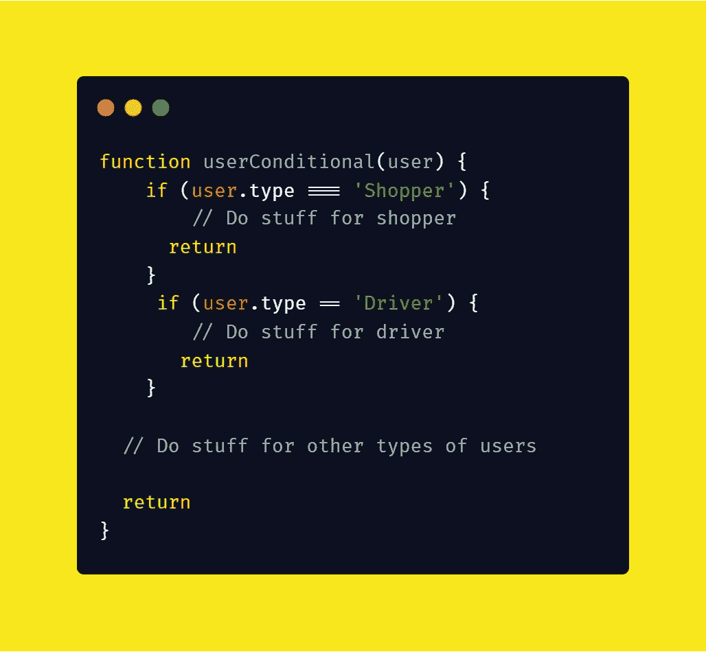
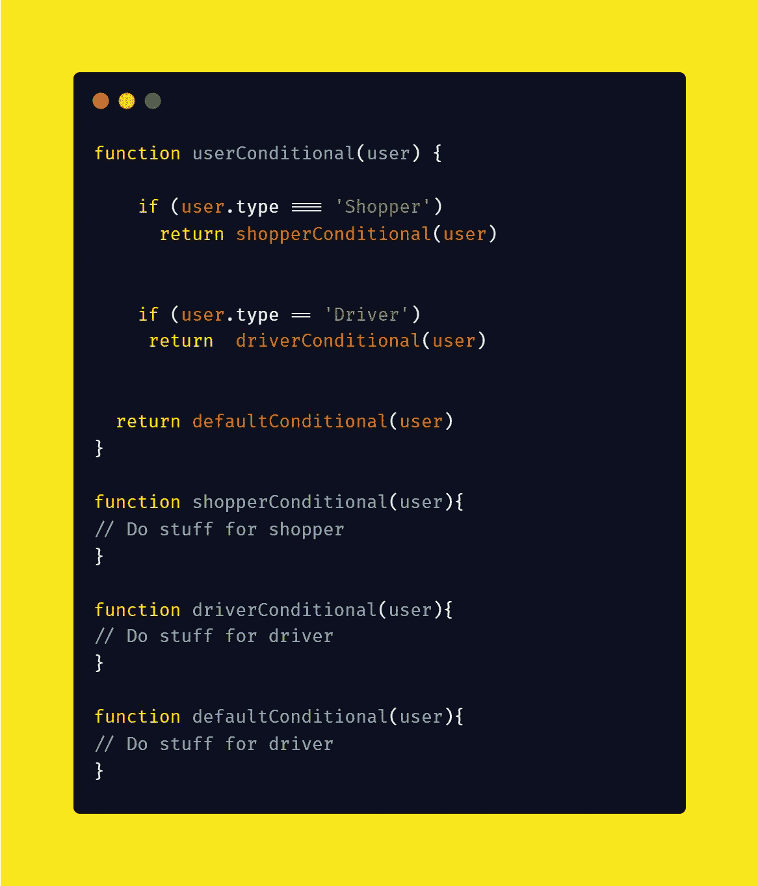
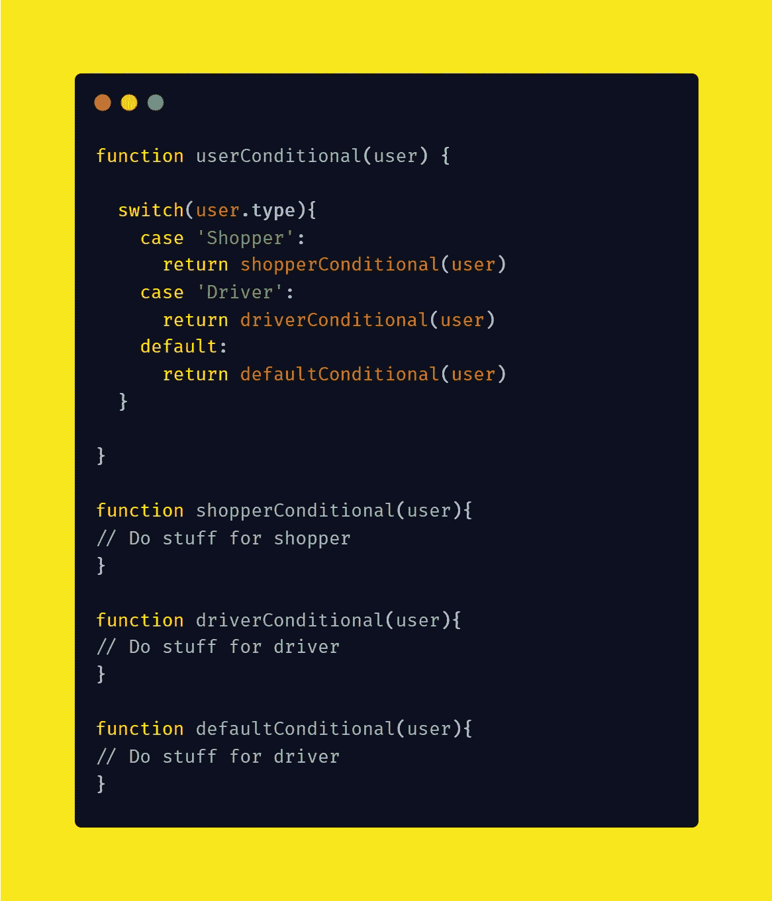
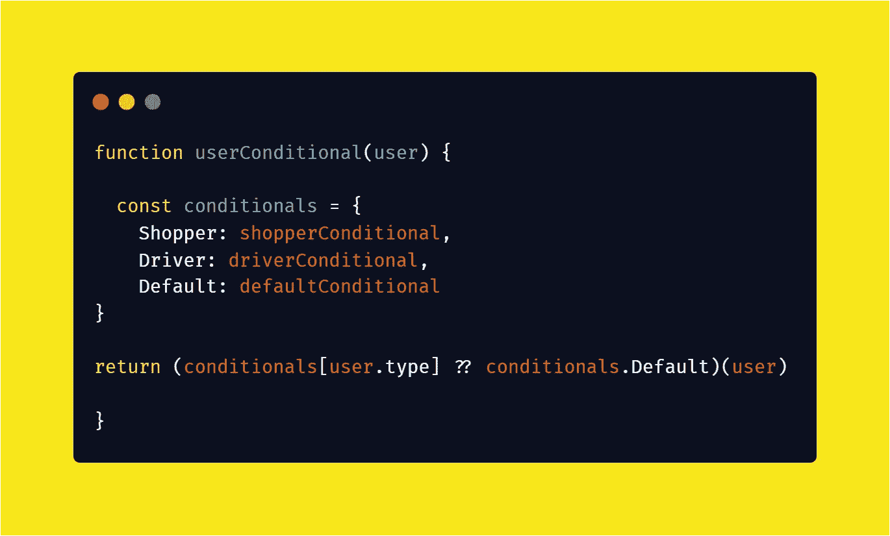
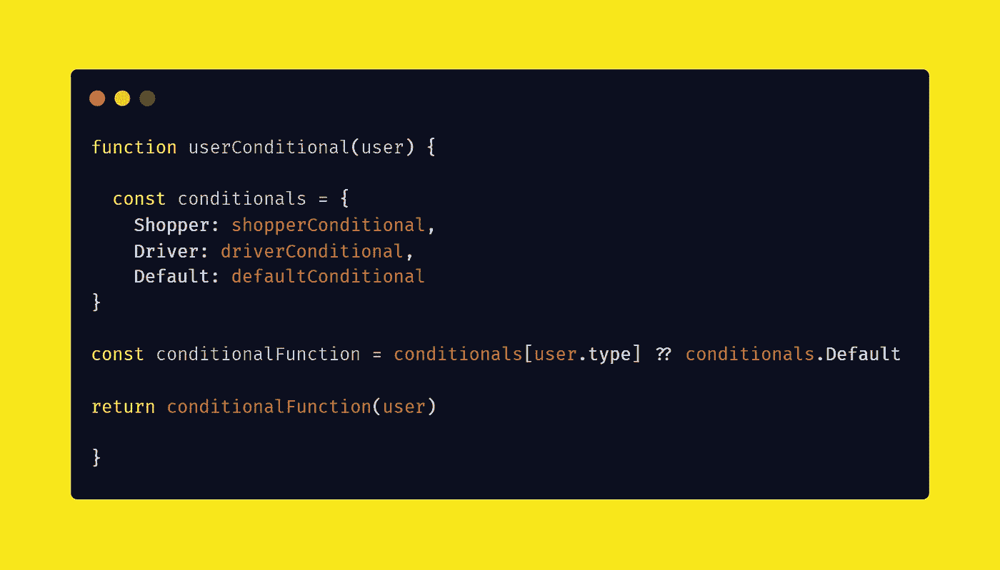
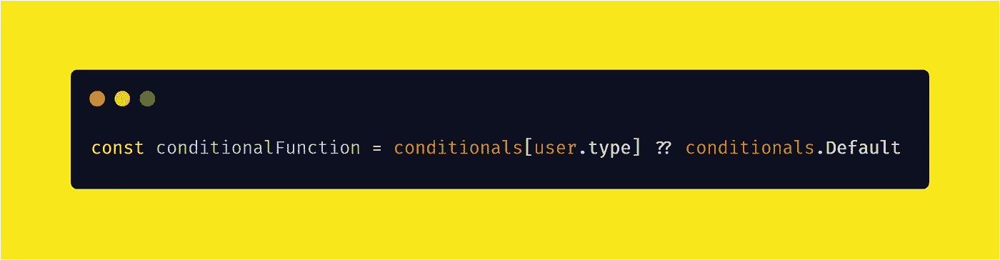
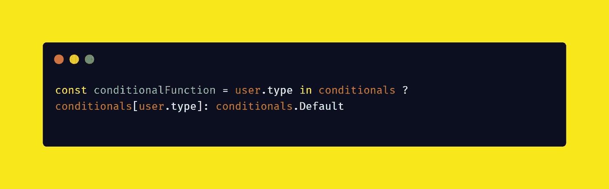
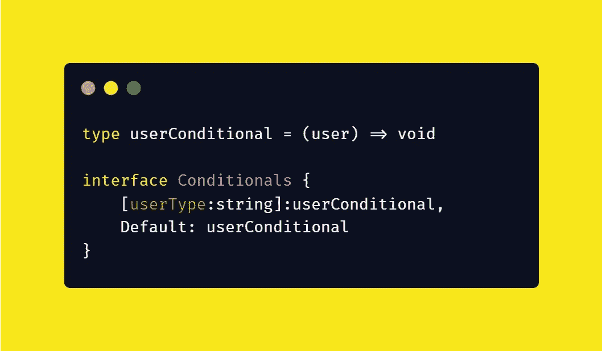
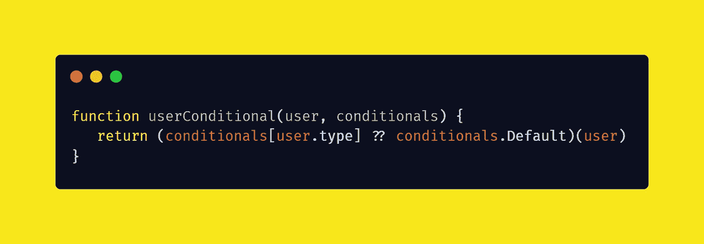

# 停止使用过多的 If 语句

> 原文：<https://javascript.plainenglish.io/stop-using-excess-conditional-statements-in-javascript-b3867345e993?source=collection_archive---------1----------------------->

## 如何创建可读和可维护的条件

假设您有一个功能，它意味着根据用户的类型采取不同的行动。我们可以写一个这样的函数:

这种方法有很多问题:

1.  不是很整齐。
2.  随着每个用户类型条件下功能的增长，主功能也在增长
3.  测试每种用户类型的功能更加困难。
4.  if 语句的数量随着用户类型的增加而增加

让我们通过将每个条件功能重构到单独的函数中来进行改进:

现在好一点了，我们现在可以单独测试条件，它阻止了主函数( **userConditional** )的增长。

我们可以通过将 if 语句重构为 switch-case 语句来做得更好:

现在事情看起来很简单，但是我们可以通过使用一个对象来做得更好:

根据您对 JavaScript 的熟悉程度，这可能有点难以解析。让我简化一下:

这一行:

如果在 conditionals 对象中找不到基于用户类型的函数，它默认为**条件。通过使用[无效合并](https://developer.mozilla.org/en-US/docs/Web/JavaScript/Reference/Operators/Nullish_coalescing_operator)操作符(？？)**

下面是没有使用这些相对较新的运算符的等效代码:

这种“对象条件句”风格有以下好处:

1.  您已经消除了对 if 语句的任何需求。
2.  所有的条件都来自一个真实的来源:条件句对象。
3.  **conditionals** 对象现在可以使用 Typescript 进行类型化:

4.条件甚至可以从主函数中分离出来，作为参数传递:

这是函数式编程的一个梦想，保持了一切的整洁和可测试性。

感谢阅读！

*获取更多详情请点击*[***plain English . io***](https://plainenglish.io/)