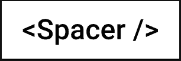
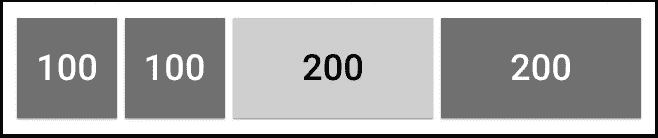
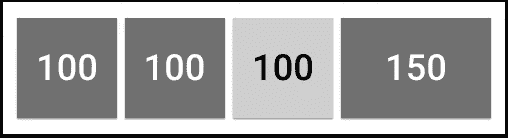

# 停止使用边距，改用间隔组件！

> 原文：<https://javascript.plainenglish.io/stop-using-margin-use-spacer-component-instead-953d9b2dbacc?source=collection_archive---------0----------------------->

## React 中处理组件间距的更好方法


在为 UI 布局编码时，我们需要一些东西来表示元素之间的间距，是的，我们已经使用`margin`很长时间了。

然而，当使用像`React`这样的基于组件的框架时，我们可能需要重新考虑`margin`是否仍然是最好的选择。

以下是我的想法:

# 保证金的问题

首先，我会说在组件的顶层使用`margin`不好，因为它打破了组件的隔离。

```
// A React component with margin set on top-level
const MyComponent = () => {
  return <div style="margin: 1rem">...</div>;
};
```

*   这里的`margin`不仅影响组件本身，还影响其他组件**(例如，它正在推离旁边的另一个组件/元素)**
*   **如果我们想把这个组件放在不同的上下文或布局中，`margin`会妨碍 resuse**

**那么，在组件内部使用`margin`怎么样(不在顶层)？乍一看，这似乎很好，但是当您出于某种原因(例如，重用/隔离/简化/性能)提取现有组件的一部分来组装一个新组件时，它会将我们再次带回到在顶层使用`margin`的问题:(**

****解决方案:垫片组件****

**与其将组件或元素之间的空白空间视为**边距**，不如假设它们实际上是**组件**——专门用来表示空白空间的组件，我们可以称之为`Spacer`。**

**对于 UI 编程来说，这并不是全新的东西，而是已经在许多 UI 框架中广泛使用的东西(尤其是在移动设备上):**

*   **[iOS 中的间隔符(SwiftUI)](https://benmcmahen.com/using-spacer-in-swiftui/)**
*   **[安卓中的间隔(Jetpack Compose)](https://developer.android.com/jetpack/compose/tutorial)**
*   **[颤振中的垫片](https://api.flutter.dev/flutter/widgets/Spacer-class.html)**

**为什么不为 Web / React 开发一个呢？我们来了:**

****

**一旦我们将间距抽象为一个确定的组件，我们就不会有使用`margin`破坏隔离的问题！所有组件都不需要关心它们周围所需的间距——父组件将通过使用`Spacer`组件来处理这些，这使得每个组件都是真正独立的和可重用的。**

**一个简单的例子是使用`Spacer`来表示文章各部分之间的垂直间距:**

```
<Article>
    <Header />
    <Spacer y={2} />
    <Section1 />
    <Spacer y={1} />
    <Section2 />
    <Spacer y={2} />
    <Footer />
</Article>
```

**组件`Spacer`的一个可能实现(基于 Material-UI 的样式化系统)可能是:**

**Spacer component based on the styled system of Material-UI**

**也就是说，您可以将`width`、`height`或`flexBasis`指定为要乘以`theme.spacing`的值(与`Box`的其他间隔道具相同)**

****更进一步:在内部使用垫片布局组件****

**有很多机会，我们可能希望使组件/元素之间的间距均匀，并且用相同的`props`放入许多`Spacer`组件是不优雅的。在这种情况下，容器组件肯定会有所帮助。**

**例如，我们可能有一个`Flexbox`组件作为容器，它接受一个间隔属性来配置插入到其子项之间的`Spacer`组件(其他一些文章可能会将其改写为`Stack`组件)。**

```
<Article>
  <Flexbox flexDirection="column" spacing={1}>
    <Header />
    <MainContent1 />
    <MainContent2 />
    <Footer />
  </Flexbox>
</Article>
```

**组件`Flexbox`的一个可能实现(基于 Material-UI 的样式化系统)可能是:**

**Flexbox component based on the styled system of Material-UI**

****奖励:flexbox 中的动态间距****

**除了使组件独立和可重用之外，`Spacer`组件还为我们带来了一个从`margin`中无法轻易获得的好处 flexbox 中的动态间距。**

**这是将空间转化为组件的自然结果——我们现在可以将它们视为 flexbox 项目，它们可以`grow`和`shrink`！**

**例如，假设我们有下面的布局(图中的数字表示盒子的宽度):**

****

**Original layout**

**给定条件:**

*   **两个左侧项目的宽度是固定的**
*   **可以收缩正确的项目和间距**
*   **我们希望在调整容器大小时，间距缩小的速度比正确的项目快两倍。**

**很容易得到这样的结果:**

```
<Flexbox>
  <Box flexBasis={100} flexShrink={0} />
  <Box flexBasis={100} flexShrink={0} />
  <Spacer flexBasis={200} flexShrink={2} />
  <Box flexBasis={200} flexShrink={1} />
</Flexbox>
```

**据此，当右侧`Box`收缩到 150 时，`Spacer`也会收缩到 100。**

****

**Shrinked layout**

# ****结论****

**让我们停止使用`margin`！**

**它打破了组件的隔离，使它们更难在不同的上下文中重用。**

**`Spacer`组件和基于它的布局组件(如`Flexbox` / `Stack`)将解决这些问题，当您希望在间距上有更大的灵活性时，它们可以带来额外的好处！**

# **原始帖子后的更新**

1.  **[Flexbox 现在有了一个](https://css-tricks.com/almanac/properties/g/gap/) `[gap](https://css-tricks.com/almanac/properties/g/gap/)` [属性来定义其子元素](https://css-tricks.com/almanac/properties/g/gap/)之间的间距，但是目前还不是所有主流浏览器都支持(没有 IE，没有 Safari < 14.1)。一旦它被现代浏览器和用户广泛采用，在大多数用例中使用`gap`和`flexbox`应该是推荐的解决方案。
    (提示:如果您使用`Flexbox`组件方法，那么将来从`<Spacer/>`切换到`gap`应该很容易，因为这只是内部实现的变化，当您有额外和/或特殊的需求来表示组件之间的间距时，`<Spacer />`仍然有用)**
2.  **关于性能，无论是否使用空的 div 元素，避免长列表项的性能问题的基本方法是虚拟化(或“在窗口中呈现”)——如果不虚拟化，长列表会损害性能；如果您确实进行了虚拟化，那么为什么要在一个简短的列表中增加几个 DOM 元素呢？**

# **相关文章**

*   **[被认为有害的余量](https://mxstbr.com/thoughts/margin/)(作者[马克斯·斯托伊伯](https://mxstbr.com/)，styled-component 的合著者)**
*   **[不要害怕空壳](https://www.coryetzkorn.com/blog/dont-fear-empty-divs/)(科里·埃茨科恩)**
*   **[CSS 中的间距](https://ishadeed.com/article/spacing-in-css/#spacer-components)(Ahmad Shadeed)**
*   **[布局-隔离组件](https://visly.app/blogposts/layout-isolated-components)(埃米尔·舍兰德)**
*   **处理 UI 组件库中的间距(Chris Pearce)**