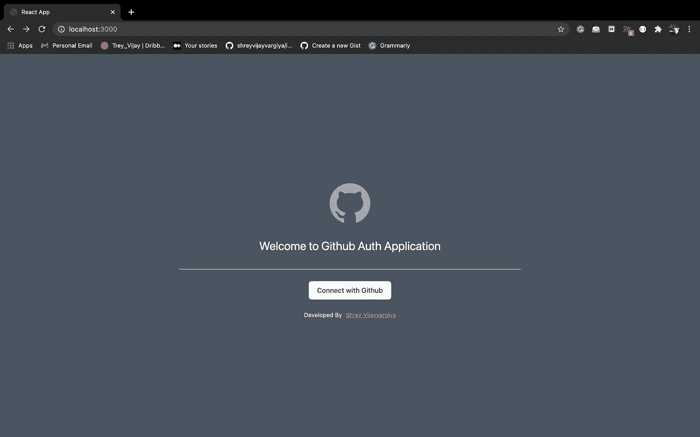
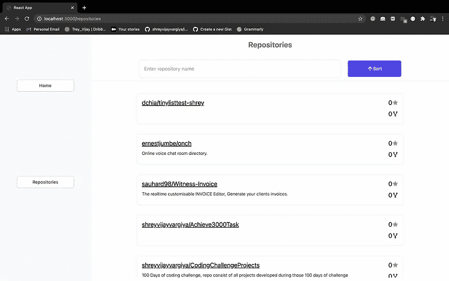
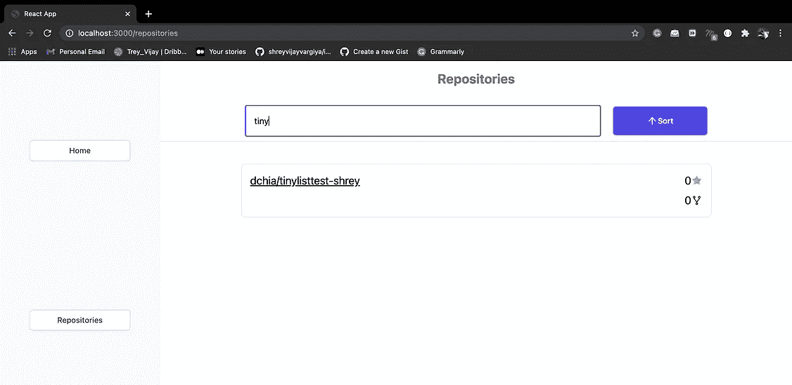
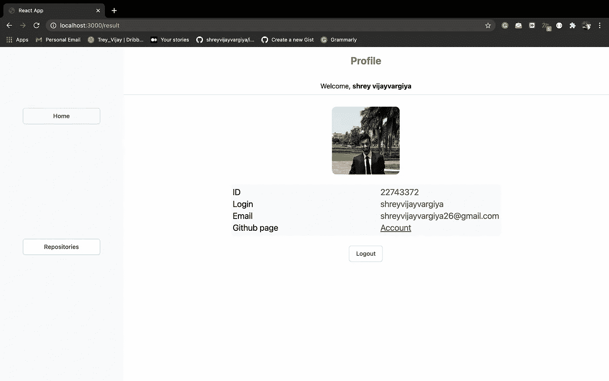

# 不要浪费时间为你的文件夹开发待办事项列表应用程序

> 原文：<https://javascript.plainenglish.io/stop-wasting-your-time-on-developing-that-to-do-list-application-88a4bc513e0a?source=collection_archive---------7----------------------->

时间就是金钱。不要浪费时间开发一个待办事项列表应用程序，让你的文件夹脱颖而出。

Photo by [Christina @ wocintechchat.com](https://unsplash.com/@wocintechchat?utm_source=medium&utm_medium=referral) on [Unsplash](https://unsplash.com?utm_source=medium&utm_medium=referral)

# 在后台

我经常想知道哪些个人项目有助于给一个完整的开发人员留下好印象。必须有一个需要最多两天时间从头开始开发的项目，包括一个像样的设计。

我为这类项目做了研究，记下了最常见的推荐项目——

*   待办事项列表
*   使用前端表单的 CRUD 操作
*   联系方式采用**发送栅格**或 **Twilio**
*   **井字游戏**游戏(存储用户分数)
*   个人博客
*   FANG 的基本克隆(脸书、亚马逊、网飞、谷歌)
*   **具有结账功能的电子商务**平台
*   实时聊天应用程序

# 不要浪费时间

好吧，这份名单可能会越来越多。看，我对上面提到的项目没有任何问题——这些对初学者来说绝对是很好的学习。这些项目的问题如下-

*   它们很耗时。
*   他们并没有真正展示解决问题的技能。
*   这些都是非常常见的项目，它们的代码可以在 Github 上免费获得。这就把成吨的 YouTube 频道的可用性放在一边，尤其是对于这类项目。

即使您已经为您的投资组合开发了这些项目，大部分时间您也会被要求做一轮技术测试来测试您的前端或后端技术技能。所以，在没有人给予绝对重视的情况下，在这样的项目上浪费这么多时间是没有意义的。

老实说，我对开发这些项目感到厌倦。现在时间就是金钱。因此，我相信高效、高效地使用它。

# 好项目的质量

如果您真的想在您的项目中脱颖而出，那么请遵循以下几点——

*   **解决一些现实世界中的问题—** 这比简单的网飞克隆应用程序更能帮助您学习。此外，相比之下，它消耗的时间更少。
*   **在限定时间内发展**——像黑客马拉松一样对待它，并在你的简历中展示这一技能。
*   **开发像样的 MVP**——最低可行产品是指用户仅可用于检查或测试目的的产品。
*   **部署代码**——使用开放的公共 Github 存储库部署的代码总是会产生巨大的影响，并且很容易展示您的技能。
*   **记录您的工作/想法或方法**——一旦您通过博客或文档提供了项目的抄本版本，开发人员就可以很容易地理解您的方法，这又会给人留下深刻的印象。

# 警告

这些要点不易处理或执行。对大多数开发人员来说，这可能很耗时(尤其是初学者)。

我们面临的一个主要问题是要么解决现实世界中的问题，要么从中开发出一个 MVP。当你像对待黑客马拉松一样对待它时，你实际上节省了很多时间，因为如果你解决了一个问题，你就远远领先于大多数开发相同 CRUD、克隆和待办事项列表类型项目的开发人员。

# 一个好项目的好处

在解决现实世界的问题时，你会学到很多东西。你的知识增长了，你理解了谷歌搜索的力量，你理解了如何处理压力并使之对你有利。这些技能不容易获得。有时，需要多年的经验和在最好的领导下在好的公司工作才能获得这样的知识。所以不要再浪费时间去开发那个愚蠢的待办事项列表应用程序了。你真的需要跳出框框思考和做事来解决现实世界的问题。所以，在设定的时间框架内做这件事很有帮助。

为了方便起见，这里有一些你可以尝试解决的现实世界的问题—

*   **打印 PDF 文件**并通过电子邮件或短信为用户分享功能。
*   **通过令牌管理前端和后端的会话**。
*   在前端和后端使用不同类型的身份验证令牌。
*   **创建一个像媒体编辑器一样的实时编辑器**(我正在用它来写这篇文章)。
*   **使用 Github API 删除 Github 库**。
*   **使用 Passport.js** 和 **JWT 令牌的谷歌认证。**
*   一个 Twitter 机器人可以捕捉一些标签推文并转发它们，
*   **加密货币机器人**当价格超过阈值时提供通知。

这些项目真正解决了现实世界的问题。此外，虽然它们不太容易开发，但是它们也不需要天才来编写代码。

# 为你的简历做一个坚实的项目

简历上的最佳项目因人而异。我将推荐的项目来自我个人的开发经验。

我希望你开发的项目应该有以下特点—

*   开发一个**前端**界面，供用户通过 Github 登录。
*   一旦用户使用 Github 授权我们的应用程序，将用户重定向到**主页**页面。
*   主页应该显示用户个人资料的详细信息，如用户名，电子邮件，个人资料图片，以及私人和个人存储库的总数。
*   开发另一个名为**存储库**的页面，该页面将显示用户的所有私有和公共存储库的列表。
*   **在列表顶部添加一个搜索输入**，并添加基于存储库名称和描述的搜索功能。
*   **添加一个排序按钮**，它将根据活动、明星、人物或任何你觉得有用的特性对存储库进行排序。
*   列表中的每一项都应该有一个**删除**按钮，从用户的 **Github** 账户中删除相应的存储库。
*   管理登录会话的用户**，最长 14 天。**
*   添加一个**注销** **按钮**，将用户抛出应用程序，如果用户想要访问应用程序，他/她应该在下一次重新登录。
*   **在 Heroku 或 Vercel 或 AWS 或 Firebase 或 Digital ocean 或 Netlify 上部署**产品。

# 方法

您必须使用 Github API 及其令牌，并在后端创建一个 API 来访问 Github 库和 API。你不能在前端直接使用 Github API，因为 Github 本身增加了 CORS 问题。

您需要在后端使用 Redis 或者在前端使用 [**Cookie**](/the-easiest-way-to-manage-token-and-created-protected-pages-in-frontend-c60db33f1921) 来管理用户登录会话。这是你的选择，但是使用一些对你来说更容易实现的东西。

您需要在前端创建路由功能和一个带有输入和按钮的列表组件。

另外，你必须使用任何你觉得舒服的 [**CSS 样式库**](https://medium.com/nerd-for-tech/perfect-styling-library-for-react-933c533bd1f4?source=your_stories_page-------------------------------------) 来使产品看起来有吸引力，因为一旦你部署了它，每个人都可以使用它。所以最好让它看起来像个像样的产品。

出于安全原因，您必须在后端和前端使用 JWT 令牌或身份验证令牌。这需要一个关于 JWT 的基本知识，你可以在这里读到。

为了获得更好的性能，您可能需要一些状态管理库，它们可以是 [**Redux**](https://medium.com/nerd-for-tech/best-redux-architecture-explained-in-5-minutes-9b993f0169c0) 或 [**React 上下文 API** 。](/creating-your-own-state-management-1f0c894039d7)

# 参考

我只添加图像，而不是代码，以便更好地理解你到底会建立什么。你可以根据自己的意愿改变用户界面和设计，因此完全可以自由地编辑、改进或修改它。

Landing page showing user to logged in via Github account

The left image is a list of repositories and the right image is a specific searched repository

Profile page for the user

# 结论

还有一件事，时间限制不是一个严格的功能，但我仍然建议你在 2-3 天或最多 4 天内完成它。如果你不能完成它，不要感到太有压力。这个项目背后的目的不是完成它，而是尽可能多、尽可能快地学习。你的学习是大多数面试官会检查的。所以，也许可以试着在周末把它作为一个有趣的活动，为你的第一个用户开发一个稳固的 MVP。

# 最后一个请求

如果你想了解更多关于这些项目的信息，请在评论区告诉我，我很乐意推荐你。

如果你已经完成了同样的项目，那么让我知道。我很乐意检查你的版本。

下次见！祝大家愉快。

*更多内容尽在*[*plain English . io*](http://plainenglish.io/)