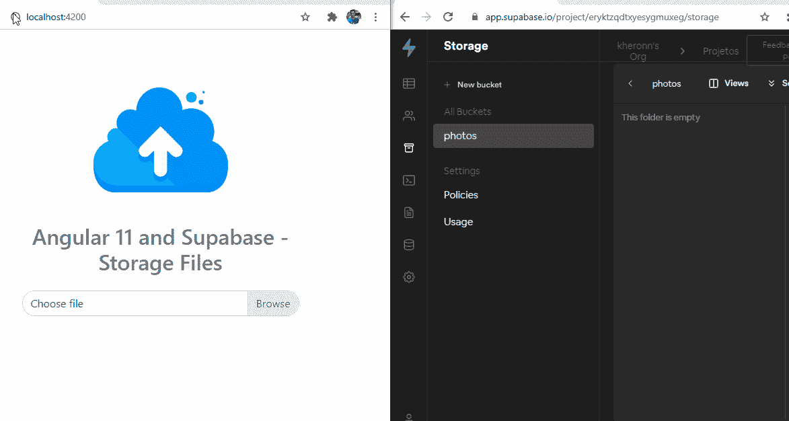
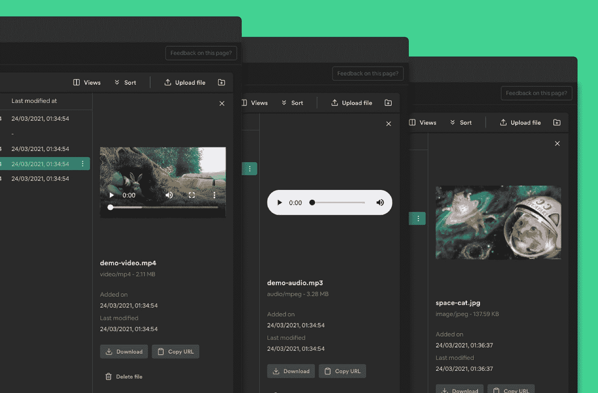

# 带角度和支架的储物装置

> 原文：<https://javascript.plainenglish.io/storage-with-angular-and-supabase-32cdfe688f1b?source=collection_archive---------8----------------------->



越来越清楚的是，Supabase 可以成为 Firebase 的替代品。

3 月 30 日，随着存储服务的发布，我们朝着这一目标迈出了一步。

一个开源的对象存储服务，具有无限的可扩展性，适用于任何类型的文件。

在本教程中，我以一种非常简洁的方式介绍了 Angular 11 中的一个项目，用于上传集成了 Supabase 存储服务的文件。

# 储存；储备

在 https://supabase.io/storage 的[可用的文档中，列出了诸如互操作性、与已经开发的整个生态系统的集成以及可伸缩性等特性。](https://supabase.io/storage)

我发现策略和权限的问题很容易实现，非常灵活。

通过该面板，可以非常直观地浏览和探索最多样化的文件格式



Fig — Control Panel Storage

还提供了其他功能，如 CDN 集成和媒体自动转换和优化。

# 与角度积分

我用 ng new 在 angular 中创建了一个项目，然后用

```
npm install @ supabase / supabase-js
```

版本 1.7.6 已经有了处理存储的方法。

最初，我们将创建一个服务来执行创建存储桶和上传文件的方法。

在编辑终端，我接到通知:

```
ng generate service storage
```

该命令创建了一个带有注释@ Injectable 的 StorageService 类。

类的实现是这样的:

*   我们使用 subabaseUrl 和 supabaseKey 属性定义 url 和密钥。这些值在 supabase 面板中可用，[正如我在以前的文章](/a-crud-with-angular-and-supabase-c205e393c823)中提到的，这不是最合适的方式，因为它暴露了密钥。

[更多详情点击此处。](https://betterprogramming.pub/how-to-secure-angular-environment-variables-for-use-in-github-actions-39c07587d590)

*   在类构造函数中，我们传递这些信息来访问存储操作方法。
*   **createBucket ()** 和 **getBucket ()** 创建并检索存储位置。桶中可以有子文件夹；
*   **upload()** —我们通知桶，带有名称的路径，以及将要发送到服务器的文件；
*   **download()**——即使是上传，不同的是一个 Blob 返回。
*   所有方法都返回数据和错误。

# 组件应用程序

出于本教程的目的，我在主组件中做了所有的事情。app.component.ts 的实现是这样的。

关于实现:

*   我们为上传声明了一些附件属性作为信息消息，上传的状态(模板中有一个 div 显示正在装载)，以及运输位置(bucket)；
*   我们将 StorageService 注入到组件的构造函数中；
*   我们实现了方法来检查 bucket 是否已经存在，否则，它会在 checkBucketExists()中创建一个位置；
*   在 **selectFile** 中，我们首先检查是否选择了任何文件，然后检索该文件，并用 replace (/ / g，'')删除文件名中的空格；
*   当调用上传时，我们传递必要的字段并检查是否有错误，或者用消息更新 UI 界面并完成加载。

以下是来自 **app.component.html:** 的模板摘录

```
<! - UPLOAD -><div class =" custom-file overflow-hidden rounded-pill mb-5 "><input id =" customFile "type = "file" (change) = "selectFile ($ event)" class = "custom-file-input rounded-pill"><label for = "customFile" class = "custom-file-label rounded-pill"> Choose file < / label></div><! - End UPLOAD -><! - LOADING -><div * ngIf = "status" class = "spinner" style = "font-size: 18px"><div class = "head"> </div></div><! - End UPLOAD -><div * ngIf = "message" class = "alert alert-success" role = "alert">{{message}}</div>
```

# 重要的

因为我们没有经过身份验证，所以我们必须允许公众访问所讨论的桶。

然后，为了让示例正常工作，在 Supabse 控制台中运行以下命令

```
create policy” Public Access “on storage.objects for allusing (bucket_id = photos);
```

这允许未经身份验证的访问。

总而言之，我在这里省略了应用内模板和样式的完整代码。

然而，你可以在下面我的 Github 上看到它的全文

就是这样。谢了。

[](https://github.com/kheronn/supabase-angular-storage) [## kher on/supabase-角度存储

### 在 GitHub 上创建一个帐户，为 kher on/supabase-angular-storage 的开发做出贡献。

github.com](https://github.com/kheronn/supabase-angular-storage)