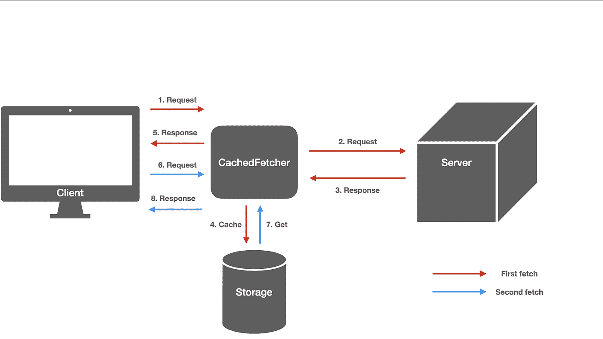

# 优化数据提取的更好方法

> 原文：<https://javascript.plainenglish.io/stored-fetch-optimize-data-fetching-5328332ceb52?source=collection_archive---------5----------------------->

## 无论你的应用平台是什么，缓存获取优化你的应用的数据获取



如果你开发过 React app，你可能听说过[《SWR》](https://swr.vercel.app/)。SWR 缓存获取的数据。因此应用程序调用相同的 fetch，缓存的数据在没有网络通信的情况下返回。

但它只对反应钩有效。如果你想使用 SWR，你必须调用' useSWR' API。你也可以只定制“获取”部分，就像这样。

```
**const** fetcher = (...args) => fetch(...args).then(res => res.json()); function App() { **const** { data, error } = useSWR('/api/user/123', fetcher); ...
}
```

您只需输入两个参数 path 和 fetcher。你无法理解缓存是如何工作的。

[**cache-fetch**](https://github.com/wkddngus5/cached-fetch)即使开发环境是普通的 JavaScript 也能工作。您可以选择缓存数据的存储。当然，提供了默认存储。是一个窗口 API 的 [**会话存储**](https://developer.mozilla.org/ko/docs/Web/API/Window/sessionStorage) 。

1.  CachedFetcher 组件获取存储和获取(第 22 行)。
2.  当调用 fetch 方法时，cachedFetcher 实例从存储中查找缓存的数据。
3.  如果缓存的数据不存在或过期，它会提取到服务器。服务器响应数据被缓存并发送给客户端。
4.  如果缓存的数据有效，缓存的数据将在没有网络通信的情况下返回。

有时你想向服务器请求实时数据。因此您可以将过期时间设置为数据并丢弃缓存的数据。

要使用这个库，你必须输入存储器和提取器。这些都是考虑`**DI(Dependency Injection)**`实现的。

首先，让我们看看 **Storage.ts** 文件:

您只需扩展存储接口并遵循其详细信息:

1.  `core`:存储核心引擎
2.  `getItem`:从存储器中获取数据。标识符是关键。
3.  `setItem`:从存储器中设置数据。标识符是关键。
4.  `removeItem`:从存储器中删除数据。标识符是关键。

让我们看看`SessionStorage`。这是一个默认的`Storage`实现:

```
class SessionStorage extends Storage { core: globalThis.Storage; constructor() {
    super(); if (!sessionStorage) { throw new Error('sessionStorage not exists.'); } this.core = sessionStorage; } getItem(key: string): CachedItem { const cached = this.core.getItem(key); if (typeof cached !== 'string') { return null; } const cachedItem = JSON.parse(cached); if (!cachedItem.data || !cachedItem.expiredAt) { return null; } return cachedItem; } setItem(key: string, item: CachedItem) { this.core.setItem(key, JSON.stringify(item)); } removeItem(key: string) { this.core.removeItem(key); }}
```

`**sessionStorage** of window`按键存储数据。键和值只是字符串类型。所以 setItem 存储`**stringify**`之后的数据，getItem 返回`**parse**`之后的数据。

费彻在这里:

它有一个方法，`**fetch**`。fetch 方法获取 URI，方法，头。不难。

在 html Fetcher(Fetcher 的一个实现)的例子中，它只是调用了`HTML **fetch**`方法。

```
// HTMLFetcher.tsclass HTMLFetcher extends Fetcher { core: Window = window; fetch(fetchParam: FetchParam): Promise<unknown> { return this.core.fetch(fetchParam.uri, { headers: fetchParam.headers }); }}
```

CachedFetcher 只运行在`**GET**` api 调用上。缺少的一点是对数据最新的判断依赖于`**expiredAt**`。欢迎任何反馈:)

[](https://github.com/wkddngus5/cached-fetch) [## wkddngus 5/缓存提取

### 在 GitHub 上创建一个帐户，为 wkddngus5/cached-fetch 开发做贡献。

github.com](https://github.com/wkddngus5/cached-fetch) 

*更多内容尽在*[***plain English . io***](http://plainenglish.io)