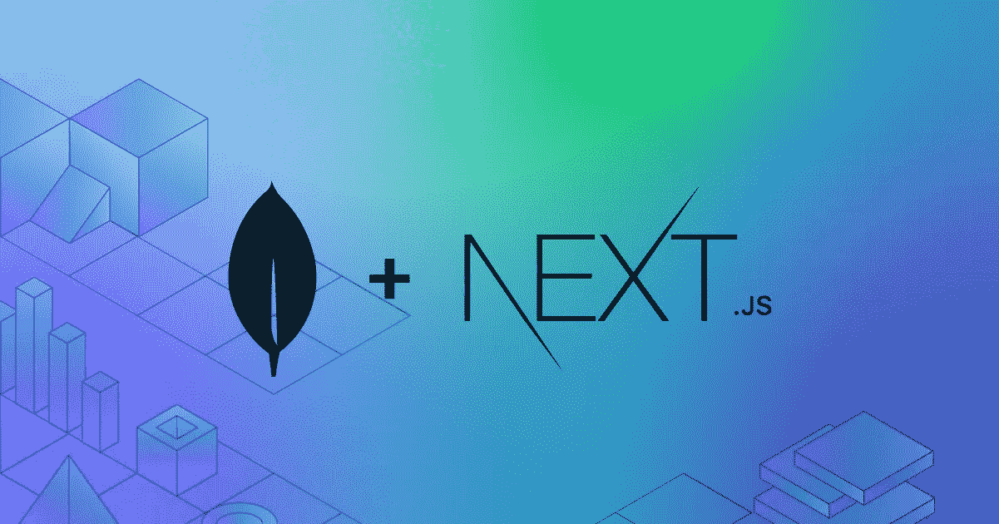

# 使用 Next.js 将数据存储到 MongoDB

> 原文：<https://javascript.plainenglish.io/storing-data-to-mongodb-with-nextjs-6372319d498b?source=collection_archive---------1----------------------->

在我的前一篇博文中，我写了如何设置 MongoDB 以便在 Next.js 项目中建立到数据库的连接，以及如何从数据库中读取数据。所以，如果你错过了，可以先看看这篇文章！



# 设置您的自定义 API 路线

通常情况下，当通过 **npx create-next-app** 命令新建一个 Next.js 项目时，会自动创建一个 API 目录。否则，您将不得不在您的**页面目录**中创建该目录。在 **API 目录**中，创建一个 JavaScript 文件(您可以随意命名)。

下面的代码片段显示了设置自定义 API 路由的整个过程:

```
import { MongoClient } from "mongodb";export default async function handler(req, res) { if (req.method === "POST") {
  const data = req.body; const client = await 
  MongoClient.connect(
    "mongodb+srv://<user><password>@cluster0.pqdli.mongodb.net/<dbname>retryWrites=true&w=majority"); const db = client.db(); const yourCollection = db.collection("yourCollection"); const result = await yourCollection.insertOne(data); console.log(result); client.close(); res.status(201).json({ message: "Data inserted successfully!" });
  }
}
```

第一步，您需要通过 **npm i mongodb** 安装所需的依赖项。完成后，使用以下命令导入 MongoClient:

```
import { MongoClient } from "mongodb";
```

之后，我创建了一个名为 **handler** 的异步函数，它有两个参数:1。请求又名请求和 2。res 又名响应。如果您曾经使用过 node.js 和 express.js，您可能会认识到这些参数。

非常简单地解释一下:请求表示来自客户端的输入信息，而另一方面，响应包含将被发送回客户端的信息。

作为函数内部的第一步，我们检查传入的请求是否来自于 **POST** 类型。只有当检查结果为真时，代码才会继续执行。

```
const data = req.body;
```

我们期望有数据附加到传入的请求。通过上面的简单代码，我们可以访问这些数据。

如果您遵循了本[教程](https://my-blog-alpha-navy.vercel.app/posts/nextjs-and-mongodb)，您应该对以下步骤很熟悉。这里就不赘述了。只是不要忘记在那里插入你的证件。

```
const client = await 
  MongoClient.connect(
    "mongodb+srv://<user>
    :<password>
    @cluster0.pqdli.
    mongodb.net/<dbname>?
    retryWrites=true&w=majority"
    ); const db = client.db(); const yourCollection = db.collection("yourCollection");
```

下一步是**从 MongoDB 数据库读取数据和向其写入数据之间最重要也是唯一的区别。**

```
const result = await yourCollection.insertOne(data);
```

不是调用集合上的 **find** 函数，而是调用 **insert** 或 **insertOne** 函数。正如函数名所暗示的，您将数据插入到您的集合中。您放在括号中的数据是您从传入请求中获得的数据。关于你的 API 路线，其实就是这样！

当然，不要忘记关闭连接。

或者，您可以发回一个响应。在本例中，状态代码 201 和一条消息将被发回。

```
res.status(201).json({ message: "Data inserted successfully!" });
```

# 在 React 组件中使用 API

设置好 API 路径后，我们可以继续在 React 组件中使用这个 API 路径。

例如，每当单击表单中的某个按钮时，就可以触发这个 API 路由。该表单中的数据将被发送到我们的数据库。我们将在下面的代码片段中演示这个场景:

```
async function clickHandler(enteredData) {const response = await 
  fetch("/api/your-api-route", {
    method: "POST",
    body: JSON.stringify(enteredData),
    headers: 
    {
      "Content-Type": 
      "application/json",
    },
  }); const data = await response.json(); console.log(data);
 }
```

通常，您可以在常规的 React 组件中插入这种函数，就在 render 或 return 函数的前面。一些 React 元素应该指向我们的 **clickHandler** 函数。在下面的例子中，一个简单的按钮将在你每次按下时执行该功能。

```
<button onClick ={clickHandler}/>
```

在某些时候，您还需要定义**输入的数据**，它被用作我们的 **clickHandler** 函数中的一个参数。例如，您可以将一些用户输入绑定到这些数据。但这不是这篇博文的重点。

让我们转而研究一下 **clickHandler** 函数！

```
const response = await fetch("/api/your-api-route",
```

因为我们的 **clickHandler** 函数是异步的，所以我们可以在函数体中再次使用 await 关键字。在这篇文章中，我使用了 fetch API，它是 React 自带的。这段代码也可以用于任何其他库，比如 axios 或任何你喜欢的库。

作为 fetch 函数的第一个参数，您需要传递 route。这就是我们之前定义的路线。

***注意*** *:您* ***必须*** *将“your-api-route”替换为 api 目录中您的 javascript-file 的名称！这是必不可少的！*

```
{
  method: "POST",
  body: JSON.stringify(enteredData),
  headers: 
  {
    "Content-Type": 
    "application/json",
  },
});
```

作为第二个参数，您传递一些更多的信息，这些信息指定了我们用这个 API 调用发出的请求。我们使用 POST 方法，因为我们想要写入数据。此外，我们需要将数据作为参数传递给请求体。我们在服务器上的代码依赖于传递给主体的数据。我们还将数据转换成 json 格式，这样我们就可以轻松地在服务器上处理数据。在头中，我们最后定义了内容的类型(这与 Next.js 或 MongoDB 没有什么特别的关系)。

```
const data = await response.json();console.log(data);
```

在最后一步中，您可以存储并打印出响应，这在这里的特定情况下是完全可选的。如果您还记得，在这种情况下，这将是消息:“数据插入成功！”。这只是我们在 API 中定义的响应。

# 结论

在这篇文章中，您了解了如何设置自己的自定义 API，以及如何在常规的 React 组件中调用它。在构建完整的 Next.js web 应用程序时，这是一项非常有用和强大的技能。我希望你喜欢这篇文章，并有一个美好的一天！