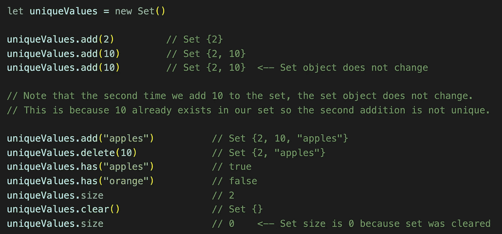
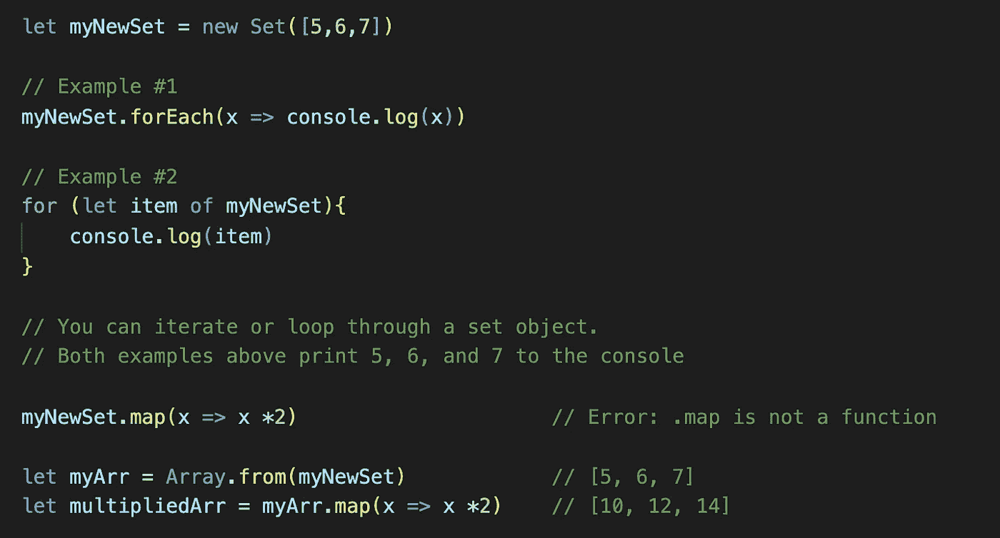
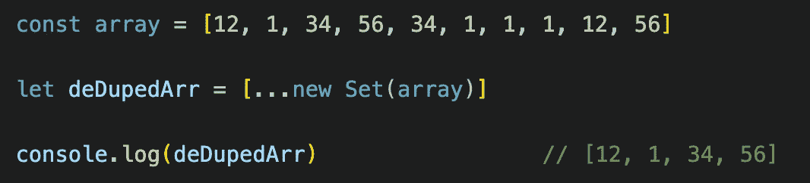
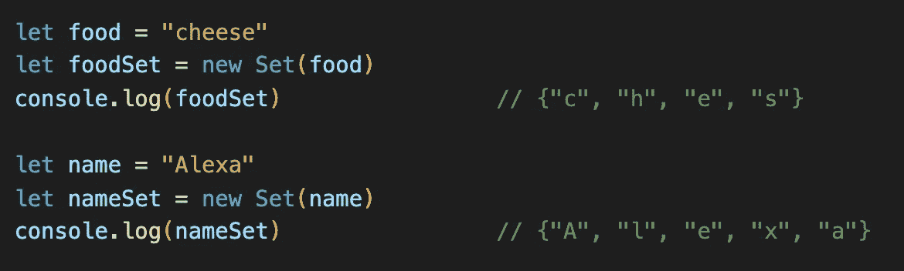

# 用 JavaScript 中的 Set 对象存储唯一值

> 原文：<https://javascript.plainenglish.io/storing-unique-values-with-set-object-in-javascript-ac2707dbdb6?source=collection_archive---------7----------------------->

最近在做一个兼职项目时，我发现自己陷入了一个令人惊讶的境地，这是我以前从未遇到过的。在我收集用户反馈的过程中，我发现我需要一种方法来收集和存储来自这些响应的独特值，而不必关心相同的响应出现的频率或它们是由谁发起的。我绞尽脑汁了整整一个小时，试图找到一个优雅的解决方案，最终我放弃了，去了知识神殿(堆栈溢出),偶然发现了这个神秘的`Set`物体。

这个`Set`物体是我的问题的完美解决方案，老实说，我很困惑为什么我以前从来没有遇到过它。这真的是那些带给你快乐的时刻之一，就像发现你可以买到纯幸运魅力棉花糖级别的快乐。对我来说，`Set`这个物体是我的 LC 棉花糖容器，我非常乐意与你分享这种简单的快乐，亲爱的读者！

## 设定的对象是什么？

正如我前面暗示的那样，`Set`对象是一个 JavaScript 对象，它只保存唯一的值。然而，这些值可以是您想要的任何值，因为它将支持原始数据类型(`numbers`、`strings`、`boolean`、`undefined`、`symbol`、`bigint`)和对象(`arrays`、`objects`、`functions`)。

## 语法和用法

可以使用构造函数`Set()`创建一个`Set`对象。首先，您可以很容易地使用这个带有变量表达式的构造函数。

`Set()`对象还有各种实例方法来帮助您添加、删除和检查存储在集合中的值，包括:

*   `Set.prototype.add(value)`将添加的值传递给集合。这将返回带有新追加值的集合。
*   `Set.prototype.delete(value)`将从集合中移除所提供的值，如果成功，则返回布尔值`true`，如果不成功，则返回`false`。
*   如果提供的值存在于集合中，则`Set.prototype.has(value)`将返回`true`，如果该值不存在，则返回`false`。
*   `Set.prototype.clear()`将从您的收藏中清除所有数值。
*   `Set.prototype.size`将返回您收藏的大小。

Examples of how to add, delete, and inspect a Set object.

## 遍历一个集合

通过使用您选择的迭代器或循环，您可以很容易地访问`Set`中的值。请记住，`Set`对象不是一个数组，所以像`.map()`这样的高阶函数将不起作用，除非你先将`Set`对象转换成一个数组。

You can get values out of a Set object by iterating or looping through the set. You can also transform the Set object, such as an array, as needed.

## 删除集合中的重复项

这里是`Set`对象真正闪光的地方，它能够被转换成具有唯一值的对象。

假设您有一个包含大量重复值的数组，您需要将唯一的值提取到一个新数组中。为此，只需创建一个新变量并将其设置为数组对象。接下来，使用 spread 操作符和`set`构造函数，将您的重复数组作为值。结果将是一个新的数组，其中只有原始数组中的唯一值。

The example above shows how to create a new array with duplicate values removed.

## 使用 Set 的陷阱

请记住，`Set`对象的核心功能是收集**唯一的**值。如果您的集合已经包含某个值，并且您不断尝试多次添加它，将不会有错误消息表明它已经存在。你将得到的只是当前值的集合。如果您需要确认，利用`Set.prototype.has(value)`方法，它将返回一个布尔值作为确认。

另一件要记住的事情是`Set`对象如何处理字符串值。当一个字符串作为一个值添加到一个新的`Set`对象时，该字符串被解构，每个字符被视为一个值。如果一个单词有重复的字母，如“cheese”，您的`Set`将只存储`c`、`h`、`e`和`s`，因为其余的`e`都是重复的。

然而，`Set`对象是区分大小写的，所以你可以期望像“Alexa”这样的字符串存储值`A`、`l`、`e`、`x`和`a`，因为`A`和`a`是集合中唯一的字符。

Be careful when using strings in Set objects. The Set object is case sensitive and only keeps unique characters.

## 结论

对象是你武器库中的一个很好的工具。它存储唯一值的能力，特别是在从其他数据类型转换时，使它成为快速提取可能被重复噪声淹没的信息的绝佳选择。

在本文中，我只介绍了`Set`对象的基础知识，但是我强烈建议通读 MDN web 文档，以便更深入地了解。

 [## 一组

### 集合对象是值的集合。您可以按插入顺序循环访问集合中的元素。中的一个值…

developer.mozilla.org](https://developer.mozilla.org/en-US/docs/Web/JavaScript/Reference/Global_Objects/Set)