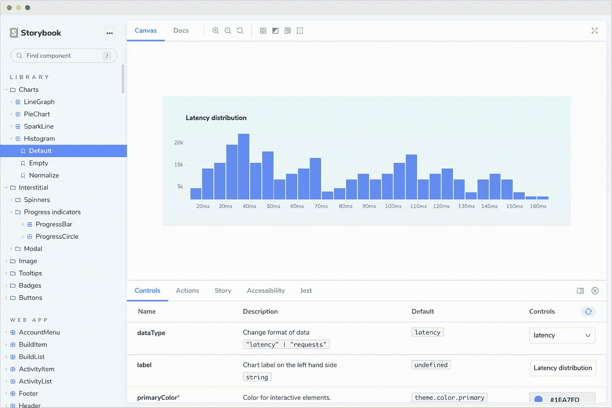
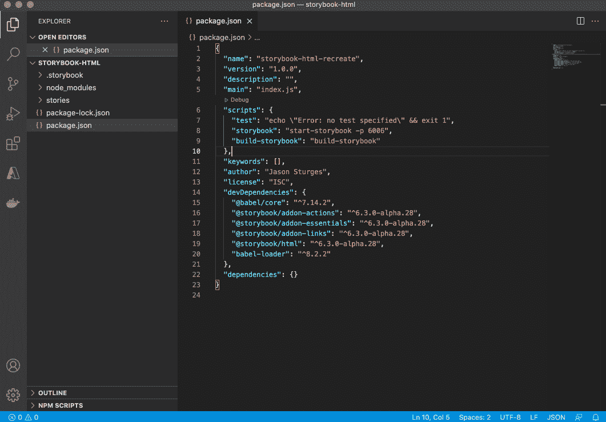
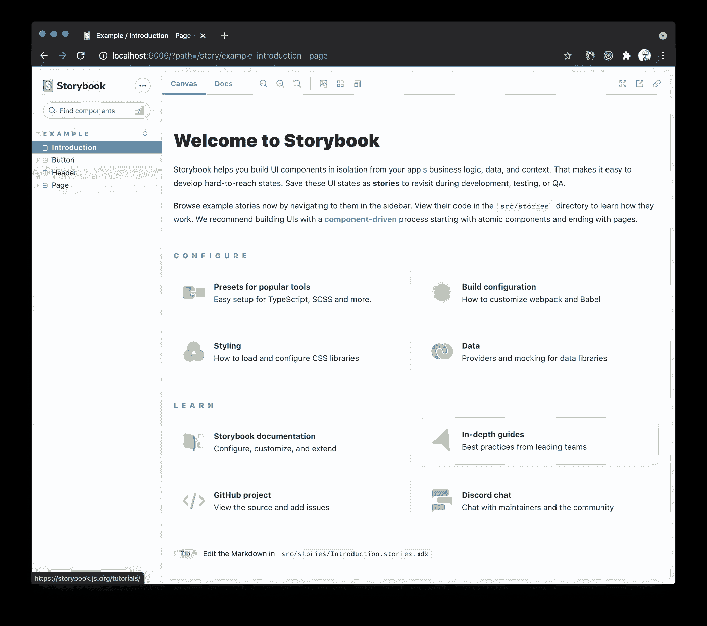
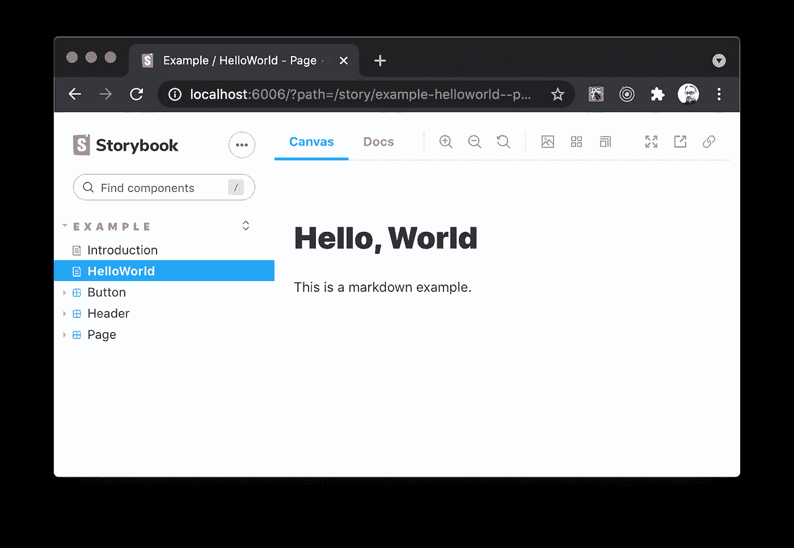
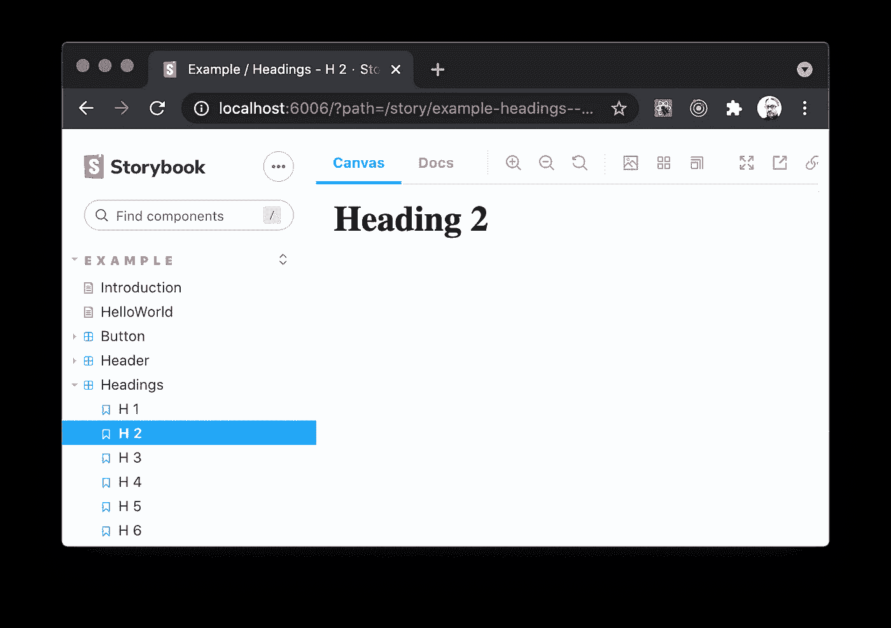

# 如何在 HTML 项目中使用故事书

> 原文：<https://javascript.plainenglish.io/storybook-for-html-projects-1e99aa452a44?source=collection_archive---------5----------------------->


Photo by [Mae Mu](https://unsplash.com/@picoftasty?utm_source=medium&utm_medium=referral) on [Unsplash](https://unsplash.com?utm_source=medium&utm_medium=referral)

[故事书](https://storybook.js.org/)对我现有项目中 UI 组件的开发非常有价值。它一直是我在使用框架(如 React)时添加的一个插件包。

然而，他们已经推出了用于 HTML 的[故事书](https://storybook.js.org/docs/html/get-started/introduction)——一个没有框架的纯 HTML 和 JavaScript 的解决方案。

如果你不熟悉来自普通 HTML 和 JavaScript 背景的故事书，它被描述为:

*“story book 是 UI 开发的工具。它通过隔离组件使开发更快更容易。这允许您一次处理一个组件。您可以开发整个用户界面，而无需启动复杂的开发堆栈、将某些数据强制输入数据库或在应用程序中导航。”*



虽然 Storybook 通常不打算支撑一个项目，但我发现 HTML 版本实际上能够引导一个项目。

注意:Storybook 的最新更新不再支持该项目；不过，先简单地`npm init`一个新项目:

```
$ mkdir my-project
$ cd my-project$ npm init
```

要进行试验，请在终端中执行以下命令:

```
npx sb@next init --type html
```

打开项目并运行故事书任务:



```
npm run storybook
```

启动后，它将在浏览器中加载 Storybook，并根据项目中文件的变化进行实时更新。



通过添加以“. stories.mdx”结尾的文件来创建 markdown 文档页面，例如:

*hello.stories.mdx:*

```
import { Meta } from '[@storybook/addon-docs](http://twitter.com/storybook/addon-docs)';<Meta title="Example/HelloWorld" /># Hello, WorldThis is a markdown example.
```

根据`Meta`标记声明，这将在“Example”组中创建一个新的“HelloWorld”页面:



组件以相同的方式工作，使用默认导出来提供标题、组和参数。例如，在其最原始的形式中:

*headings.stories.js:*

```
export default {
  title: 'Example/Headings'
};export const H1 = () => '<h1>Heading 1</h1>'
export const H2 = () => '<h2>Heading 2</h2>'
export const H3 = () => '<h3>Heading 3</h3>'
export const H4 = () => '<h4>Heading 4</h4>'
export const H5 = () => '<h5>Heading 5</h5>'
export const H6 = () => '<h6>Heading 6</h6>'
```

上述故事将在“标题”组下产生六个组件:



对于涉及模板和 CSS 样式的更复杂的示例，请查看 Storybook 自动包含的按钮、标题和页面示例。

*更多内容请看*[***plain English . io***](http://plainenglish.io)