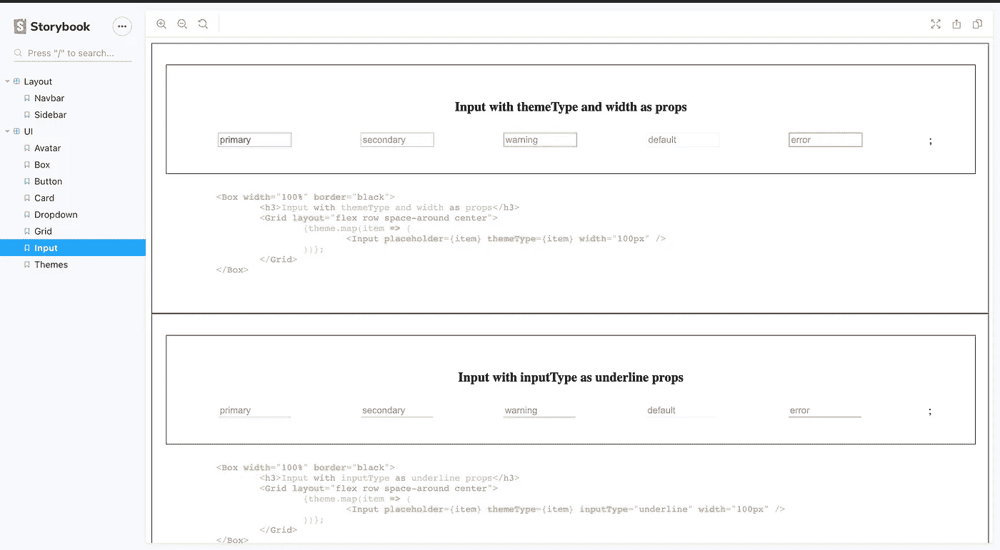

# 故事书入门

> 原文：<https://javascript.plainenglish.io/storybook-part-1-an-impressive-kit-you-need-to-showcase-your-frontend-skills-8aa1b04b53b6?source=collection_archive---------13----------------------->

## 你应该用来展示你的前端技能的必备工具包


你已经为整个 UI 库开发了可重用的组件或功能，现在是展示的时候了，那么**故事书**就是为你准备的。

查看链接，我如何用故事书展示我的作品= >【https://uireactlibrary.now.sh/?path=/story/ui 卡片

# 什么是故事书？

故事书是 UI 开发的工具。它通过隔离组件使开发更快更容易。

1.  故事书工具包由
    **故事**组成——所有故事的集合，一个单独的故事就像一个单独的 UI 组件。
2.  故事书提供了 3 个基本功能——写故事、写文档和附加组件。

**编写故事** —这是一个独立的 UI 组件或功能，它捕获并呈现 UI 组件的状态。
**—故事书为开发者提供内置的文档功能，解释他们所创作的故事的深度应用。
**附加组件** —故事书提供像 WordPress 这样的插件，帮助用户扩展故事书的属性，如文档、交互控件等。**

# ****如何安装****

**我们将使用下一个 JS 存储库来安装故事书。这里是 repository = >[https://github . com/shreyvijayvargiya/iHateReadingLogs/tree/main/TechLogs/MaterialUIInstallationWithNextJS](https://github.com/shreyvijayvargiya/iHateReadingLogs/tree/main/TechLogs/MaterialUIInstallationWithNextJS)
安装故事书 react package =>***【story book/react】*****

```
yarn add @storybook/react
```

**创建一个名为“ ***Storybook*** 的文件夹，后面是 2 个子文件夹， **Playground** 和 **Components** 。
***游乐场*** —这个文件夹包含了我们想要在故事书的预览 iframe 上显示的所有故事。
***组件*** —该文件夹将包含我们将用于创建故事的组件。**

**您想要创建的每个故事都应该包含一个以“ ***.stories.js*** ”扩展名结尾的文件。例如，创建一个故事来显示你定制的按钮应该像 **"Button.stories.js"** 那样结束。这背后的原因是，Storybook 内置配置会自动检测所有带有. stories.js 扩展名文件的故事，默认情况下，该文件中返回的任何内容都将在预览框中呈现为一个故事。但是，您可以轻松地更改内置配置并创建您自己的配置(稍后将对此进行介绍)。**

****

**The Storybook is the root of the repository with the Playground and the Components folder inside it.**

**我的**游乐场文件夹**包含我想要展示的所有故事，我的**组件文件夹**包含我的故事将使用的所有组件。为了创建这个故事，我们将使用" ***@storybook/react" npm 包*** 提供的"*stories of "方法。这个方法有两个参数，故事的名称和故事的 UI 组件。添加完故事的名称后，您使用名为***“add”、*** 的子方法，它接受 UI 组件作为参数来呈现/返回。***

******

***storiesOf method provided by Storybook***

***图中的“ ***storiesOf”方法*** 以第一个参数作为故事的名称，即“ ***组件*** ”，第二个参数是一个模块，后面调用一个名为***【add】***的方法，我们要向其中添加一个回调，返回一个 UI 组件作为**按钮**在故事中渲染。在 add 方法的 render 方法内部，可以添加任何想要返回的 UI 组件**。*****

# *****我的游乐场*****

***我正在开发一个自定义按钮，将接受如按钮的名称和颜色的道具。因为我正在使用材质 UI 库，所以颜色道具将枚举[“主要”，“次要”，“警告”]。***

> ***N ***ote*** —当创建一个故事的组件时，你可以声明**属性类型**，这也增加了严格的属性类型检查，并有助于展示你的组件的扩展功能。***

******

***Custom Button inside Components***

***这是我在组件中自定义的按钮。下一步是导出这个按钮，并将其呈现在故事书的故事中。***

# *****我的故事*****

******

***Custom Button Story inside Stories***

***在一个按钮故事中，我刚刚导入了在" ***组件"* "** 文件夹中声明的自定义按钮，并使用故事书的 ***"add"*** 方法创建了一个故事。***

# ***测试你的第一个故事书故事***

***在“***”package . JSON“***文件中添加故事书脚本，以便在本地服务器上运行它。***

```
*"storybook":"start-storybook"*
```

***接下来，我们需要告诉故事书 **CLI(命令行界面)**来检测所有的**。*stories . js****文件检测我们的故事。故事书 CLI 总是寻找**”。storybook"** 文件夹，检查开发者是否声明了自己的配置。所有故事的配置都应该在“ ***的“ ***config.js*** ”文件中声明。*故事书**。****

******

***config.js***

> ***不要试图改变**的名称*。故事书的"*** 文件对应到别的东西上，故事书的 CLI 总是寻找" ***。故事书根目录中的*** 。还有，永远放 ***”。storybook"*** 在你的 **package.json** 所在的库的根目录下，否则 storybook 检测不到。***

***在 Storybook 配置文件中，您可以声明根附加组件或提供所有" ***stories.js"*** 文件的路径。这个配置是使用“ ***@storybook/react”提供的方法“ ***【配置】*** 来声明的。******

# ***在本地运行故事书***

***现在运行命令" ***【颜跑故事书】*** ，这样就会默认启动 localhost:51086 上的故事书游乐场。***

******

***Custom Button in Storybook Playground***

# ******延伸故事******

***我们可以在一个故事中显示更多按钮，或者在一个故事中创建更多的子故事。我用一个颜色道具来展示不同类型的按钮，并根据颜色道具来命名不同的故事。***

************

***Default Button in the left image, Primary button in the right image.***

******

***All Buttons in the Grids.***

# *****结论*****

***这只是故事书的安装部分，并显示基本的 UI 组件。将故事书的故事部分视为一个简单的 UI 组件，并返回您想要显示的任何内容。我将在另一篇文章中添加一个 ***react-live*** 包，帮助编辑传递给故事书本地服务器上的按钮的道具。在下一部分，我将介绍故事书的“*”特性，以及如何安装和使用它。为了获得更多的灵感，我添加了一个链接到我创建的 UI 前端库。****

```
**[My React UI library](https://uireactlibrary.now.sh/?path=/story/ui--input)**
```

********

****Storybook setup for my Frontend UI library****

****下次再见，祝大家愉快。****

```
**Code Repository [https://github.com/shreyvijayvargiya/iHateReadingLogs/tree/main/TechLogs/StoryBookInstallation](https://github.com/shreyvijayvargiya/iHateReadingLogs/tree/main/TechLogs/StoryBookInstallation)**
```