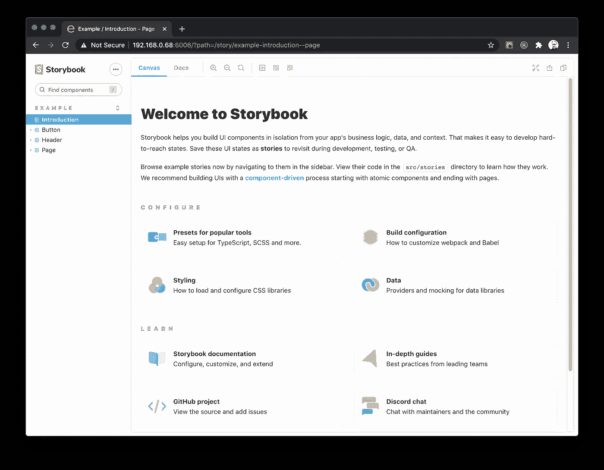

# 带有 React、Redux 和材质 UI 的故事书

> 原文：<https://javascript.plainenglish.io/storybook-with-react-redux-and-material-ui-eeacd04bee26?source=collection_archive---------2----------------------->


Photo by [Alex Block](https://unsplash.com/@alexblock?utm_source=medium&utm_medium=referral) on [Unsplash](https://unsplash.com?utm_source=medium&utm_medium=referral)

用 React CRA、Redux、材质 UI 主题化、代理和路由导航故事书的复杂性可能会很棘手。

[Storybook](https://storybook.js.org/) 对于独立开发和测试 UI 组件来说是无价的，它支持快速原型开发，同时迫使你对组件和容器的 API 进行批判性思考。

# 初始设置

使用`npx sb init`命令设置 React 故事书很简单。例如，要用 Storybook 搭建一个 [Create React App](https://reactjs.org/docs/create-a-new-react-app.html) ，只需执行以下命令:

```
npx create-react-app my-app
cd my-app
npx sb init
```

故事书和 CRA 最近出现了一些问题——你可能在执行`npx sb init`后遇到了巴别塔错误，例如:

> 错误:找不到模块“babel-loader”

或者，在添加 babel loader 后:

> 中的错误。/.story book/story book-init-framework-entry . js
> 模块未找到:错误:您试图导入项目 src/目录之外的…/my-app/node _ modules/@ pmmmwh/react-refresh-web pack-plugin/lib/runtime/refresh utils . js。不支持 src/之外的相对导入。
> 您可以将它移动到 src/中，或者从项目的 node_modules/中添加一个符号链接。

谢天谢地，故事书团队已经解决了这些问题。

要尝试最新功能，请安装为:

```
npx sb@next init
```

完成后，Storybook 将在以下位置搭建配置和一组示例故事:

*   `.storybook/` —故事书的配置
*   `src/stories/` —示例故事

要启动 Storybook，请执行:

```
yarn storybook
```

然后，导航到 [http://localhost:6006/](http://localhost:6006/) 查看界面:



# 创建故事书文档

Storybook 使用 MDX 来创建 [Storybook 文档](https://storybook.js.org/docs/react/writing-docs/introduction)——这是记录组件的好方法。

在`src/stories`文件夹下，通过创建一个名为`[topic].stories.mdx`的新文件并在`<Meta tile="section/topic]" />`元块中指定标题来创建任意数量的 MDX 文档。

下面是一个示例 introduction.stories.mdx 文件:

上面的例子结合了 markdown 和样式化的 HTML，将会在 Storybook UI 中产生下面的页面:


# 创造一个故事

Storybook 自动搭建一些示例故事，其中示例组件定义在`src/stories`文件夹中。当然，您可以像往常一样从`src/`访问您的组件——这些只是为了演示的目的。事实上，你可以删除 stories 文件夹中的所有内容，重新开始。

在`src/stories`文件夹下，通过添加名为`[topic].stories.js`的新文件来分组组件集合，从而创建任意数量的故事。

在每个故事中，加载故事的 React 和组件，导出标题、参数类型和组件以加载到 Storybook 中:

上面的例子显示了一个具有以下参数类型的`Button`组件:

*   背景颜色，使用颜色控件
*   主要，使用布尔拨动开关
*   标签，使用字符串文本输入
*   大小，使用单选控件显示可能选项的枚举

默认情况下，通过向组件传递参数，组件将默认为使用标签“*primary Button”*启用的 Primary。

Storybook 将按如下方式加载这个故事:


Storybook 的[基本控件](https://storybook.js.org/docs/react/essentials/controls)文档中定义了各种各样的内置控件。包括数组、布尔值、数字、范围、文本、颜色、日期、单选、复选和选择。

# 代理端点和 Web 套接字

如果您的开发环境包含多个通过其他后端服务器提供流数据、静态资产和 API 的服务器，您可能需要实现中间件来代理请求。

例如，如果您的 React 应用程序实现了利用`http-proxy-middleware`的代理，您可以通过在`.storybook/`文件夹下创建一个名为`middleware.js`的文件来将相同的功能与 Storybook 合并，该文件包括:

上面，web socket 请求被代理到 localhost 端口 4002，`/photos`和`/api`的两个端点被代理到 localhost 端口 3001。

# 还原、主题化和路由

三个额外的主题在这里被分组，因为它们都与 Storybook 的预览装饰器相关。

*   合并一家 Redux 商店
*   与材质 UI 主题提供程序集成
*   用 React 路由器处理路由问题

通过在名为`preview.js`的`.storybook/`文件夹下创建一个包含以下内容的文件，所有的故事都可以实现一个全局装饰器来提供这个功能:

这将围绕 Storybook 呈现的故事包装功能。

## Redux

Storybook 更倾向于组件和属性，而不是管理存储状态的容器。

然而，在你的故事中加入一个提供者可能是必要的，特别是对于生命周期很长的大型项目。

这样做，可能有助于暴露和鼓励逻辑和表示的分离；或者，如果您的组件与 Redux 存储紧密集成，只需防止错误。

在预览装饰器中，添加 Redux 提供程序并存储。

## 材质 UI 主题化

如果你的解决方案包含了主题化，比如 Material UI 的主题化系统，那么用你的主题提供者来查看你的组件是最理想的。

在预览装饰器中，添加您的主题提供者和主题定义。

## 反应路由器

路由在故事书里一般意义不大；但是，如果您的组件包含诸如 React Router DOM 中的`useLocation` hook 之类的功能，它们将抛出一个错误，除非实现了某种路由器。

```
import { useLocation } from "react-router-dom";const MyComponent = () => {
  const location = useLocation();

  useEffect(() => {
    // something happens...
  }, [location]);
```

为了弥补这一点，在预览装饰器中包含一个路由器，比如 React Router 的`MemoryRouter`。