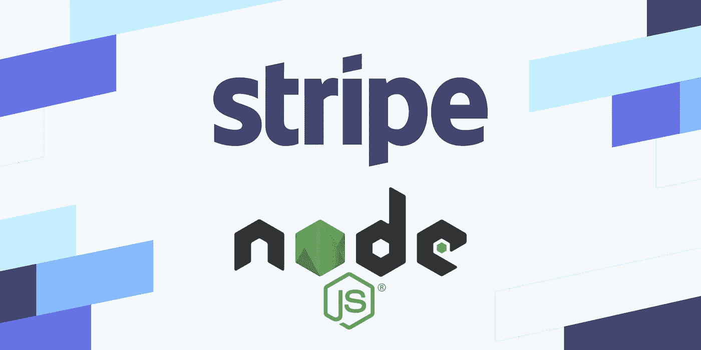
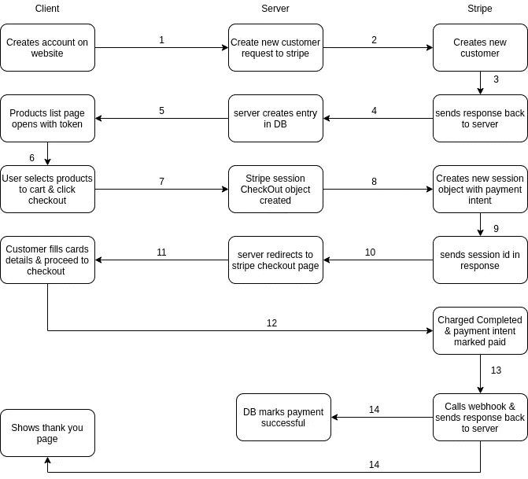
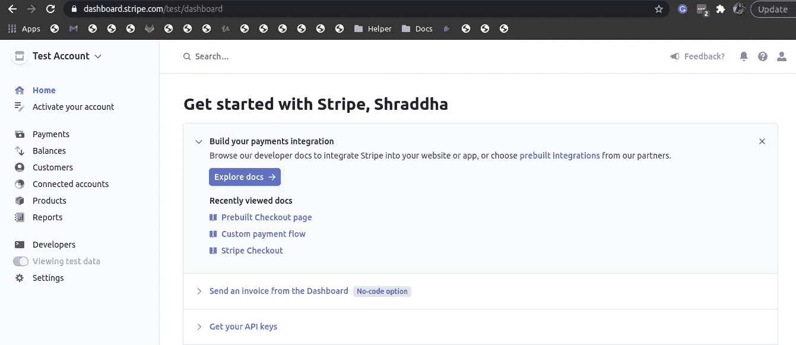
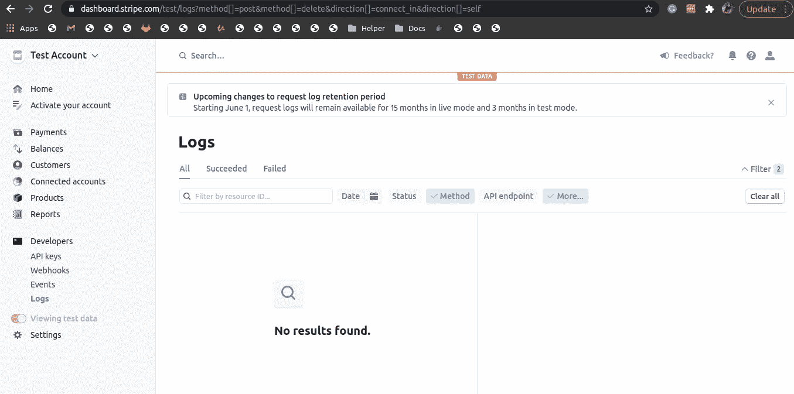
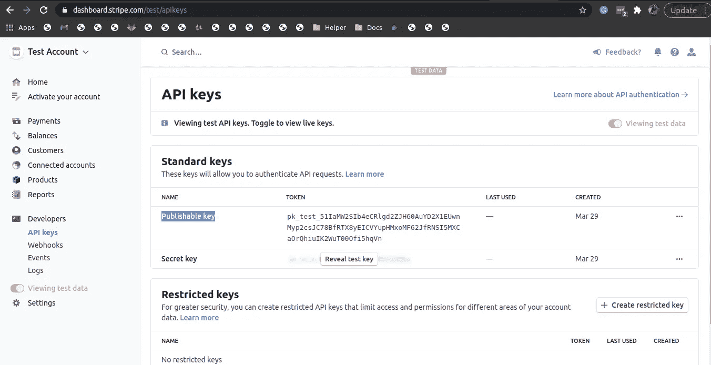
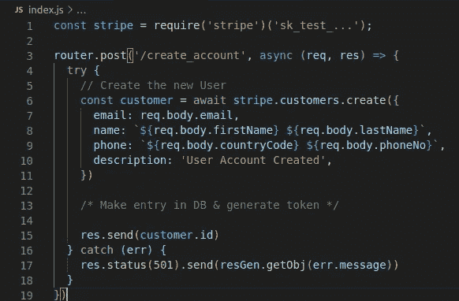
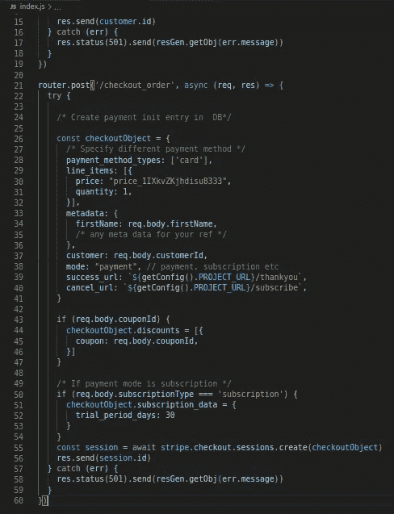
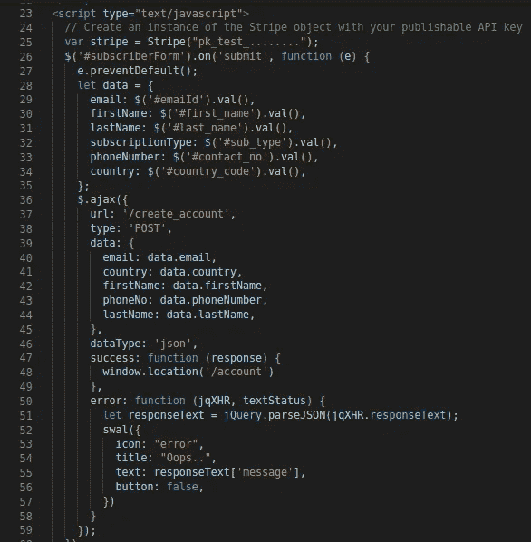
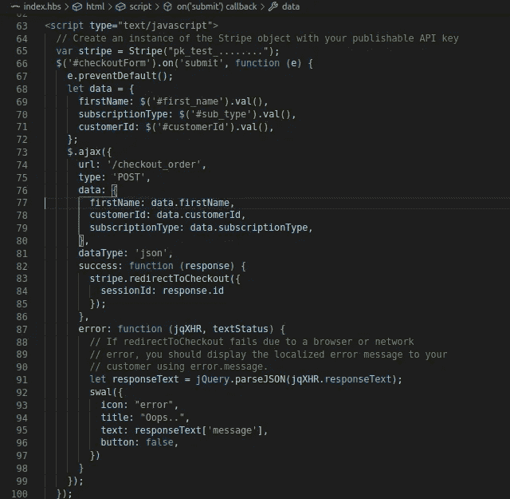

# 与 Node.js 的条带集成

> 原文：<https://javascript.plainenglish.io/stripe-integration-with-node-js-6adb8cbc81f7?source=collection_archive---------6----------------------->



Stripe+node.js

数字时代增加了在线支付方式。只需点击一下，就可以轻松地在网上购买任何产品。为了达到这个目的，市场上有许多支付网关。

Stripe 是最受欢迎的国际支付网关之一。您可以向客户收取一次性费用或连续定期订购费用。使用 stripe，您可以轻松地选择其中一种类型，并在自己的数据库中维护一个记录。

因此，不再浪费时间，让我们深入了解与 Node.js 项目的条带集成。



Account creation to checkout flow

## **第一步。条带帐户创建**

首先，在 https://stripe.com/en-in 的[上创建 stripe 账户，并填写您的数据。它看起来会像这样。](https://stripe.com/en-in)



默认情况下，它会为您创建一个测试环境，让您尝试所有选项。您可以通过在“激活您的帐户”部分填写业务相关信息来激活您的帐户。Stripe 在“开发人员”部分提供日志和事件，供开发人员检查与 stripe 活动相关的日志和事件。



现在转到“API 密匙”一节来获取应用程序的 API 密匙。有两种类型的密钥“可公开密钥”和“秘密密钥”。可发布密钥用于客户机环境&秘密密钥用于服务器端环境。



API keys for stripe account

## **第二步。Node.js 设置**

用 npm 或纱线安装包装:

```
npm install stripe --saveyarn add stripe
```

现在让我们创建 index.js 文件，并创建客户&为客户结帐生成会话。导入条带时提供服务器密钥。

```
const stripe = require('stripe')('sk_test_...');const customer = await stripe.customers.create({
 email: req.body.email,
 name: `${req.body.firstName} ${req.body.lastName}`,
 phone: `${req.body.countryCode} ${req.body.phoneNo}`,
 description: 'User Account Created'
})
```

可以创建 checkout 对象并根据条件添加其他数据。您可以在订阅支付模式下指定优惠券代码或免费试用。

```
const checkoutObject = {
/* Specify different payment method */
payment_method_types: ['card'],
line_items: [{
 price: "price_1IXkvZKjhdisu8333",
 quantity: 1,
}],
metadata: {
 firstName: req.body.firstName,
 /* any meta data for your ref */
},
customer: customer.customerId,
mode: "payment", // payment, subscription etc
success_url: `${getConfig().PROJECT_URL}/thankyou`,
cancel_url: `${getConfig().PROJECT_URL}/subscribe`,
}
if (req.body.couponId) {
 checkoutObject.discounts = [{
  coupon: req.body.couponId,
 }]
}
/* If payment mode is subscription */
if (req.body.subscriptionType === 'subscription') {
 checkoutObject.subscription_data = {
  trial_period_days: 30
 }
}const session = await stripe.checkout.sessions.create(checkoutObject)
```

下面是一个文件中的全部代码。



Stripe create customer API



Stripe checkout session API

现在创建表单并要求用户数据提交表单。点击订阅表单，收集数据并调用创建帐户 API 注册成功后，将用户导航到帐户页面，并向用户展示产品。在点击购物车时，结帐按钮调用结帐订单 API。



Call create account API

如果会话创建成功，它将被重定向到条带结帐页面，否则将向客户显示错误。



Call checkout Order API

## 结论

仅此而已。您已经准备好开始您的在线支付业务。欲了解更多信息，请访问条带集成的官方文档。要了解如何模仿 Stripe APIs 进行自动化测试[，请阅读这里的](/mock-stripe-api-in-node-js-with-jest-c9d8df595ff4)。感谢阅读。

*更多内容请看*[***plain English . io***](http://plainenglish.io)