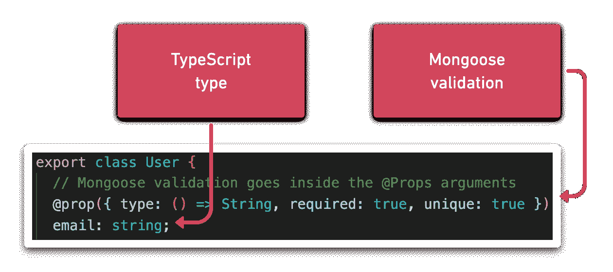

# 带有 Typegoose & TypeScript 的强类型猫鼬模型

> 原文：<https://javascript.plainenglish.io/strongly-typed-mongoose-models-with-typegoose-typescript-9290d4ed00ed?source=collection_archive---------3----------------------->

在我的上一篇文章中，我们讨论了如何[集成 Mongoose 和 TypeScript](https://tomanagle.medium.com/strongly-typed-models-with-mongoose-and-typescript-7bc2f7197722) 来手动创建强类型模型。在本文中，您将学习如何使用 [Typegoose](https://github.com/typegoose/typegoose) 同时创建 Mongoose 模型&类型脚本类型。

**参见最终知识库:**[https://github.com/tomanagle/Typegoose-example](https://github.com/tomanagle/Typegoose-example)

**有什么问题？**

通常，我们的应用程序中使用的数据形状都是从模型级别开始的。然后，我们用 TypeScript 复制这些数据形状，这样我们就可以通过应用程序来表示数据。Typegoose 旨在消除在 Mongoose 和 TypeScript 中创建数据形状的需要，并在整个开发生命周期中保持形状同步。

【Typegoose 如何解决问题？

Typegoose 通过使用类和装饰器来输出 Mongoose 模型和 TypeScript 接口，从而解决了这个问题。类中的每个属性都有一个 TypeScript 类型和一个`@props`装饰器。装饰器将构建 Mongoose 模型，而 TypeScript 属性将用于构建接口。最后，这个类可以用来构建一个带有恰当命名的`getModelForClass`函数的模型

在我们开始学习 Typegoose 之前，让我们快速回顾一下我们的起源。在上一个指南中，我们创建了两个模型。

用户模型:

和一个宠物模型:

这两个模型展示了我们将在 Typegoose 中复制的几个关键的 Mongoose 概念:

*   模式验证，如必需和唯一
*   引用另一个模式
*   嵌入子文档

现在，让我们看看如何用 Typegoose 重写上述模式。

用户模型现在看起来像这样:

宠物模型现在看起来像这样:

正如您所看到的，每个模式都是由一个具有 TypeScript 类型的类定义的。然后，一个`@props`装饰器被放在每个类型的顶层，以定义 Mongoose 模式验证。

## 虚拟

Mongoose 虚拟类型是在输出中计算的数据类型。结果不会保存在文档中。它们非常适合于几个字段的连接。我还用它们来计算数组中子文档的数量，以保存发送给客户机的大型数据列表，这样就可以显示计数。

使用将出现在文档上的虚拟字段:

虚拟鹅文档:[https://typegoose.github.io/typegoose/docs/api/virtuals](https://typegoose.github.io/typegoose/docs/api/virtuals)

虚拟猫鼬文档:[https://mongoosejs.com/docs/guide.html#virtuals](https://mongoosejs.com/docs/guide.html#virtuals)

索引是任何数据库的重要组成部分，MongoDB 也不例外。幸运的是，Typegoose 支持使用`@index`装饰器进行索引。

Typegoose 索引文档:[https://type goose . github . io/type goose/docs/API/decorators/indexes](https://typegoose.github.io/typegoose/docs/api/decorators/indexes)

猫鼬指数文档:[https://mongoosejs.com/docs/guide.html#indexes](https://mongoosejs.com/docs/guide.html#indexes)

## 最后的想法

Typegoose 是独立声明您的 TypeScript 类型和 Mongoose 模型的一个很好的替代方法。这个存储库看起来维护得很好，最后一次提交是在撰写本文的 13 天前，问题部分报告了少量的错误。

然而，当使用库来定义应用程序的对象结构时，弄清楚前面可能有哪些障碍总是很重要的。你不希望不能以某种方式创建一个对象，因为你正在使用的助手库不支持它。

**最终储存库:**[https://github.com/tomanagle/Typegoose-example](https://github.com/tomanagle/Typegoose-example)

**类型鹅:**https://github.com/typegoose/typegoose

## 🌎让我们保持联系

[在 YouTube 上订阅](https://www.youtube.com/TomDoesTech)
[不和](https://discord.gg/4ae2Esm6P7)
[推特](https://twitter.com/tomdoes_tech)
[抖音](https://www.tiktok.com/@tomdoestech)
[脸书](https://www.facebook.com/tomdoestech)
[insta gram](https://www.instagram.com/tomdoestech)
[给我买杯咖啡](https://www.buymeacoffee.com/tomn)