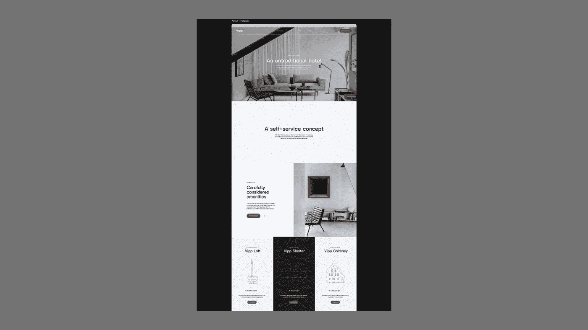
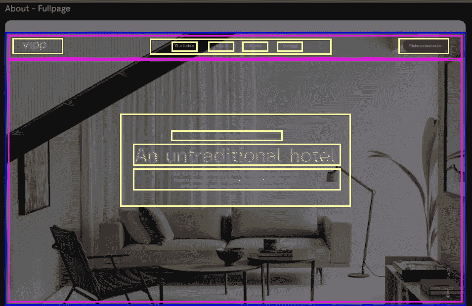
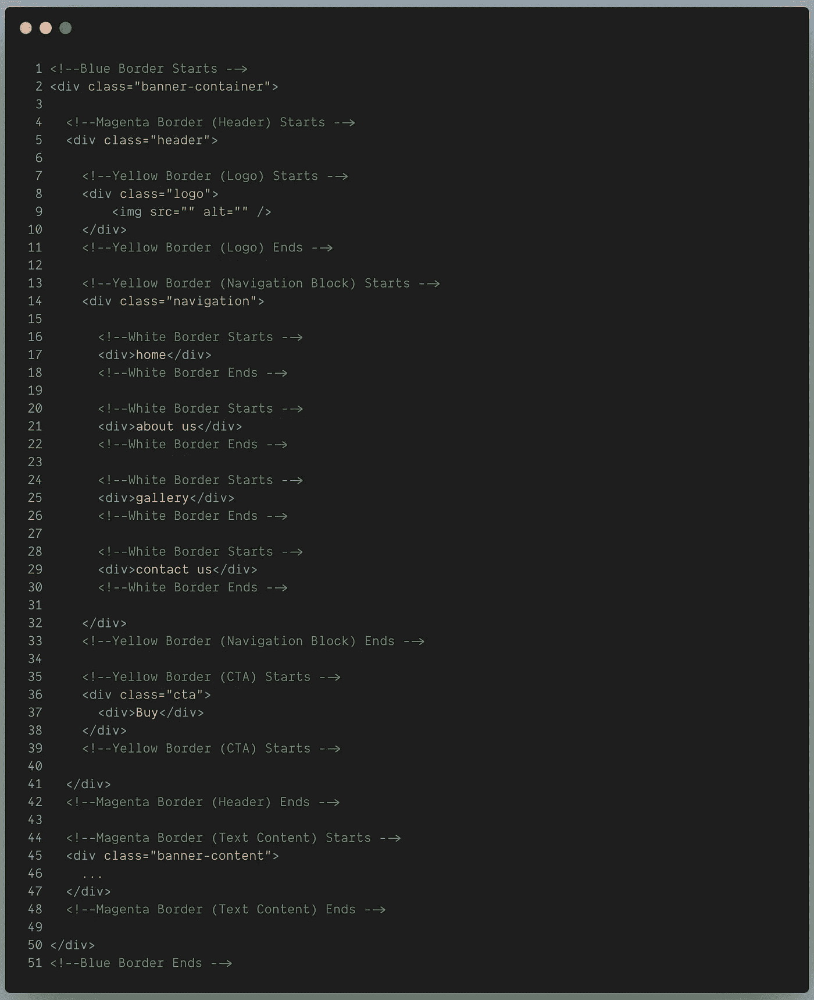
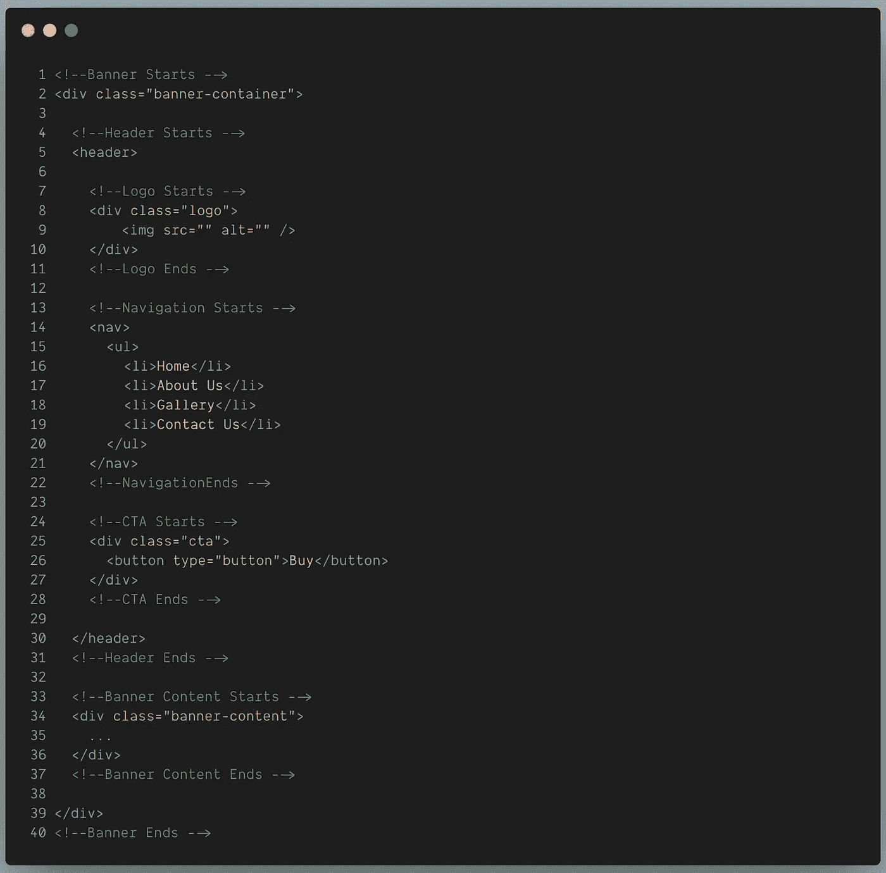

# 构建 HTML 页面的正确方法

> 原文：<https://javascript.plainenglish.io/structuring-html-pages-the-right-way-3daddbce6320?source=collection_archive---------7----------------------->

最初，我专注于 JavaScript 及其框架，认为 HTML 并不那么重要。但是很快我被证明是错的。我意识到 HTML 和 CSS 的良好知识也同样重要。

随着我们在网上看到的一切最终都以 HTML 块的形式呈现，我觉得有必要分享我构建 HTML 页面的方式

通常，我们提供了网页的视觉设计。所以让我们从一个开始:

[https://in.pinterest.com/pin/68609594312871165/visual-search/?x=22&y=84&w=530&h=549&cropSource=6](https://in.pinterest.com/pin/68609594312871165/visual-search/?x=22&y=84&w=530&h=549&cropSource=6)

以上设计是某室内设计公司的，设计干净优雅。现在我们有了我们的 VD(视觉设计)，通常，我们的下一步是开始编码。但这就是事情开始出错的地方。

我们可能对自己的技能很有信心，但是我们仍然应该彻底地检查设计。

## 第一步也是最重要的一步是正确地完成设计。

让我们看一下上面的设计。这里，页面被分成不同的部分，每个部分都有独特的设计。

*   该页面有四个主要的水平部分。
*   第一部分有一个带有徽标和导航按钮的标题。这一部分还有一个背景图片，中间有一条信息。
*   第二部分为纯色背景，文本内容位于中间。
*   第三部分分为两个垂直部分。第一部分(左边部分)是文本内容，第二部分(右边部分)是图像。
*   第四部分分为三个纵向部分。第一和第三部分(最左边和最右边)有一个带有图像和文本内容的白色背景。第二部分(中间部分)为黑色背景，包含图像和文本内容。

## 第二步是通过 TLF(左上流程)方法以 HTML 块表示的形式线框化设计

让我们看这一页的第一部分。

TLF 方法的工作方式如下:

*   首先，横向划分设计。
*   然后把水平的部分垂直分开。

是的，我知道一开始听起来很困惑。为了更好地理解，让我们通过设计线框来理解上述方法。

在上面的部分中，

*   最外面的父节点是带有蓝色边框的节点。
*   它可以水平分为两个主要的子部分，即一个标题和文本内容。所以我们用洋红色的边框把它们分开。(TLF 方法中的顶端)。
*   在标题块中，设计不能进一步水平划分。所以我们寻找垂直分割。
*   它可以垂直分为三个部分。我们用一条黄色的边界将它们分开(在 TLF 进近中向左)。
    1。徽标
    2。导航按钮阻止
    3。CTA 按钮
*   现在，我们再次来到徽标块，看看它是否可以水平分割。没有，可以竖着分吗？不。这意味着标志区块是最终的，我们移动到下一个区块(在 TLF 方法左)。
*   我们查看导航按钮块，看看它是否可以水平分割。没有，可以竖着分吗？是的。
*   我们将它们划分为带有白色边框的文本块(TLF 方法中的左侧)。
*   我们看一下 CTA 块，它不能再分了。这就完成了我们的头部线框。
*   对于文本内容块可以重复同样的操作。

> 使用 TLF 方法的正确方法是看设计块是否可以水平分割。如果有，分。如果没有，看设计块是否可以垂直分割。重复同样的步骤，直到覆盖所有设计模块。

最后是编码时间。

我们已经成功地以 HTML 的形式构建了上述设计。

再多几个点可以进一步完善结构化过程。它们如下

*   始终使用注释(便于我们将来记住，也便于他人理解)
*   利用适当的语义 HTML 标签。
*   避免使用不推荐使用的 HTML 标签。
*   [验证](https://validator.w3.org/)您的 HTML 代码。
*   避免使用不需要的 HTML 元素。
*   始终使用 DOCTYPE 声明。

您可以看到第一个和第二个编码块之间的差异。
第二种更具描述性，易于理解，代码更少。

谢谢你的宝贵时间。我希望你喜欢读这篇文章！

此外，这是我的第一个帖子，所以建议和赞赏是受欢迎的。

*更多内容尽在*[***plain English . io***](http://plainenglish.io/)